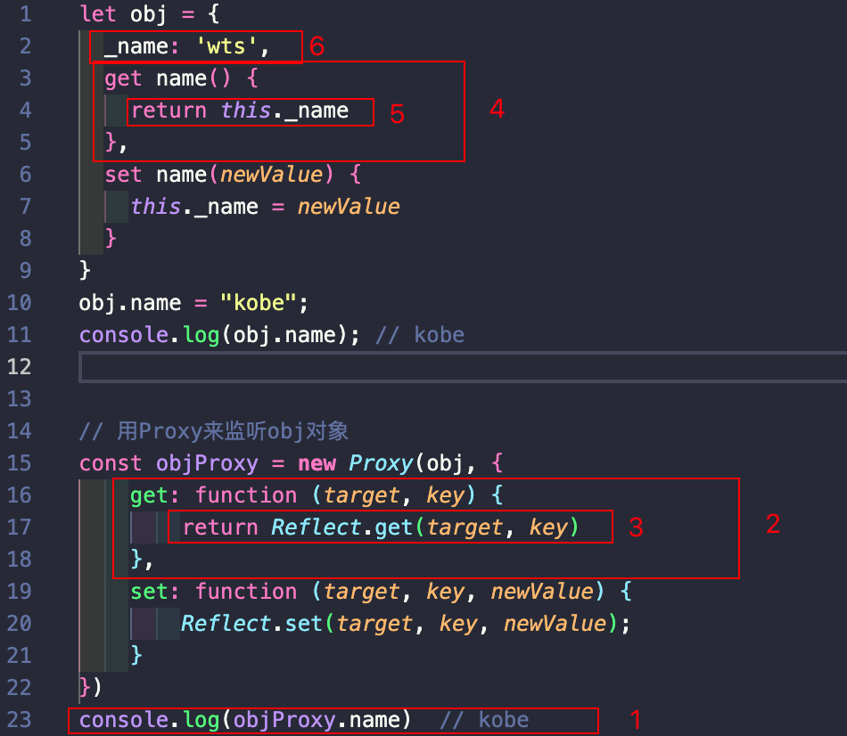

## 监听对象的操作

 我们先来看一个需求：有一个对象，我们希望监听这个对象中的属性被设置或获取的过程

比如说

```js
const obj = {name: 'why'}
obj.name = 'kobe';
delete obj.name
// 监听到这个赋值的操作，---> 执行一些其他事情
// 就像vue中，通过监听name,让我们的template中的name进行更新
```

-  通过我们前面所学的知识，能不能做到这一点呢？
- 监听对象操作在很多框架中是比较重要的
-  其实是可以的，我们可以通过之前的属性描述符中的存储属性描述符来做到；

这段代码就利用了前面讲过的 Object.defineProperty 的存储属性描述符来对 属性的操作进行监听。

```js
const obj = {
	name: 'wts',
	age: 18
}

// 上面这两个操作都想监听到
Object.defineProperty(obj, 'name', {
    // 当访问name的时候来到get
    get: function () {
        console.log('监听到name属性被访问了')
    },
    // 当设置name的时候来到set
   set: function(){
       console.log('监听到name属性被设置了')
   } ,
})
// 想要监听这么一个对象
console.log(obj.name);	// 监听到name属性被访问了
obj.name = 'kobe';	// 监听到name属性被设置了

// 上面只是针对name属性做监听，如果想针对所有属性都做监听怎么办呢
Object.keys(obj).forEach(key => {	// 这个方法可以获取到所有的key,这个方法表示会调用所有的key来循环
    let value = obj[key];
    Object.defineProperty(Obje, key, {
        get() {
            console.log('监听到obj对象的' + key + '属性被访问了')
            return value;
        },
        set(newValue){
            console.log('监听到obj对象的' + key+ '属性被设置了')
            value = newValue;	// 通过改变外面的自有变量，来设置
        }
    })	// 在循环中监听每一个key
})
obj.name = 'kobo';
obj.age = 30;
console.log(obj.name);
console.log(obj.age);

// 打印监听多个obj的代码
'监听到obj对象的name属性被设置了'
'监听到obj对象的age属性被设置了'
'监听到obj对象的name属性被访问了'
kobe
'监听到obj对象的age属性被访问了'
30
```

所以在前面这种方式里面Object.defineProperty里面他也是可以做监听操作的

但是这样做有什么缺点呢？

 首先，Object.defineProperty设计的初衷，不是为了去监听截止一个对象中所有的属性的（属性的变化）。

-  我们在定义某些属性的时候，初衷其实是定义普通的属性，但是后面我们强行将它变成了数据属性描述符。

 其次，如果我们想监听更加丰富的操作，比如新增属性、删除属性，那么 Object.defineProperty是无能为力的。

```js
obj.height = 1.88
// definedProperty是监听不到的
// 或者是删除一个属性  defineProperty也是监听不到的
```

 所以我们要知道，存储数据描述符设计的初衷并不是为了去监听一个完整的对象。

所以es6提供了一个Proxy


## Proxy基本使用

在ES6中，新增了一个**Proxy类**，这个类从名字就可以看出来，是用于帮助我们创建一个代理的，也就是说，如果我们希望监听一个对象的相关操作，那么我们可以先创建一个代理对象（Proxy对象）。

紧接着我们如果想监听一个对象，我们不应该直接去监听这个对象，我们应该先创建一个代理对象，之后对该对象的所有操作，都通过代理对象来完成，代理对象可以监听我们想要对原对象进行哪些操作；

- 首先如果我们想监听一个对象，我们其实不应该直接修改这个对象，这种方式其实不好
- 那么Proxy做的事其实就是先创建出一个代理对象
- 如果我们创建出一个代理对象，我们修改的都是代理对象的值，最后把代理对象传递给原始对象
- 我们可以重写捕获器，一共有13种捕获器

我们可以将上面的案例用Proxy来实现一次：

- 首先，我们需要new Proxy对象，并且传入需要侦听的对象以及一个处理对象，可以称之为handler； ü const p = new Proxy(target, handler)

- 其次，我们之后的操作都是直接对Proxy的操作，而不是原有的对象，因为我们需要在handler里面进行侦听；


```js

const obj = {
  name: 'wts',
  age: 18
}

// 首先要知道对哪个对象做代理,也就是第一个参数
// 第二个参数传的是捕获器，可以捕获到设置对象删除对象等,先给给空对象
const objProxy = new Proxy(obj, {});

console.log(objProxy.name)  // wts
console.log(objProxy.age) // 18
```

可以看到，我们通过proxy对象，也是可以获取到对象的属性的 

```js
objProxy.name = 'kobe';
objProxy.age = 30;
console.log(obj.name);	// kobe
console.log(obj.age);	//30
```

可以看到我们修改Proxy对象，依然可以修改到Obj对象

以上就是Proxy的基本操作，如果我们想监听到设置和获取怎么办呢？就可以重写捕获器


## Proxy的set和get捕获器

如果我们想要侦听某些具体的操作，那么就可以在handler中添加对应的捕捉器（Trap）：

```js
const obj = {
  name: 'wts',
  age: 18
}

// 首先要知道对哪个对象做代理,也就是第一个参数
// 第二个参数传的是捕获器，可以捕获到设置对象删除对象等,先给给空对象
const objProxy = new Proxy(obj, {
  // 获取值时的捕获器，当我们获取值时，就会自动回调这个捕获器
  // 当我们获取属性的时候，其实会传过来好几个参数
  // target表示被代理的对象，key代表获取的属性
  get: function (target, key) {
    console.log(`监听到对象的${key}属性被访问了`, target)
    return target[key];
  },

  // 设置值时的捕获器，当我们设置值时，就会自动回调这个捕获器
  // 当我们设置属性的时候，也会传过来好几个参数
  // target表示被代理的对象，key代表设置的属性，newValue就是修改的新的值
  set: function (target, key, newValue) {
    console.log(`监听到对象的${key}属性被设置了`, target);
    target[key] = newValue;
  }
});

console.log(objProxy.name)  // 监听到对象的name属性被访问了 { name: 'wts', age: 18 }	wts
console.log(objProxy.age) // 监听到对象的age属性被访问了 { name: 'wts', age: 18 }	18

objProxy.name = 'kobe';	// 监听到对象的name属性被设置了 { name: 'wts', age: 18 }
objProxy.age = 30;	// 监听到对象的age属性被设置了 { name: 'kobe', age: 18 }
console.log(obj.name);	// kobe
console.log(obj.age);	// 30
```

set和get分别对应的是函数类型；

- set函数有四个参数：
  - target：目标对象（侦听的对象）；
  - property：将被设置的属性key；
  - value：新属性值；
  - receiver：调用的代理对象；
- get函数有三个参数：
  - target：目标对象（侦听的对象）；
  - property：被获取的属性key；
  - receiver：调用的代理对象；


## Proxy的其他捕获器

### 13个捕获器分别是做什么的呢？

举个栗子，假设我们用 *in* 操作符的时候，在以前用defineProperty的时候，我们是不可能监听到的，那么用Proxy能不能监听到呢

```js
let obj = {name: 'wts', age: 18}
const objProxy = new Proxy(obj, {
  // 监听in的捕获器, 他只有两个参数，一个target，一个key，没有recever，recever只有get和set有
  has: function (target, key) {
    console.log('监听到使用了in操作符', key)
    // 这里需要return一下
    return key in target
  },
  // 监听delete的捕获器
  deleteProperty: function (target, key) {
    console.log('监听到对象的' + key + '属性in操作', target)
    delete target[key]
  }
})

// in操作
console.log('name' in objProxy);

// delete操作
delete objProxy.name
```

所以，对于proxy不仅仅对以前的监听方式做了一个增强，更重要的是对某一个对象做了一个代理，我们只需要操作代理对象就可以， 这样的话就不需要直接修改我们的被代理对象了

如果修改直接通过Object.defineProperty(obj, 'name', {})来修改对象的话，我们是把他的属性修饰符给改掉了。

比如

```js
const obj = {
	name: 'wts'	// 数据属性描述符
}
Object.defineProperty(obj, 'name', {})	// 变成成了访问属性描述符
```

这种方式不是特别好，我们不应该改对象属性的描述符，所以现在我们可以通过proxy来创建一个代理对象，这样避免了直接修改对象的属性描述符


### handler.getPrototypeOf()

- Object.getPrototypeOf 方法的捕捉器。
- 主要解决的是在拿隐式原型的时候(`obj.__proto__`)存在浏览器兼容性问题


### handler.setPrototypeOf()

- Object.setPrototypeOf 方法的捕捉器。
- 设置原型的时候监听到


### handler.isExtensible()

- Object.isExtensible 方法的捕捉器。
- 用来监听是否使用了isExtensible来检查对象

```js
const p = new Proxy({}, {
  isExtensible(target) {
    console.log("isExtensible检查被调用");
    return Reflect.isExtensible(target);
  }
});

Object.isExtensible(p); // 输出"isExtensible检查被调用"并返回true
```


### handler.preventExtensions()

- Object.preventExtensions 方法的捕捉器。


### handler.getOwnPropertyDescriptor()

- Object.getOwnPropertyDescriptor 方法的捕捉器。


### handler.defineProperty()

- Object.defineProperty 方法的捕捉器。


### handler.ownKeys()

- Object.getOwnPropertyNames 方法和 Object.getOwnPropertySymbols 方法的捕捉器。


### handler.has()

- in 操作符的捕捉器。


### handler.get()

- 属性读取操作的捕捉器。


### handler.set()

- 属性设置操作的捕捉器。


### handler.deleteProperty()

- delete 操作符的捕捉器。


### handler.apply()

- 函数调用操作的捕捉器。
- 用于函数对象

```js
function foo() {}
const fooProxy = new Proxy(foo, {
	// 第一个参数是foo函数，第二个参数是this对象，第三个参数是apply时传递的参数
	apply: function (target, thisAry, argArray) {
		console.log('对foo函数进行了监听');
		target.apply(thisArg, argArry)
	}， 
})
fooProxy.apply({}, ['abc', 'cba']);
```


### handler.construct()

- new 操作符的捕捉器。
- 用于函数对象

```js
function foo() {}
const fooProxy = new Proxy(foo, {
  // 其实target和newTarget是一样的
  constructor: function (target, argArray, newTarget) {
    	console.log('监听到new调用')
    	return new target(...argArray);
	}
})
new fooProxy('abc', 'cba')
```


## Reflect的作用

Reflect也是ES6新增的一个API，它是一个对象，字面的意思是反射。

Proxy经常和Reflect一起来使用，那么这个Reflect有什么用呢？

- 它主要提供了很多操作JavaScript对象的方法，有点像Object中操作对象的方法；
- 比如Reflect.getPrototypeOf(target)类似于 Object.getPrototypeOf()-获取对象的原型；
- 比如Reflect.defineProperty(target, propertyKey, attributes)类似于Object.defineProperty()-定义对象的属性描述符；

既然已经有Object可以做这些操作，那么为什么还需要有Reflect这样的新增对象呢？

- 这是因为在早期的ECMA规范中没有考虑到这种对对象本身的操作如何设计会更加规范，所以将这些API放到了Object上面；
- 但是Object作为一个构造函数，这些操作实际上放到它身上并不合适；
- 另外还包含一些类似于in、delete操作符，让JS看起来是会有一些奇怪的；
- 所以在ES6中新增了Reflect，让我们这些操作都集中到了Reflect对象上；
- 所以ECMA其实是打算用Reflect来替换Object方法的，或许会有一天Object的方法就删掉了，这样是为了更加规范化

那么Object和Reflect对象之间的API关系，可以参考MDN文档：https://developer.mozilla.org/zh-CN/docs/Web/JavaScript/Reference/Global_Objects/Reflect/Comparing_Reflect_and_Object_methods


## Reflect的常见方法

Reflect中有哪些常见的方法呢？它和Proxy是一一对应的，也是13个：

### Reflect.getPrototypeOf(target)

- 类似于 Object.getPrototypeOf()。


### Reflect.setPrototypeOf(target, prototype)

- 设置对象原型的函数. 返回一个 Boolean， 如果更新成功，则返 回true。


### Reflect.isExtensible(target)

- 类似于 Object.isExtensible()


### Reflect.preventExtensions(target)

- 类似于 Object.preventExtensions()。返回一个Boolean。


### Reflect.getOwnPropertyDescriptor(target, propertyKey)

- 类似于 Object.getOwnPropertyDescriptor()。如果对象中存在 该属性，则返回对应的属性描述符, 否则返回 undefined.


### Reflect.defineProperty(target, propertyKey, attributes)

- 和 Object.defineProperty() 类似。如果设置成功就会返回 true


### Reflect.ownKeys(target)

- 返回一个包含所有自身属性（不包含继承属性）的数组。(类似于 Object.keys(), 但不会受enumerable影响).


### Reflect.has(target, propertyKey)

- 判断一个对象是否存在某个属性，和 in 运算符 的功能完全相同。


### Reflect.get(target, propertyKey[, receiver])

- 获取对象身上某个属性的值，类似于 target[name]。


### Reflect.set(target, propertyKey, value[, receiver])

- 将值分配给属性的函数。返回一个Boolean，如果更新成功，则返回true。


### Reflect.deleteProperty(target, propertyKey)

- 作为函数的delete操作符，相当于执行 delete target[name]。


### Reflect.apply(target, thisArgument, argumentsList)

- 对一个函数进行调用操作，同时可以传入一个数组作为调用参数。和 Function.prototype.apply() 功能类似。


### Reflect.construct(target, argumentsList[, newTarget])

- 对构造函数进行 new 操作，相当于执行 new target(...args)。


## Reflect的使用

之前我们操作代理对象的时候都是通过操作源对象的

```js
const obj = {
  name: 'wts',
  age: 18
}

const objProxy = new Proxy(obj, {
  get: function (target, key) {
    // 直接操作源对象的
    return target[key];
  },
});
```

但是我们本来的目的是不要直接操作源对象的，但是现在就是操作了，但是有了Reflect以后可以这样来做

```js
const obj = {
  name: 'wts',
  age: 18
}
const objProxy = new Proxy(obj, {
	get: function (target, key, receiver) {
		// 我们就可以这样写，通过Reflect来获取值, 而不是通过target[key]
    // 一共有三个参数
		return Reflect.get(target, key);
	},
  set: function (target, key, newValue, receiver) {
      return Reflect.set(target, key, newValue);
  }
})
```

> 两种方式有什么区别
>
> 1.Reflect没有操作源对象
>
> 2.Reflect会有返回值
>
> ```js
> target[key] = newValue	// 并不会告诉你是否设置成功，（Object.freeze()， 假如被冻结，就设置不成功, 但是会静默失败)
> const result = Reflect.set(target, key, newValue)	// 他会返回一个boolean，告诉你是否设置成功
> ```

所以我们可以将之前Proxy案例中对原对象的操作，都修改为Reflect来操作：

```js
const objProxy = new Proxy(obj, {
  has: function (target, key) {
    return Reflect.has(target, key)
  },
  set: function (target, key, value) {
    return Reflect.set(target, key, value)
  },
  get: function (target, key) {
    return Reflect.set(target, key)
  },
  deleteProperty: function (target, key) {
    return Reflect.deleteProperty(target, key)
  }
})
```


## Receiver的作用

我们发现在使用Proxy的getter、setter的时候有一个receiver的参数，它的作用是什么呢？

- 如果我们的源对象（obj）有setter、getter的访问器属性，那么可以通过receiver来改变里面的this；

我们可以这样写一个对象的getter和setter

```js
let obj = {
  _name: 'wts',
  get name() {
    return this._name
  },
  set name(newValue) {
    this._name = newValue
  }
}
obj.name = "kobe";
console.log(obj.name); // kobe


// 用Proxy来监听obj对象
const objProxy = new Proxy(obj, {
    get: function (target, key) {
        return Reflect.get(target, key)
    },
    set: function (target, key, newValue) {
        Reflect.set(target, key, newValue);
    }
})
console.log(objProxy.name)	// kobe
```

访问流程



访问objProxy.name,会先找到Reflect.get(target,key),然后找到obj对象中的 get name 然后返回找到obj中的_name

那么有一个问题，obj中get中的this指向的是什么呢？

```js
get name() {
	return this._name	// 这里的this指向的是什么呢
}
```

指向的 obj对象，还是objProxy对象呢？

是obj对象

而且从另外一个角度，如果它是objeProxy对象呢，那么在访问this._name的时候，他会再次来到代理对象中的get方法，但是可以发现并没有出现这种情况，所以可以看出来它不是objProxy对象而是obj对象。

那么就会出现一个问题，obj的get方法中的this._name在访问的时候绕过objProxy，直接访问的是obj

但是我们希望的是对obj对象的所有访问，都经过proxy的一层代理，但是从上面得出对_name访问的时候并没有进行代理，如果这个时候对`obj._name`属性的访问做了一些拦截的操作，就没有效果，因为你没有走代理。

proxy对_name没有拦截，只对name做了一个拦截，所以要怎么解决这个问题呢？那就让这个this指向的应该是代理的对象，这个时候就可以用到receiver这个参数了

```js
const objProxy = new Proxy(obj, {
    get: function (target, key, receiver) {
        console.log('get方法被访问了----', key, receiver)	// Proxy {_name: 'wts'}
        return Reflect.get(target, key)
    },
    set: function (target, key, newValue) {
        Reflect.set(target, key, newValue);
    }
})

const objProxy = new Proxy(obj, {
  get: function (target, key, receiver) {
    console.log(receiver === objProxy)	// true
    return Reflect.get(target, key)
  }
})
```

这个receiver是谁呢？他是创建出来的**proxy实例对象**，通过浏览器可以看出来（node是看不出来的）

经过上述验证，就能得到receiver指向的就是这个Proxy的实例对象

- 

那么receiver有什么作用呢？

Reflect实际上是可以传递第三个参数的

- target
- key
- receiver

Reflect如果传了第三个参数，那么传递的第三个参数就会作为被代理对象（obj）的this

```js
let obj = {
  _name: 'wts',
  get name() {
    return this._name	// 这里的this指向的是objProxy(通过receiver传递进来的)
  },
  set name(newValue) {
    this._name = newValue
  }
}
obj.name = "kobe";
console.log(obj.name); // kobe


// 用Proxy来监听obj对象
const objProxy = new Proxy(obj, {
    get: function (target, key, receiver) {
      // 这里的receiver是objProxy,传递给Reflect.get后，会改变被代理对象的this
      return Reflect.get(target, key, receiver)	
    },
    set: function (target, key, newValue) {
      Reflect.set(target, key, newValue);
    }
})
console.log(objProxy.name)	// kobe
```

通过代理对象，访问this的时候就可以在proxy的get或者set中拦截到了

```js
let obj = {
  _name: 'wts',
  get name() {
    return this._name	// 这里的this指向的是objProxy(通过receiver传递进来的)
  },
  set name(newValue) {
    this._name = newValue
  }
}

// 用Proxy来监听obj对象
const objProxy = new Proxy(obj, {
    get: function (target, key, receiver) {
      // 这里的receiver是objProxy,传递给Reflect.get后，会改变被代理对象的this
      return Reflect.get(target, key, receiver)	
    }
})
console.log(objProxy.name)
	// kobe
	// kobe
```

这里打印两次kobe

第一次的访问this.name被拦截了进行一次打印

第二次访问obj中get name的方法返回了`this._name`也就是访问了`this._name`也进行了一次打印

> 注意：只有get和set才有receiver的

```js
let obj = {
  _name: 'wts',
  get name() {
    return this._name	// 这里的this指向的是objProxy(通过receiver传递进来的)
  },
  set name(newValue) {
    this._name = newValue
  }
}

// 用Proxy来监听obj对象
const objProxy = new Proxy(obj, {
    set: function (target, key, newValue, receiver) {
      console.log('执行了proxy中的set')
      Reflect.set(target, key, newValue, receiver);
    }
})

objProxy.name = 'abc'

// 执行了proxy中的set
// 执行了proxy中的set
```

那为什么不直接把objProxy对象传过去，而要弄一个receiver对象呢？

- 方便
- 有一些场景不好确定objProxy


## Reflect的construct

案例：

```js
function Student(name, age) {
  this.name = name
  this.age = age
}
function Teacher() {}
const stu = new Student('wts', 18)
console.log(stu)	// Student {name: wts, age: 18}
console.log(stu.__proto__ === Student.prototype)	// true
```

提一个无理的要求，要求new Student的时候，要求你创建的出来的类型是Teacher类型，并且创建的时候里面的this指向的也是Teacher

```js
function Student(name, age) {
  this.name = name
  this.age = age
}
function Teacher() {}
const stu = new Student('wts', 18)
console.log(stu)	// Student {name: wts, age: 18}
console.log(stu.__proto__ === Student.prototype)	// true

// 第一个是要new的函数，第二个是函数参数，要求是一个数组，第三个创建出来的是什么类型
const teacher = Reflect.construct(Student, ['why', 18], Teacher)	 // Teacher {name: 'wts', age: 18}
```

可以发现创建出来的是一个Teacher类型的对象。

由于this指向的是Teacher所以

```js
function Student(name, age) {
  // Student里面的this指向的实际是Teacher，也就是给Teacher加上了name和age
  this.name = name
  this.age = age
}

function Teacher() {}
const teacher = Reflect.construct(Student, ['wts', 18], Teacher)

console.log(teacher) // Teacher {name: 'wts', age: 18}
console.log(teacher.__proto__ === Teacher.prototype)	// true

function Animal() {}
const stu = Reflect.construct(Student, ['wts', 18], Animal)
console.log(stu.__proto__ === Animal.prototype)	// true
```


## 响应式

我们先来看一下响应式意味着什么？我们来看一段代码：

- m有一个初始化的值，有一段代码使用了这个值；
- 那么在m有一个新的值时，这段代码可以自动重新执行；

```js
let m = 20
console.log(m)
console.log(m * 2)

// 当重新设置了m后，自动重新执行上面的打印
m = 40
```

我们希望，当我们的m发生变化的时候，后面的代码会重新执行，那么该怎么处理呢？

你可能会想，把他封装成一个函数，当m变化的时候，调用一下

```js
let m = 20
foo()

function foo() {
  console.log(m)
  console.log(m * 2)
  console.log(m ** 2)
}

m = 200
foo()
```

有一个问题，如果有一个变量n也想实现响应式呢？那你还要封装成一个n的函数吗？所以我们需要封装一个自动收集依赖的过程。

响应式的理解就是我们有一个值发生改变的时候，使用到这个值的地方都会自动的执行。

上面的这样一种可以自动响应数据变量的代码机制，我们就称之为是响应式的。

但是我们见得更多的是对象，vue里面也是对象

- 那么我们再来看一下对象的响应式：


```js
const obje = {
	name: 'why',
	age: 18
}
console.log(obj.name)	// 当name发生改变的时候，这里重新执行
```

以上便是对响应式的理解，那么要怎么实现呢？

上面的log代码想要重新执行，放在全局肯定是不合适的，并且执行的代码中可能不止一行代码，想到的应该是放到一个函数中

```js
const obj = {
  name: 'wts',
  age: 18
}

function foo() {
  const newName = obj.name
  console.log('你好啊, 李银河')
  console.log('Hello World')
  console.log(obj.name)
}

// 非响应式的代码
function bar() {
  console.log('普通的其他函数')
  console.log('这个函数不需要有任何响应式')
}

obj.name = 'kobe'	// 这行代码执行以后要重新执行foo函数
```

现在的问题就变成了，当数据发生变化时，自动去执行某一个函数；


但是有一个问题：在开发中我们是有很多的函数的，我们如何区分一个函数需要响应式，还是不需要响应式呢？

- 很明显，下面的函数中 foo 需要在obj的name发生变化时，重新执行，做出相应；
- bar函数是一个完全独立于 obj 的函数，它不需要执行任何响应式的操作；


## 响应式函数的实现watchFn

bar函数不需要响应式执行，那么如何区分什么函数该响应式执行，什么函数不该响应式执行呢？

这个时候我们封装一个新的函数watchFn，凡是传入到watchFn的函数，就是需要响应式的，其他默认定义的函数都是不需要响应式的；

```js
const reactiveFns = []	// 用来储存响应式函数,但是注意，这里只能储存一个属性的改变，下面储存的是name

// 接收一个响应式函数
function watchFn(fn) {
  reactiveFns.push(fn)
  fn()
}

const obj = {
  name: 'wts',
  age: 18
}

function foo() {
  const newName = obj.name
  console.log('你好啊, 李银河')
  console.log('Hello World')
  console.log(obj.name)
}

function bar() {
  console.log('普通的其他函数')
  console.log('这个函数不需要有任何响应式')
}

watchFn(foo)	// foo函数需要响应式

obj.name = 'kobe'	// 这行代码执行以后要重新执行foo函数

// 依赖一旦改变，就调用响应式函数
reactiveFns.forEach(fn => {
  fn()
})
```


## 响应式依赖的收集

目前我们收集的依赖是放到一个数组中来保存的，但是这里会存在数据管理的问题：

- 我们在实际开发中需要监听很多对象的响应式；
- 这些对象需要监听的不只是一个属性（name），它们很多属性(age、height)的变化，都会有对应的响应式函数；
- 我们不可能在全局维护一大堆的数组来保存这些响应函数；

所以我们要设计一个类，这个类用于管理某一个对象的某一个属性的所有响应式函数：

- 相当于替代了原来的简单 reactiveFns 的数组；
- depend的是依赖的意思

```js
class Depend {
  constructor() {
    // 储存需要重新执行的函数
    this.reactiveFns = []
  }
  
  // 把需要执行的函数保存起来
  addDepend(fn) {
    this.reactiveFns.push(fn)
  }
  
  // 执行所有的需要重新执行的函数
  notify() {
    this.reactiveFns.forEach(fn => {
      fn()
    })
  }
}

// name发生改变，需要执行的代码
function foo() {
  const newName = obj.name
  console.log('你好啊, 李银河')
  console.log('Hello World')
  console.log(obj.name)
}

function bar() {
  console.log('普通的其他函数')
  console.log('这个函数不需要有任何响应式')
}

const dep = new Depend()
function watchFn(fn) {
  dep.addDepend(fn)
  fn()
}

const obj = {
  name: 'wts',
  age: 18
}

watchFn(dep)

// 当依赖发生改变的时候调用notify就行了
obj.name = 'kobe'
depend.notify()
```

这样做有什么好处呢？以后每一个属性都会对应一个类，比如name对应一个depend，age对应一个depend

这样就通过类来实现依赖的收集，和依赖发生改变的时候，会重新执行用到依赖的地方.


## 监听对象的变化

前面是依赖收集完了之后手动执行notify函数，其实不应该手动执行，应该是发生改变的时候自动执行的

那么我们接下来就可以通过之前学习的方式来监听对象的变量：

- 方式一：通过 Object.defineProperty的方式（vue2采用的方式）；
- 方式二：通过new Proxy的方式（vue3采用的方式）；

我们这里先以Proxy的方式来监听：

```js
class Depend {
  constructor() {
    // 储存需要重新执行的函数
    this.reactiveFns = []
  }
  
  // 把需要执行的函数保存起来
  addDepend(fn) {
    this.reactiveFns.push(fn)
  }
  
  // 执行所有的需要重新执行的函数
  notify() {
    this.reactiveFns.forEach(fn => {
      fn()
    })
  }
}

const dep = new Depend()
function watchFn(fn) {
  dep.addDepend(fn)
  fn()
}

const obj = {
  name: 'wts',
  age: 18
}

// name属性发生改变，需要执行的代码
function foo() {
  const newName = obj.name
  console.log('你好啊, 李银河')
  console.log('Hello World')
  console.log(obj.name)
}

function bar() {
  console.log('普通的其他函数')
  console.log('这个函数不需要有任何响应式')
}

watchFn(foo)

const proxyObj = new Proxy(obj, {
  get: function (target, key, receiver) {
    Reflect.get(target, key, receiver)
  },
  set: function (target, key, value, receiver) {
    Reflect.set(target, key, value, receiver)
    // name发生修改，重新执行需要执行的代码
    dep.notify()	// 当依赖发生改变的时候调用notify就行了
  }
})

// 通过代理对象来修改name
proxyObj.name = 'kobe'
```

这里都进行了代理，一旦修改了代理对象的name属性，就会进入到set捕获器，然后调用dep类中的notify函数，重新执行所有跟name绑定的需要执行的函数，解决了手动调用函数的问题

但是还是存在一个问题，就是上面不管改谁都会重新执行notify，不管是name还是age，都会进入到set函数中，调用notify执行所有的函数，因为没有对他们做一个区分，希望得到的效果是，name发生改变，就执行绑定了name的所有函数，如果age发生了改变，就执行绑定了age的所有函数，所以我们应该每一个属性，对应一个depend对象，上面name对应了一个depend对象，name改变的话，执行name对应的depend对象中的notify，nameage也应该对应一个depend对象，当age发生改变的时候，也应该执行age对应的depend对象中的notify

第二个问题是上面监听的只是obj这个对象，但是如果还有info对象呢，还有其他对象呢，上面的代码就不具备通用性了。所以我们的代码逻辑应该是，有多个对象，都同时能够监听自己的属性变化，并且在属性变化时，执行依赖了该属性的函数，那么按照这个思路，当一个属性发生变化，第一步是先找到是哪个对象，接着找到对象的哪个属性发生了变化，找到该属性以后，执行这个属性的depend，调用notify方法

 

## 对象的依赖管理

我们目前是创建了一个Depend对象，用来管理对于name变化需要监听的响应函数：

- 但是实际开发中我们会有不同的对象，另外会有不同的属性需要管理；
- 我们如何可以使用一种数据结构来管理不同对象的不同依赖关系呢？

在前面我们刚刚学习过WeakMap，并且在学习WeakMap的时候我讲到了后面通过WeakMap如何管理这种响应式的数据依赖：


>所以我们可以设计这样的一个代码解构
>
>```js
>// obj对象
>// name： depend
>// age: depend
>const objMap = new Map()
>objMap.set('name', nameDepend)
>objMap.set('age', ageDepend)
>
>// info对象
>// address: depend
>// name: depend
>const infoMap = new Map()
>infoMap.set('addredd', addressDepend)
>```
>
>把每一个depend和属性在map中进行关联存储起来
>
>那么这两个map保存到哪呢？所以我们需要把map和对象关联起来
>
>```js
>// obj对象
>// name： depend
>// age: depend
>const objMap = new Map()
>objMap.set('name', nameDepend)
>objMap.set('age', ageDepend)
>
>// info对象
>// address: depend
>// name: depend
>const infoMap = new Map()
>infoMap.set('addredd', addressDepend)
>
>const targetMap = new WeakMap()
>targetMap.set(obj, objMap)
>targetMap.set(info, infoMap)
>```
>
>通过WeakMap把前面的map和所属的对象进行关联
>
>这样做的好处就是两步操作就可以找到obj的name的depend
>
>```js
>const depend = targetMap.get(obj).get('name')	// 获取到name的depend
>depend.notify()
>
>const dependInfo = targetMap.get(info).get('address')
>dependInfo.notify()
>```

那么现在就存在一个问题

```js
  set: function (target, key, value, receiver) {
    Reflect.set(target, key, value, receiver)
    // name发生修改，重新执行需要执行的代码
    dep.notify()	// 当依赖发生改变的时候调用notify就行了
  }
```

我们在设置之后直接调用了dep.notify()就不行了，因为这里没有做对象和属性的区分


## 对象依赖管理的实现

我们可以写一个getDepend函数专门来管理这种依赖关系：

```js
const targetMap = new WeakMap()
function getDepend(target, key) {
  let map = targetMap.get(target)	// 1.先获取对象的所有属性，也就是map对象
  // 2. 但是第一次可能获取不到,要创建对象
  if (!map) {
    map = new Map()
    targetMap.set(target, map)
  }
  // 3.根据key获取depend对象
  let depend = map.get(key)
  
  // 4.第一次获取不到depend，要创建一个depend,并且把depend设置到map里面去和属性做一个关联
  if (!depend) {
    depend = new Depend()
    map.set(key, depend)
  }
}
```

有了这个方法之后我们就能重新获取dep了

```js
const targetMap = new WeakMap()
function getDepend(target, key) {
  let map = targetMap.get(target)	// 1.先获取对象的所有属性，也就是map对象
  // 2. 但是第一次可能获取不到,要创建对象
  if (!map) {
    map = new Map()
    targetMap.set(target, map)
  }
  // 3.根据key获取depend对象
  let depend = map.get(key)
  
  // 4.第一次获取不到depend，要创建一个depend,并且把depend设置到map里面去和属性做一个关联
  if (!depend) {
    depend = new Depend()
    map.set(key, depend)
  }
  return depend
}

class Depend {
  constructor() {
    // 储存需要重新执行的函数
    this.reactiveFns = []
  }
  
  // 把需要执行的函数保存起来
  addDepend(fn) {
    this.reactiveFns.push(fn)
  }
  
  // 执行所有的需要重新执行的函数
  notify() {
    this.reactiveFns.forEach(fn => {
      fn()
    })
  }
}

const dep = new Depend()
function watchFn(fn) {
  dep.addDepend(fn)
  fn()
}

const obj = {
  name: 'wts',
  age: 18
}

// name属性发生改变，需要执行的代码
function foo() {
  const newName = obj.name
  console.log('你好啊, 李银河')
  console.log('Hello World')
  console.log(obj.name)
}

function bar() {
  console.log('普通的其他函数')
  console.log('这个函数不需要有任何响应式')
}

watchFn(foo)

const proxyObj = new Proxy(obj, {
  get: function (target, key, receiver) {
    Reflect.get(target, key, receiver)
  },
  set: function (target, key, value, receiver) {
    Reflect.set(target, key, value, receiver)
		const dep = getDepend(target, key)
    dep.notify()
  }
})

// 通过代理对象来修改name
proxyObj.name = 'kobe'

// 你好啊, 李银河
// Hello World
// wts
```

但是dep是没有东西的，因为我们没有加入depend,前面是通过obj.name来使用name属性而不是代理对象，所以proxyObj.name修改后没有拿到depend

那么怎么收集依赖呢？


## 正确的依赖收集

我们之前收集依赖的地方是在 watchFn 中：

- 但是这种收集依赖的方式我们根本不知道是哪一个key的哪一个depend需要收集依赖；
- 你只能针对一个单独的depend对象来添加你的依赖对象；

那么正确的应该是在哪里收集呢？应该在我们调用了Proxy的get捕获器时

- 因为如果一个函数中使用了某个对象的key，那么它应该被收集依赖,因为通过proxy的get捕获器是可以监听到的

  ```js
  watchFn(function () {
    const newName = obj.name
    console.log('你好啊, 李银河')
    console.log('Hello World')
    console.log(obj.name)
  })
  
  const proxyObj = new Proxy(obj, {
    get: function (target, key, receiver) {
        const depend = getDepend(target, key)	// 通过getDepend可以拿到该属性的depend
        // 怎么拿到watchFn中的函数呢？如果不能拿到的话，就没办法让这个函数重新执行
        depend.addDepend()
      return Reflect.get(target, key, receiver)  
    }
    set: function (target, key, value, receiver) {
      Reflect.set(target, key, value, receiver)
  		const dep = getDepend(target, key)
      dep.notify()
    }
  })
  ```

  现在的问题是怎么拿到watchFn中的函数呢？增加一个全局变量

  ```js
  // 新增一个全局变量用来保存当前的fn函数
  let activeReactiveFn = null
  function watchFn(fn) {
    activeReactiveFn = fn
    fn()
    activeReactiveFn = null
  }
  
  watchFn(function () {
    const newName = obj.name
    console.log('你好啊, 李银河')
    console.log('Hello World')
    console.log(obj.name)
  })
  
  const proxyObj = new Proxy(obj, {
    get: function (target, key, receiver) {
        const depend = getDepend(target, key)	// 通过getDepend可以拿到该属性的depend
        // 通过全局函数activeReactiveFn来将fn函数保存到depend中
        depend.addDepend(activeReactiveFn)
      return Reflect.get(target, key, receiver)  
    },
    set: function (target, key, value, receiver) {
      Reflect.set(target, key, value, receiver)
  		const dep = getDepend(target, key)
      dep.notify()
    }
  })
  ```


完整的代码

```js
// 新增一个全局变量用来保存当前的fn函数
let activeReactiveFn = null

const targetMap = new WeakMap()

function watchFn(fn) {
  activeReactiveFn = fn
  fn()
  activeReactiveFn = null
}

class Depend {
  constructor() {
    // 储存需要重新执行的函数
    this.reactiveFns = []
  }
  
  // 把需要执行的函数保存起来
  addDepend(fn) {
    this.reactiveFns.push(fn)
  }
  
  // 执行所有的需要重新执行的函数
  notify() {
    this.reactiveFns.forEach(fn => {
      fn()
    })
  }
}

const obj = {
  name: 'wts',
  age: 18
}

const proxyObj = new Proxy(obj, {
  get: function (target, key, receiver) {
      const depend = getDepend(target, key)	// 通过getDepend可以拿到该属性的depend
      // 通过全局函数activeReactiveFn来将fn函数保存到depend中
      depend.addDepend(activeReactiveFn)
    return Reflect.get(target, key, receiver)  
  },
  set: function (target, key, value, receiver) {
    Reflect.set(target, key, value, receiver)
		const dep = getDepend(target, key)
    dep.notify()
  }
})


function getDepend(target, key) {
  let map = targetMap.get(target)	// 1.先获取对象的所有属性，也就是map对象
  // 2. 但是第一次可能获取不到,要创建对象
  if (!map) {
    map = new Map()
    targetMap.set(target, map)
  }
  // 3.根据key获取depend对象
  let depend = map.get(key)
  
  // 4.第一次获取不到depend，要创建一个depend,并且把depend设置到map里面去和属性做一个关联
  if (!depend) {
    depend = new Depend()
    map.set(key, depend)
  }
  return depend
}

watchFn(function () {
  const newName = proxyObj.name
  console.log('你好啊, 李银河')
  console.log('Hello World')
  console.log(proxyObj.name)
})

proxyObj.name = 123

// 你好啊, 李银河
// Hello World
// wts
// 你好啊, 李银河
// Hello World
// 123
// 你好啊, 李银河
// Hello World
// 123
```

也就是说我们用几次，他就会执行几次，这样显然是不好的，原因就是我们每次访问name的时候他就会被加入到depend一次，执行多次就会多次添加到depend中去


## 对Depend重构

但是这里有两个问题：

- 问题一：如果函数中有用到两次key，比如name，那么这个函数会被收集两次；
- 问题二：我们并不希望将添加reactiveFn放到get中，因为它是属于Dep的行为；

```js
const proxyObj = new Proxy(obj, {
  get: function (target, key, receiver) {
    const depend = getDepend(target, key)	// 通过getDepend可以拿到该属性的depend
		depend.depend()	
    return Reflect.get(target, key, receiver)  
  },
  set: function (target, key, value, receiver) {
    Reflect.set(target, key, value, receiver)
		const dep = getDepend(target, key)
    dep.notify()
  }
})
```


所以我们需要对Depend类进行重构：

- 解决问题一的方法：不使用数组，而是使用Set；
- 解决问题二的方法：添加一个新的方法，用于收集依赖；

```js
class Depend {
  constructor() {
    // 储存需要重新执行的函数
    this.reactiveFns = new Set()
  }
  
  // 把需要执行的函数保存起来
  addDepend(fn) {
    this.reactiveFns.push(fn)
  }
  
  // 添加依赖
  depend() {
    if (activeReactiveFn) {
      this.reactiveFns.add(activeReactiveFn)
    }
  }
  
  // 执行所有的需要重新执行的函数
  notify() {
    this.reactiveFns.forEach(fn => {
      fn()
    })
  }
}

const proxyObj = new Proxy(obj, {
  get: function (target, key, receiver) {
      const depend = getDepend(target, key)	// 通过getDepend可以拿到该属性的depend
      // activeReactiveFn被去掉了，我希望，你只关注depend，而不需要关心收集的依赖是什么
      depend.depend()	
    return Reflect.get(target, key, receiver)  
  },
  set: function (target, key, value, receiver) {
    Reflect.set(target, key, value, receiver)
		const dep = getDepend(target, key)
    dep.notify()
  }
})
```

经过以上修改之后，就能通过set去掉重复依赖

以上便是响应式的原理，但是还存在一个问题，就是我们当前是实现了obj对象的响应式，但是如果还存在info对象就不能达到响应式了，所以我们还需要封装一个函数，这个函数能够将任何一个对象实现响应式


## 创建响应式对象

我们目前的响应式是针对于obj一个对象的，我们可以创建出来一个函数，针对所有的对象都可以变成响应式对象：

```js
function reactive(obj) {
  return new Proxy(obj, {
    get: function (target, key, receiver) {
      const depend = getDepend(target, key); 
      depend.depend();
      return Reflect.get(target, key, receiver);
    },
    set: function (target, key, value, receiver) {
      Reflect.set(target, key, value, receiver);
      const dep = getDepend(target, key);
      dep.notify();
    },
  });
}

let obj = {
  name: 'wts',
  age: 18
}
let info = {
  name: 'kobe',
  age: 10
}

let objProxy = reactive(obj)
let infoProxy = reactive(info)

objProxy.name = '111'
infoProxy.name = '222'
```

VUE3响应式原理完整代码

```js
// 新增一个全局变量用来保存当前的fn函数
let activeReactiveFn = null

const targetMap = new WeakMap()

function watchFn(fn) {
  activeReactiveFn = fn
  fn()
  activeReactiveFn = null
}

class Depend {
  constructor() {
    // 储存需要重新执行的函数
    this.reactiveFns = new Set()
  }
  
  // 把需要执行的函数保存起来
  addDepend(fn) {
    this.reactiveFns.push(fn)
  }
  
  // 添加依赖
  depend() {
    if (activeReactiveFn) {
      this.reactiveFns.add(activeReactiveFn)
    }
  }
  
  // 执行所有的需要重新执行的函数
  notify() {
    this.reactiveFns.forEach(fn => {
      fn()
    })
  }
}

function reactive(obj) {
  return new Proxy(obj, {
    get: function (target, key, receiver) {
      const depend = getDepend(target, key); 
      depend.depend();
      return Reflect.get(target, key, receiver);
    },
    set: function (target, key, value, receiver) {
      Reflect.set(target, key, value, receiver);
      const dep = getDepend(target, key);
      dep.notify();
    },
  });
}

function getDepend(target, key) {
  let map = targetMap.get(target)	// 1.先获取对象的所有属性，也就是map对象
  // 2. 但是第一次可能获取不到,要创建对象
  if (!map) {
    map = new Map()
    targetMap.set(target, map)
  }
  // 3.根据key获取depend对象
  let depend = map.get(key)
  
  // 4.第一次获取不到depend，要创建一个depend,并且把depend设置到map里面去和属性做一个关联
  if (!depend) {
    depend = new Depend()
    map.set(key, depend)
  }
  return depend
}

let obj = {
  name: 'wts',
  age: 18
}
let info = {
  name: 'kobe',
  age: 10
}

let objProxy = reactive(obj)
let infoProxy = reactive(info)

watchFn(function () {
  console.log('我是obj对象', objProxy.name)
})

watchFn(function () {
  console.log('我是info对象', infoProxy.name)
})

objProxy.name = '111'
infoProxy.name = '222'

// 我是obj对象 wts
// 我是info对象 kobe
// 我是obj对象 111
// 我是info对象 222
```


## Vue2响应式原理

我们前面所实现的响应式的代码，其实就是Vue3中的响应 式原理：

- Vue3主要是通过Proxy来监听数据的变化以及收集相关 的依赖的；
- Vue2中通过我们前面学习过的Object.defineProerty 的方式来实现对象属性的监听；

我们可以将reactive函数进行如下的重构：

- 在传入对象时，我们可以遍历所有的key，并且通过属 性存储描述符来监听属性的获取和修改；
- 在setter和getter方法中的逻辑和前面的Proxy是一致的；

```js
function reactive(obj) {
  // {name: "why", age: 18}
  // ES6之前, 使用Object.defineProperty
  Object.keys(obj).forEach(key => {
    let value = obj[key]
    Object.defineProperty(obj, key, {
      get: function() {
        const depend = getDepend(obj, key)
        depend.depend()
        return value
      },
      set: function(newValue) {
        value = newValue
        const depend = getDepend(obj, key)
        depend.notify()
      }
    })
  })
  return obj
}

```

VUE2响应式原理完整代码

```js
// 保存当前需要收集的响应式函数
let activeReactiveFn = null

/**
 * Depend优化:
 *  1> depend方法
 *  2> 使用Set来保存依赖函数, 而不是数组[]
 */

class Depend {
  constructor() {
    this.reactiveFns = new Set()
  }

  // addDepend(reactiveFn) {
  //   this.reactiveFns.add(reactiveFn)
  // }

  depend() {
    if (activeReactiveFn) {
      this.reactiveFns.add(activeReactiveFn)
    }
  }

  notify() {
    this.reactiveFns.forEach(fn => {
      fn()
    })
  }
}

// 封装一个响应式的函数
function watchFn(fn) {
  activeReactiveFn = fn
  fn()
  activeReactiveFn = null
}

// 封装一个获取depend函数
const targetMap = new WeakMap()
function getDepend(target, key) {
  // 根据target对象获取map的过程
  let map = targetMap.get(target)
  if (!map) {
    map = new Map()
    targetMap.set(target, map)
  }

  // 根据key获取depend对象
  let depend = map.get(key)
  if (!depend) {
    depend = new Depend()
    map.set(key, depend)
  }
  return depend
}

function reactive(obj) {
  // {name: "why", age: 18}
  // ES6之前, 使用Object.defineProperty
  Object.keys(obj).forEach(key => {
    let value = obj[key]
    Object.defineProperty(obj, key, {
      get: function() {
        const depend = getDepend(obj, key)
        depend.depend()
        return value
      },
      set: function(newValue) {
        value = newValue
        const depend = getDepend(obj, key)
        depend.notify()
      }
    })
  })
  return obj
}

// 监听对象的属性变量: Proxy(vue3)/Object.defineProperty(vue2)
const objProxy = reactive({
  name: "why", // depend对象
  age: 18 // depend对象
})

const infoProxy = reactive({
  address: "广州市",
  height: 1.88
})

watchFn(() => {
  console.log(infoProxy.address)
})

infoProxy.address = "北京市"

const foo = reactive({
  name: "foo"
})

watchFn(() => {
  console.log(foo.name)
})

foo.name = "bar"
foo.name = "hhh"

```

