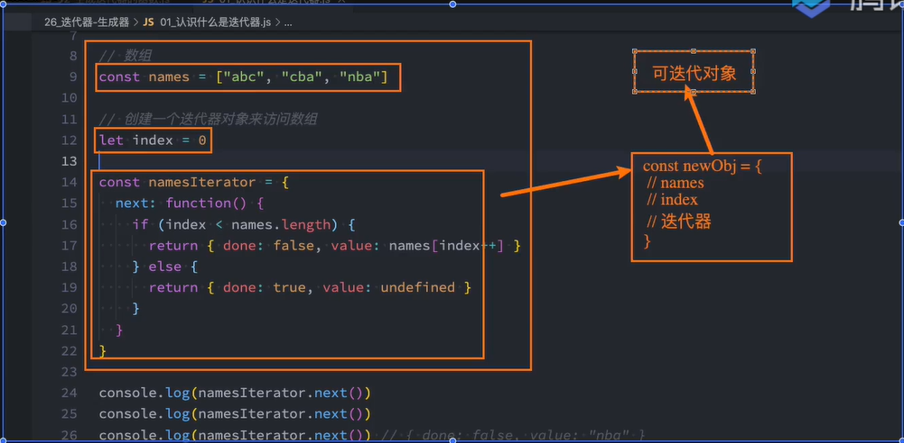

## 什么是迭代器？

迭代器（iterator），是确使用户可在容器对象（container，例如链表或数组）上遍访的对象，使用该接口无需关心对象的内部实现细节。其行为像数据库中的光标，迭代器最早出现在1974年设计的CLU编程语言中，在各种编程语言的实现中，迭代器的实现方式各不相同，但是基本都有迭代器，比如Java、Python等；

从迭代器的定义我们可以看出来，迭代器是帮助我们对某个数据结构进行遍历的一个对象，并且迭代器本身就是一个对象。

在JavaScript中，迭代器也是一个具体的对象，这个对象需要符合迭代器协议（iterator protocol）：

- 迭代器协议定义了产生一系列值（无论是有限的还是无限的）的标准方式；

- 在js中这个标准的方式就是一个特定的next方法；

next方法有如下的要求：

- 一个无参数或者有一个参数的函数（generator），返回一个应当拥有以下两个属性的对象：
  - done（boolean）
    - 如果迭代器可以产生序列中的下一个值，则为`false`。（这等价于没有指定`done`这个属性。）
    - 如果迭代器已将序列迭代完毕，则为 true。这种情况下，value 是可选的，如果它依然存在，即为迭代结束之后的默认返回值。

  - value
    - 迭代器返回的任何 JavaScript 值。done 为 true 时可省略。


迭代器对象：

```js
const iterator = {
  next: function () {
    return { done: true, value: 123 }
  }
}
```

但是这个迭代器不能迭代对象，那 怎么能迭代一个对象呢

```js
const names = ['abc', 'cba', 'nba'];
// 以前我们可能是这样遍历它
for(let i = 0; i < names.length; i++) {
    console.log(names[i])
}
```

但是我们可以有一种新的方式来迭代对象，它的内部可能是这个样子

```js
// 伪代码
const namesIterator = {
    next: function () {
      // 第一次返回
        return { done: false, value: 'abc' }
      // 第二次返回
        return { done: false, value: 'cba' }
      // 第三次返回
        return { done: false, value: 'nba' }
      // 第四次返回
        return {
            done: true,	// 访问完了以后才为true
            value: undefined	// 最后一次为undefined
        }
    }
}

const names = ['abc', 'cba', 'nba'];
let index = 0;
// 那么就可以这样写了
const namesIterator = {
    
    return {
        next: function () {
            if(index < arr.length) {
                return {done: false, value: arr[index++]}
            }else {
                return {done: true, value: undefined}
            }
        }
    }
}
```

所以给数组写一个迭代器

```js
const names = ['abc', 'cba', 'nba'];
let index = 0;
// 那么就可以这样写了
const namesIterator = {
  next: function () {
      if(index < names.length) {
          return {done: false, value: names[index++]}
      }else {
          return {done: true, value: undefined}
      }
  }
}
console.log(namesIterator.next())
console.log(namesIterator.next())
console.log(namesIterator.next())
console.log(namesIterator.next())

// { done: false, value: 'abc' }
// { done: false, value: 'cba' }
// { done: false, value: 'nba' }
// { done: true, value: undefined }
```

当访问完了以后，再访问的话，value就是undefined, 并且done是true，这样我们就实现了一个迭代器对象，可以将数组进行迭代

上面写的迭代器是一个names的迭代器，也就是说，这个迭代器只能针对前面的names这个对象，那如果有另外的对象呢？比如：

```js
const nums = [10, 20, 30, 40];
```

我们可能又要写一个类似上面的迭代器，那么我们可以写一个针对所有数组的迭代器，所以可以把迭代器封装一下

```js

const names = ['abc', 'cba', 'nba'];
const nums = [10, 20, 30, 40];
function createArrayIterator(arr) {
    let index = 0;
    return {
        next: function () {
            if(index < arr.length) {
                return {done: false, value: arr[index++]}
            }else {
                return {done: true, value: undefined}
            }
        }
    }
}

const namesIterator = createArrayIterator(names);	// 拿到names的迭代器对象
console.log(namesIterator.next());
console.log(namesIterator.next());
console.log(namesIterator.next());
console.log(namesIterator.next());

const numsIterator = createArrayIterator(nums) // 拿到nums的迭代器对象
console.log(numsIterator.next());
console.log(numsIterator.next());
console.log(numsIterator.next());
console.log(numsIterator.next());
console.log(numsIterator.next());

// { done: false, value: 'abc' }
// { done: false, value: 'cba' }
// { done: false, value: 'nba' }
// { done: true, value: undefined }
// { done: false, value: 10 }
// { done: false, value: 20 }
// { done: false, value: 30 }
// { done: false, value: 40 }
// { done: true, value: undefined }
```

那么上面的函数，就可以帮助我们生成一个迭代器对象了,但是这些迭代器都是一个有限的迭代器，但是我们也可以创建无限的迭代器

```js
const nums = [10, 20, 30, 40];
function createNumberIterator(){
    let index = 0
    return {
        next: function () {
            return {
                done: false, value: index++
            }
        }
    }
}

const namesIterator = createNumberIterator(nums);	// 拿到names的迭代器对象
console.log(namesIterator.next());
console.log(namesIterator.next());
console.log(namesIterator.next());
console.log(namesIterator.next());
console.log(namesIterator.next());
console.log(namesIterator.next());

// { done: false, value: 0 }
// { done: false, value: 1 }
// { done: false, value: 2 }
// { done: false, value: 3 }
// { done: false, value: 4 }
// { done: false, value: 5 }
```

不管调多少次next，他都是false，这个时候，这个迭代器，他就是一个无限的迭代器

无限的迭代器是比较少的，因为迭代器出现的目的就是为了迭代一个容器对象，这个容器对象无限的话，还是比较少的


## 可迭代对象

但是上面的代码整体来说看起来是有点奇怪的：

- 我们获取一个数组的时候，需要自己创建一个index变量，再创建一个所谓的迭代器对象；
- 事实上我们可以对上面的代码进行进一步的封装，让其变成一个可迭代对象；

什么又是可迭代对象呢？

- 它和迭代器是不同的概念；
- 当一个对象实现了iterable protocol协议时，它就是一个可迭代对象；
- 这个对象的要求是必须实现 @@iterator 方法，在代码中我们使用 Symbol.iterator 访问该属性；

当我们要问一个问题，我们转成这样的一个东西有什么好处呢？

- 当一个对象变成一个可迭代对象的时候，进行某些迭代操作，比如 for...of 操作时，其实就会调用它的 @@iterator 方法；



把这三个东西封装到一个对象里面，这个对象称之为可迭代对象

迭代器：

迭代器是一个对象，符合迭代器协议 (iterator protocol),必须实现next函数

```js
// 迭代器
const iterator = {next: function() {}}
```

可迭代对象:

可迭代对象也是一个对象，符合可迭代协议(iterable protocal),必须实现@@iterator方法

```js
// 实现@@iterator方法，在js中就是实现[Symbol.iterator]函数
const iterableObj = { [Symbol.iterator]: function () { return 迭代器}}
```

迭代器和可迭代对象的区别：

迭代器是一个实现了next方法的对象，实现的next返回一个对象，该对象包含value和done

可迭代对象实现了一个方法（Symbol.iterator），该方法返回一个迭代器

可迭代对象代码：

```js
const iterableObj = {
  names: ['abc', 'cba', 'nba'],
  [Symbol.iterator]: function () {
    let index = 0;
    return {
      // 这个函数需要是一个箭头函数，里面的this才指向iterableObj这个对象
      next: () => {
        if(index < this.names.length) {
          return {done: false, value: this.names[index++]};
        }else {
          return {done: true, value: undefined};
        }
      }
    }
  }
}

// iterableObj对象就是一个可迭代对象
console.log(iterableObj[Symbol.iterator])

// 获得迭代器
let iterator = iterableObj[Symbol.iterator]();
console.log(iterator.next());
console.log(iterator.next());
console.log(iterator.next());
console.log(iterator.next());

// [Function: [Symbol.iterator]]
// { done: false, value: 'abc' }
// { done: false, value: 'cba' }
// { done: false, value: 'nba' }
// { done: true, value: undefined }

// 每次调用都是生成一个新的迭代器
let iterator1 = iterableObj[Symbol.iterator];
console.log(iterator1.next());
console.log(iterator1.next());
console.log(iterator1.next());
console.log(iterator1.next());
// { done: false, value: 'abc' }
// { done: false, value: 'cba' }
// { done: false, value: 'nba' }
// { done: true, value: undefined }
```

上面实现了一个可迭代对象,变成一个可迭代对象有什么用呢？for...of可以遍历的东西必须是一个可迭代对象

```js
const obj = {
    name: 'why',
    age: 18
}

// 假设有一个对象，我们想用for...of来遍历
// 但是对象是不支持for...of 的，
// 为什么不支持呢
// 因为对象不是可迭代对象, 所以不支持
for(const item of obj) {
    
}
```

那如果把我们上面封装的对象放到for...of里面呢?

```js
const iterableObj = {
  names: ['abc', 'cba', 'nba'],
  [Symbol.iterator]: function () {
    let index = 0;
    return {
      // 这个函数需要是一个箭头函数，里面的this才指向iterableObj这个对象
      next: () => {
        if(index < this.names.length) {
          return {done: false, value: this.names[index++]};
        }else {
          return {done: true, value: undefined};
        }
      }
    }
  }
}

// 实现了一个可迭代对象后，就可以使用for...of来遍历
// 注意for...of不能遍历对象，但是当前iterableObj是一个对象，但是我们把它变成了可迭代对象，所以我们可以遍历它
for(const item of iterableObj) {
    console.log(item)	// 可以打印
}

// abc
// cba
// nba
```


## 原生迭代器对象

事实上我们平时创建的很多原生对象已经实现了可迭代协议，会生成一个迭代器对象的：

- String、Array、Map、Set、arguments对象、NodeList集合；

字符串的迭代器

```js
const str = 'Hello World'
console.log(str[Symbol.iterator])
for(const s of str) {
  console.log(s)
}
// [Function: [Symbol.iterator]]
// H
// e
// l
// ... 
```

数组的迭代器

```js
// 这个数组实际上是由 new Array创建的，创建出来的那一刻就是可迭代对象
// 数组本身是一个可迭代对象
// 这个对象里面实际上就有 names[Symbol.iterator]
const names = ['abc', 'cba', 'nba']

// 获取可迭代的函数
console.log(names[Symbol.iterator])

// 调用可迭代函数，获取到迭代器
const iterator = names[Symbol.iterator]()
console.log(iterator.next())
console.log(iterator.next())
console.log(iterator.next())
console.log(iterator.next())

// [Function: values]
// { value: 'abc', done: false }
// { value: 'cba', done: false }
// { value: 'nba', done: false }
// { value: undefined, done: true }
```

所以数组本身就是一个可迭代对象，这就解释了，为什么for...of可以遍历数组

map/set迭代器

```js
// map/set
const set = new Set()
set.add(10)
set.add(100)
for(const item of set){
	console.log(item)
}

console.log(set[Symbol.iterator])	// 他也是一个函数，返回值是一个迭代器
// 10
// 100
// [Function: values]
```

所以，set和map之所以能通过for...of来遍历也是因为它是可迭代对象

函数值中arguments迭代器

```js
function foo(x, y, z){
    console.log(arguments[Symbol.iterator])
    for(const item of arguments){
        console.log(item)
    }
}
foo(10, 20, 30)
// [Function: values]
// 10
// 20
// 30
```


## 可迭代对象的应用

那么这些东西可以被用在哪里呢？

- JavaScript中语法：for ...of、展开语法（spread syntax）、yield*（后面讲）、解构赋值（Destructuring_assignment）；
- 创建一些对象时：new Map([Iterable])、new WeakMap([iterable])、new Set([iterable])、new WeakSet([iterable]);
- 一些方法的调用：Promise.all(iterable)、Promise.race(iterable)、Array.from(iterable);

数组展开语法

```js
// 展开语法
const iterableObj = {
    names: ['abc', 'cba', 'nba'],
    [Symbol.iterator]: function() {
        let index = 0;
        return {
            next: () => {
                if(index < this.names.length) {
                    return {
                        done: false, 
                        value: this.names[index++]
                    }
                }else {
                    return {
                        done: true,
                        value: undefined
                    }
                }
            }
        }
    }
}

const names = ['abc', 'cba', 'nba'];	
// 正常来讲我们可以对names做展开运算符，但是其实之所以能对它做展开运算符的操作就是因为它是一个可迭代对象，那我们自己实现的可迭代对象实际上也可以做展开运算，也是因为我们实现了可迭代对象的协议
const newNames = [...names, ...iterableObj];
console.log(newNames)
// [ 'abc', 'cba', 'nba', 'abc', 'cba', 'nba' ]
```


对象展开语法不是通过迭代器实现

```js
const obj  = {name: 'why', age: 18}
for(const item of obj){
    
} // 对象是不可以for...of遍历的
const newObj = {...obj}	// 对象是可以进行展开运算符的,但是用的不是迭代器

// 那么为什么对象不可以通过for遍历，却可以使用展开运算符呢
// ES9(ES2018) 新增了一个特性，要求在对象中是可以使用展开运算符的
// 但是在迭代器中，是不可以使用展开运算符的，所以它的底层压根使用的就不是迭代器
```

解构语法

```js
const [name1, name2] = names 	// 迭代器实现的
const {name, age} = obj	// 非迭代器实现的，新增的特性
```

创建一些其他对象时，让我们传入的是可迭代对象

```js
const set1 = new Set(iterableObj);	// 需要传入可迭代对象
const set new Set([1,  2, 3]);
// 上面都是可迭代对象

const arr1 = Array.from(arguments)	// 将arguments转成数组
// Array.from接收的也是一个可迭代对象

// promise.all 接收的也是也是一个可迭代对象，它会将每一个值包裹成promise，然后执行.then
Promise.all(iterableObj).then(res => {
    console.log(res)
})
```

这些就是常见的可迭代对象场景


## 自定义类的迭代

在前面我们看到Array、Set、String、Map等类创建出来的对象都是可迭代对象：

- 在面向对象开发中，我们可以通过class定义一个自己的类，这个类可以创建很多的对象：
- 如果我们也希望自己的类创建出来的对象默认是可迭代的，那么在设计类的时候我们就可以添加上 @@iterator 方法；

案例：创建一个classroom的类

- 教室中有自己的位置、名称、当前教室的学生；
- 这个教室可以进来新学生（push）；
- 创建的教室对象是可迭代对象；

```js
class Person{ }
const p1 = new Person()
const p2 = new Person()
const p3 = new Person()

for(const item of p1){}
// 我们自己创建的类不是一个可迭代对象
// 但是我们希望它是可迭代对象
```

给类新增迭代器

```js
class ClassRoom{
  constructor(address, name, students) {
      this.address = address;
      this.anme = name;
      this.students = students;
  }
  entry(newStudent) {
      this.students.push(newStudent)
  }

  // 所以要这样写
  [Symbol.iterator]() {
    let index = 0;
    return {
      next:() => {
        if(index < this.students.length) {
          return {
            value: this.students[index++],
            done: false
          }
        }else {
          return{
            value: undefined,
            done: true
          }
        }
      }
    }
  }
}
const classRoom = new ClassRoom('3幢5楼200', '计算机教室', ['james', 'curry', 'wts'])
console.log('创建成功的类', classRoom)
classRoom.entry('lilei');

// 这里迭代的是students的值，因为这个类实现的迭代器返回的是students的值
for(const item of classRoom){
  console.log('遍历classRoom:', item)
}  

// 创建成功的类 ClassRoom {
//   address: '3幢5楼200',
//   anme: '计算机教室',
//   students: [ 'james', 'curry', 'wts' ]
// }
// 遍历classRoom: james
// 遍历classRoom: curry
// 遍历classRoom: wts
// 遍历classRoom: lilei
```

假如我们在某种情况下把迭代器停掉该怎么办？


## 迭代器的中断

迭代器在某些情况下会在没有完全迭代的情况下中断：

- 比如遍历的过程中通过break、continue、return、throw中断了循环操作；
- 比如在解构的时候，没有解构所有的值；

那么这个时候我们想要监听中断的话，可以添加return方法：

```js
class ClassRoom {
  constructor(address, name, students) {
    this.address = address;
    this.anme = name;
    this.students = students;
  }
  entry(newStudent) {
    this.students.push(newStudent);
  }
  [Symbol.iterator]() {
    let index = 0;
    return {
      next: () => {
        if (index < this.students.length) {
          return {
            value: this.students[index++],
            done: false,
          };
        } else {
          return {
            value: undefined,
            done: true,
          };
        }
      },
      // 因为是迭代器停掉了，所以在迭代器监听的
      return: () => {
        console.log("迭代器提前终止了");
        return { done: true, value: undefined };
      },
    };
  }
}

const classRoom1 = new ClassRoom("3幢5楼200", "计算机教室", [
  "james",
  "curry",
  "wts",
]);
const classRoom2 = new ClassRoom("3幢5楼200", "计算机教室", [
  "haha",
  "www",
  "heihei",
]);
classRoom2.entry("lilei");
for (const item of classRoom1) {
  console.log(item);
}

for (const item of classRoom2) {
  console.log(item);
  if (item === "www") break;	// 终止了迭代器
}
// james
// curry
// wts

// haha
// www
// 迭代器提前终止了
```

> 注意：注意是因为这个return函数是有要求的，要求我们的return对象返回的应该也是一个对象，并且有done和value，否则会报错
>
> ```js
> return: () => {
>     console.log('迭代器停止了')
>     return {done: true, value: undefined}
> }
> ```
>
> 


## 什么是生成器？ 

生成器是ES6中新增的一种函数控制、使用的方案，它可以让我们更加灵活的控制函数什么时候继续执行、暂停执行等。

生成器是跟函数有关系的，迭代器是跟对象有关系的。

生成器函数也是一个函数，但是和普通的函数有一些区别：

- 首先，生成器函数需要在function的后面加一个符号：*
- 其次，生成器函数可以通过yield关键字来控制函数的执行流程：
- 最后，生成器函数的返回值是一个Generator（生成器）：
  - 生成器事实上是一种特殊的迭代器；
  - MDN：Instead, they return a special type of iterator, called a Generator.

在函数中，正常代码会直接从上往下执行

```js
function foo() {
  const value1 = 100
  console.log(value1)
  
  const value2 = 200
  console.log(value2)
  
  const value3 = 300
  console.log(value3)
}
foo()

// 100
// 200
// 300
```

现在提一个要求:

在执行到第二行和第三行的时候，暂停一下，不要往后执行了,可以return，但是后面的代码永远执行不到了，但是要求是暂停，暂停之后是可以恢复的。

这个时候就需要生成器来执行了，用生成器就可以精准的控制什么时候继续执行，什么时候暂停执行

生成器是和函数结合在一起的，生成器函数通常有一个结果，它返回的结果才叫生成器

```js
function* foo() {
  
}
```

函数生成器对象可以这样来写

```js
function* foo() {
  console.log('函数开始执行')

  const value1 = 100
  console.log('value1', value1)
  yield

  const value2 = 200
  console.log('value2', value2)
  yield

  const value3 = 300
  console.log('value3', value3)
  yield

  console.log('函数执行结束')
}
foo()	// 调用后没有任何打印
```

我们发现上面的生成器函数foo的执行体压根没有执行，函数调用以后没有任何打印，这是因为，它只是返回了一个生成器对象（迭代器，生成器是特殊的迭代器）。那么我们如何可以让它执行函数中的东西呢？调用next即可；

```js
function* foo() {
  // 第一段代码
  console.log('函数开始执行')
  const value1 = 100
  console.log('value1', value1)
  yield

  // 第二段代码
  const value2 = 200
  console.log('value2', value2)
  yield

  // 第三段代码
  const value3 = 300
  console.log('value3', value3)
  yield

  // 第四段代码
  console.log('函数执行结束')
}
// 生成器对象
const generator = foo()
generator.next()

// 函数开始执行
// value1 100
```

可以发现，上面调用了一个next，执行了第一段代码，然后代码就暂停了，如果我们想执行所有的代码那么

```js
function* foo() {
  // 第一段代码
  console.log('函数开始执行')
  const value1 = 100
  console.log('value1', value1)
  yield

  // 第二段代码
  const value2 = 200
  console.log('value2', value2)
  yield

  // 第三段代码
  const value3 = 300
  console.log('value3', value3)
  yield

  // 第四段代码
  console.log('函数执行结束')
}
const generator = foo()
generator.next()  // 执行第一段代码
generator.next()  // 执行第二段代码
generator.next()  // 执行第三段代码
generator.next()  // 执行第四段代码

// 函数开始执行
// value1 100
// value2 200
// value3 300
// 函数执行结束
```

迭代器在前面讲的时候我们说过它的next是有返回值的， 返回的是一个对象 {done: true, value: undefiend} 这种对象

那么生成器有没有返回值呢？

```js
function* foo() {
  // 第一段代码
  console.log('函数开始执行')
  const value1 = 100
  console.log('value1', value1)
  yield

  // 第二段代码
  const value2 = 200
  console.log('value2', value2)
  yield

  // 第三段代码
  const value3 = 300
  console.log('value3', value3)
  yield

  // 第四段代码
  console.log('函数执行结束')
}
const generator = foo()
console.log(generator.next())  // 执行第一段代码
console.log(generator.next())  // 执行第二段代码
console.log(generator.next())  // 执行第三段代码
console.log(generator.next())  // 执行第四段代码

// 函数开始执行
// value1 100
// { value: undefined, done: false }
// value2 200
// { value: undefined, done: false }
// value3 300
// { value: undefined, done: false }
// 函数执行结束
// { value: undefined, done: true }
```

但是我们很多时候不希望next返回的是一个undefined，这个时候我们可以通过yield来返回结果

```js
function* foo() {
  // 第一段代码
  console.log('函数开始执行')
  const value1 = 100
  console.log('value1', value1)
  yield 'value1'

  // 第二段代码
  const value2 = 200
  console.log('value2', value2)
  yield 'value2'

  // 第三段代码
  const value3 = 300
  console.log('value3', value3)
  yield 'value3'

  // 第四段代码
  console.log('函数执行结束')
  return 'value4'
}
const generator = foo()
console.log(generator.next())  // 执行第一段代码
console.log(generator.next())  // 执行第二段代码
console.log(generator.next())  // 执行第三段代码
console.log(generator.next())  // 执行第四段代码

// 函数开始执行
// value1 100
// { value: 'value1', done: false }
// value2 200
// { value: 'value2', done: false }
// value3 300
// { value: 'value3', done: false }
// 函数执行结束
// { value: 'value4', done: true }
```

调用next函数的返回值是通过**yield**后面的值来传递的，但是注意，最后一个next的返回值是通过**return**传递的，如果没有返回值默认**return undefined**{value: undefined, done: true}。

注意：yield 也可以是一个表达式，比如 yield value1 * 10

注意：这里代码的执行顺序是，先执行代码段，再执行next函数的返回值，再接着执行代码段

注意：当我们的生成器函数，如果遇到yield，它会暂停函数的执行，直到调用下一次next方法，再执行下一段代码

注意：如果遇到了return，它会整个函数停掉了，并且调用的next函数返回的done变成true，下面的所有的yield都不会执行了

```js
function* foo() {
  // 第一段代码
  console.log('函数开始执行')
  const value1 = 100
  console.log('value1', value1)
  return '停掉了整个函数'
  
 	yield value1 * 10
  
  // 第二段代码
  const value2 = 200
  console.log('value2', value2)
  yield 'value2'

  // 第三段代码
  const value3 = 300
  console.log('value3', value3)
  yield 'value3'

  // 第四段代码
  console.log('函数执行结束')
  return 'value4'
}
const generator = foo()
console.log(generator.next())  // 执行第一段代码
console.log(generator.next())  // 执行第二段代码
console.log(generator.next())  // 执行第三段代码
console.log(generator.next())  // 执行第四段代码

// 函数开始执行
// value1 100
// { value: '停掉了整个函数', done: true }
// { value: undefined, done: true }
// { value: undefined, done: true }
// { value: undefined, done: true }
```

yield返回值

```js
function* foo() {
  // 第一段代码
  console.log('函数开始执行')
  const value1 = 100
  console.log('value1', value1)
 	yield value1 * 10
  
  // 第二段代码
  const value2 = 200
  console.log('value2', value2)
  yield 'value2'

  // 第三段代码
  const value3 = 300
  console.log('value3', value3)
  yield 'value3'

  // 第四段代码
  console.log('函数执行结束')
  return 'value4'
}
const generator = foo()
console.log(generator.next())  // 执行第一段代码
console.log(generator.next())  // 执行第二段代码
console.log(generator.next())  // 执行第三段代码
console.log(generator.next())  // 执行第四段代码

// 函数开始执行
// value1 100
// { value: 1000, done: false }
// value2 200
// { value: 'value2', done: false }
// value3 300
// { value: 'value3', done: false }
// 函数执行结束
// { value: 'value4', done: true }
```


## 生成器传递参数 – next函数

函数既然可以暂停来分段执行，那么函数应该是可以传递参数的，我们是否可以给每个分段来传递参数呢？

- 我们在调用next函数的时候，可以给它传递参数，那么这个参数会作为上一个yield语句的返回值；
- 注意：也就是说我们是为本次的函数代码块执行提供了一个值；

```js
function* foo() {
  let v1 = yield 'value1'	// 调用第二个next方法时传的值赋给v1了
  console.log('v1', v1)

  let v2 = yield 'value2'	// 调用第三个next方法时传的值赋给v2了
  console.log('v2', v2)

  let v3 = yield 'value3'	// 调用第四个next方法时传的值赋给v3了
  console.log('v3', v3)
}
const generator = foo()
console.log(generator.next()) // 注意：这个无法传值，传值也不会被接收
console.log(generator.next('v1的值'))
console.log(generator.next('v2的值'))
console.log(generator.next('v3的值'))

// { value: 'value1', done: false }
// v1 v1的值
// { value: 'value2', done: false }
// v2 v2的值
// { value: 'value3', done: false }
// v3 v3的值
// { value: undefined, done: true }
```

那么第一段代码怎么传呢？

首先第一段代码，一般很少给他传递参数，如果非要传参数的话，我们在调用foo的时候可以传递进来

```js
function* foo(v0) {
  console.log('v0', v0)
  let v1 = yield 'value1'
  console.log('v1', v1)

  let v2 = yield 'value2'
  console.log('v2', v2)

  let v3 = yield 'value3'
  console.log('v3', v3)
}
const generator = foo('v0的值')
console.log(generator.next()) // 注意：这个无法传值，传值也不会被接收
console.log(generator.next('v1的值'))
console.log(generator.next('v2的值'))
console.log(generator.next('v3的值'))

// v0 v0的值
// { value: 'value1', done: false }
// v1 v1的值
// { value: 'value2', done: false }
// v2 v2的值
// { value: 'value3', done: false }
// v3 v3的值
// { value: undefined, done: true }
```


## 生成器提前结束 – return函数

还有一个可以给生成器函数传递参数的方法是通过return函数：

- return传值后这个生成器函数就会结束，之后调用next不会继续生成值了

```js

function* foo(num) { 
  const value1 = 100 * num
  console.log('第一段代码执行', value1);
  const n = yield value1;
  
  console.log('n', n)
  
  // generator.return(30)是在第一个next之后调用的，所以相当于是在这里加了 return n
  // 这个n是return传的参数，实际上和next传参一样，也是从上面一个yield的返回值中拿到这个n的

  const value2 = 200 * n;
  console.log('第二段代码执行', value2)
  const count = yield value2;
}

const generator = foo(10);
console.log(generator.next());	// { value: 1000, done: false }
console.log(generator.return(30))	// { value: 30, done: true }

// 并且以后的代码都会终止掉
console.log(generator.next()); // {value: undefined, done: true}
```


## 生成器抛出异常 – throw函数

除了给生成器函数内部传递参数之外，也可以给生成器函数内部抛出异常：

- 抛出异常后我们可以在生成器函数中捕获异常；
- 但是在catch语句中不能继续yield新的值了，但是可以在catch语句外使用yield继续中断函数的执行；

```js
function* foo() {
  console.log('函数开始了')

  let v1 = yield 'value1'
  console.log('第二段代码', v1)

  let v2 = yield 'value2'
  console.log('第三段代码', v2)
}

let generator = foo()

console.log(generator.next())
console.log(generator.throw(10))
console.log(generator.next(20))

// 函数开始了
// { value: 'value1', done: false }

// /Users/shan/data/JS高级/课堂资料day01_32/课堂/code/exerice/exerice.js:4
//   let v1 = yield 'value1'
//            ^
// 10
// (Use `node --trace-uncaught ...` to show where the exception was thrown)

// Node.js v18.16.0
```

可以发现报错了，既然报错了，那么我们可以捕获错误

```js
function* foo() {
  console.log('函数开始了')
  try{
    console.log('捕获的yield前')
    let v1 = yield 'value1'
    console.log('捕获的yield后', v1)
  } catch(err) {
    console.log('catch中的yield前', err)
    let v2 = yield 'catch中的yield'
    console.log('catch中的yield后', v2)
  }
  let v3 = yield 'value3'
  console.log('第三段代码', v3)
}

let generator = foo()

console.log(generator.next())
console.log(generator.throw(10))
console.log(generator.next(20))
console.log(generator.next(30))

// 函数开始了
// 捕获的yield前
// { value: 'value1', done: false }
// catch中的yield前 10
// { value: 'catch中的yield', done: false }
// catch中的yield后 20
// { value: 'value3', done: false }
// 第三段代码 30
// { value: undefined, done: true }
```

注意：上面那段generator.throw(10)这段代码怎么理解呢？调用next执行第一段代码，这个时候代码暂停了，接着调用了throw，立即停止执行下面的代码并且抛出错误，然后在catch中捕获了错误，然后执行第二个yield前的代码。

throw的应用场景

```js
const result = generator.next()
if (result.value !== 200) {
  console.log(generator.throw('error message'))
}
```

假如上面的结果我不满意，那么我可以终止掉这段代码


## 生成器替代迭代器

我们发现生成器是一种特殊的迭代器，那么在某些情况下我们可以使用生成器来替代迭代器：

首先我们自己创建的迭代器

```js
function createArrayIterator(arr) {
  let index = 0
  return {
    next: function() {
      if (index < arr.length) {
        return { done: false, value: arr[index++] }
      } else {
        return { done: true, value: undefined }
      }
    }
  }
}
const names = ['abc', 'cba', 'nba']
const nameIterator = createArrayIterator(names)	// 返回一个迭代器

console.log(nameIterator.next())
console.log(nameIterator.next())
console.log(nameIterator.next())
console.log(nameIterator.next())

// { done: false, value: 'abc' }
// { done: false, value: 'cba' }
// { done: false, value: 'nba' }
// { done: true, value: undefined }
```

用生成器来替代迭代器，那么我们能不能让这个函数返回一个生成器呢？

因为生成器返回的对象可以调next

```js
function* createArrayIterator(arr) {
  let index = 0
  yield arr[index++]
  yield arr[index++]
  yield arr[index++]
}
const names = ['abc', 'cba', 'nba']
const nameIterator = createArrayIterator(names)	// 返回一个生成器

console.log(nameIterator.next())
console.log(nameIterator.next())
console.log(nameIterator.next())
console.log(nameIterator.next())

// { value: 'abc', done: false }
// { value: 'cba', done: false }
// { value: 'nba', done: false }
// { value: undefined, done: true }
```

哪怕是这样也可以

```js
function* createArrayIterator(arr) {
  yield 'abc'
  yield 'cba'
  yield 'nba'
}
const names = ['abc', 'cba', 'nba']
const nameIterator = createArrayIterator(names)	// 返回一个生成器

console.log(nameIterator.next())
console.log(nameIterator.next())
console.log(nameIterator.next())
console.log(nameIterator.next())

// { value: 'abc', done: false }
// { value: 'cba', done: false }
// { value: 'nba', done: false }
// { value: undefined, done: true }
```

不过最好这样

```js
function* createArrayIterator(arr) {
  for(let i = 0; i < arr.length; i++) {
    yield arr[i]
  }
}
const names = ['abc', 'cba', 'nba']
const nameIterator = createArrayIterator(names)

console.log(nameIterator.next())
console.log(nameIterator.next())
console.log(nameIterator.next())
console.log(nameIterator.next())

// { value: 'abc', done: false }
// { value: 'cba', done: false }
// { value: 'nba', done: false }
// { value: undefined, done: true }
```

事实上我们还可以使用yield*来生产一个可迭代对象，相当于是一种yield的语法糖，只不过会依次迭代这个可迭代对象，每次迭代其中的一个值；

```js
function* createArrayIterator(arr) {
  yield* arr	// yield* 后面必须跟一个可迭代对象
}
const names = ['abc', 'cba', 'nba']
const nameIterator = createArrayIterator(names)

console.log(nameIterator.next())
console.log(nameIterator.next())
console.log(nameIterator.next())
console.log(nameIterator.next())

// { value: 'abc', done: false }
// { value: 'cba', done: false }
// { value: 'nba', done: false }
// { value: undefined, done: true }
```

这种写法相当于for循环的语法糖

如果有一个需求，让我们创建一个函数，这个函数可以迭代一个范围内的数字

迭代器实现：

```js
function createRangeIterator(start, end) {
  let index = start
  return {
    next: function () {
      if (index < end) {
        return { done: false, value: index++}
      } else {
        return {done: true, value: undefined}
      }
    }
  }
}
const nameIterator = createRangeIterator(10, 20)

console.log(nameIterator.next())
console.log(nameIterator.next())
console.log(nameIterator.next())
console.log(nameIterator.next())

// { done: false, value: 10 }
// { done: false, value: 11 }
// { done: false, value: 12 }
// { done: false, value: 13 }
```

生成器实现

```js
function* createRangeIterator(start, end) {
  let index = start
	while(index < end) {
    yield index++
  }
}
const nameIterator = createRangeIterator(10, 20)

console.log(nameIterator.next())
console.log(nameIterator.next())
console.log(nameIterator.next())
console.log(nameIterator.next())

// { value: 10, done: false }
// { value: 11, done: false }
// { value: 12, done: false }
// { value: 13, done: false }
```


## 自定义类迭代 – 生成器实现

我们原来是这样写的

```js
class ClassRoom {
  constructor(address, name, students) {
    this.address = address;
    this.anme = name;
    this.students = students;
  }
  entry(newStudent) {
    this.students.push(newStudent);
  }
  [Symbol.iterator]() {
    let index = 0;
    return {
      next: () => {
        if (index < this.students.length) {
          return {
            value: this.students[index++],
            done: false,
          };
        } else {
          return {
            value: undefined,
            done: true,
          };
        }
      },
      return: () => {
        console.log("迭代器提前终止了");
        return { done: true, value: undefined };
      },
    };
  }
}

const classRoom1 = new ClassRoom("3幢5楼200", "计算机教室", [
  "james",
  "curry",
  "wts",
]);
const classRoom2 = new ClassRoom("3幢5楼200", "计算机教室", [
  "haha",
  "www",
  "heihei",
]);
classRoom2.entry("lilei");
for (const item of classRoom1) {
  console.log(item);
}

for (const item of classRoom2) {
  console.log(item);
  if (item === "www") break;	// 终止了迭代器
}
// james
// curry
// wts

// haha
// www
// 迭代器提前终止了
```

> 在类中写函数的方法拓展
>
> ```js
> class Person {
>   	// 方案一：
>   	foo = function () {}
>   	// 方案二
>   	foo = () => {}
> }
> ```
>
> 

symbol可以这样写

```js
class ClassRoom {
  // ...
  [Symbol.iterator] = function* () {}
}
```

在之前的自定义类迭代中，我们也可以换成生成器：

```js
class ClassRoom {
  constructor(address, name, students) {
    this.address = address;
    this.anme = name;
    this.students = students;
  }
  entry(newStudent) {
    this.students.push(newStudent);
  }
  *[Symbol.iterator]() {
    yield* this.students
  }
}

const classRoom1 = new ClassRoom("3幢5楼200", "计算机教室", [
  "james",
  "curry",
  "wts",
]);
const classRoom2 = new ClassRoom("3幢5楼200", "计算机教室", [
  "haha",
  "www",
  "heihei",
]);
classRoom2.entry("lilei");
for (const item of classRoom1) {
  console.log(item);
}

for (const item of classRoom2) {
  console.log(item);
  if (item === "www") break;	// 终止了迭代器
}
// james
// curry
// wts

// haha
// www
// 迭代器提前终止了
```

这里迭代的是class类实例


## 对生成器的操作

既然生成器是一个迭代器，那么我们可以对其进行如下的操作：

```js
function* createArrayIterator(arr) {
  yield* arr
}
const names = ['abc', 'cba', 'nba']

const namesIterator1 = createArrayIterator(names)	// 这里是一个生成器
for(const item of namesIterator1) {
  console.log(item)
}
// abc
// cba
// nba

const set = new Set(namesIterator1)	// 接收一个迭代器
console.log(set)  // Set(0) {}

Promise.all(namesIterator1).then(res => {
  console.log(res)  // []
})
```


## 异步处理方案

学完了我们前面的Promise、生成器等，我们目前来看一下异步代码的最终处理方案。

这个是我们以前处理异步的方案

```js
// request.js
function requestData(url,) {
  // 异步请求的代码会被放入到executor中
   //给别人返回一个承诺 
  return new Promise((resolve, reject) => {
    // 模拟网络请求
    setTimeout(() => {
      // 拿到请求的结果
      // url传入的是coderwhy, 请求成功
      if (url === "coderwhy") {
        // 成功
        let names = ["abc", "cba", "nba"]
        resolve(names)
      } else { // 否则请求失败
        // 失败
        let errMessage = "请求失败, url错误"
        reject(errMessage)
      }
    }, 3000);
  })
}
```

又比如，你给我一个url，2秒后给你一个什么东西

```js
// request.js
function requestData(url) {
  return new Promise((resolve, reject) => {
    setTimeout(() => {
      resolve(url)
    }, 3000);
  })
}
requestData('coderwts').then(res => {
  console.log(res)
})
```

需求：

- 我们需要向服务器发送网络请求获取数据，一共需要发送三次请求；
- 第二次的请求url依赖于第一次的结果；
- 第三次的请求url依赖于第二次的结果；
- 依次类推；

例如这种:

```js
1. url: wts -> res: wts
2. url: res + 'aaa' -> res: wtsaaa
3. url: res + 'bbb' -> res: wtsaaabbb
```

如果按照上面那种需求的话，我们可能要这样写，这种也被称为回调地狱

```js
function requestData(url) {
  return new Promise((resolve, reject) => {
    setTimeout(() => {
      resolve(url)
    }, 3000);
  })
}

// 方案一：
function getData() {
  requestData('wts').then(res1 => {
    requestData(res1 + 'aaa').then(res2 => {
      requestData(res2 + 'bbb').then(res3 => {
        console.log('res3:', res3)
      })
    })
  })
}
getData() // res3: wtsaaabbb

// 方案二：
function getData() {
  requestData('wts').then(res1 => {
    // 前面讲过，这里return函数实际是一个promise，并且then里面如果有then，那么里面的then会替代外层的then
    return requestData(res1 + 'aaa')
  }).then(res2 => {
    return requestData(res1 + 'bbb')
  }).then(res3 => {
    console.log('res3:', res3)
  })
}
getData() // res3: wtsaaabbb
```


## Generator方案

但是上面的代码其实看起来也是阅读性比较差的，有没有办法可以继续来对上面的代码进行优化呢？

```js
// 方案三：promise + generator
function* getData() {
  const res1 = yield requestData('wts')
  const res2 = yield requestData(res1 + 'aaa')
  const res3 = yield requestData(res2 + 'bbb')
  console.log(res3) // wtsaaabbb
}

const generator = getData()
generator.next().value.then(res => {
  generator.next(res).value.then(res => {
    generator.next(res).value.then(res => {
      generator.next(res)
    })
  })
})
```


## 自动执行generator函数

目前我们的写法有两个问题：

- 第一，我们不能确定到底需要调用几层的Promise关系；
- 第二，如果还有其他需要这样执行的函数，我们应该如何操作呢？

所以，我们可以封装一个工具函数execGenerator自动执行生成器函数：

```js
// 方案三（封装）：

// request.js
function requestData(url) {
  // 异步请求的代码会被放入到executor中
  return new Promise((resolve, reject) => {
    // 模拟网络请求
    setTimeout(() => {
      // 拿到请求的结果
      resolve(url)
    }, 2000);
  })
}

function execGenerator(genFn) {	// 通过自动化函数，获取最后的yield结果
  const generator = genFn()
  function exec(res) {
    const result = generator.next(res)
    if (result.done) {
      return result.value
    }
    result.value.then(res => {
      exec(res)
    })
  }
  exec()
}

execGenerator(getData)

// 每一次执行，都新增一些参数
function* getData() {
  const res1 = yield requestData("wts")
  const res2 = yield requestData(res1 + "aaa")
  const res3 = yield requestData(res2 + "bbb")
  const res4 = yield requestData(res3 + "ccc")
  console.log(res4) // whyaaabbbccc
}
```

这种代码的阅读性很强

上面这个函数，可能我们自己写不出来，但是npm实际已经有这种包了,叫做 co

```js
// 方案四：利用第三方库

// 每一次执行，都新增一些参数
function* getData() {
  const res1 = yield requestData("wts")
  const res2 = yield requestData(res1 + "aaa")
  const res3 = yield requestData(res2 + "bbb")
  const res4 = yield requestData(res3 + "ccc")
  console.log(res4)
}

// request.js
function requestData(url) {
  // 异步请求的代码会被放入到executor中
  return new Promise((resolve, reject) => {
    // 模拟网络请求
    setTimeout(() => {
      // 拿到请求的结果
      resolve(url)
    }, 2000);
  })
}

// npm install co
const co = require('co');
co(getData);
```

所以社区里早就有了这个函数了，这个包就是TJ写的


方案五：

```js
// request.js
function requestData(url) {
  // 异步请求的代码会被放入到executor中
  return new Promise((resolve, reject) => {
    // 模拟网络请求
    setTimeout(() => {
      // 拿到请求的结果
      resolve(url)
    }, 2000);
  })
}

async function getData() {
  const res1 = await requestData('wts')
  const res2 = await requestData(res1 + 'aaa')
  const res3 = await requestData(res2 + 'bbb')
  console.log(res3)
}
getData()

// wtsaaabbb
```

async await的本质就是上面的生成器函数，它们是上面的一个语法糖

