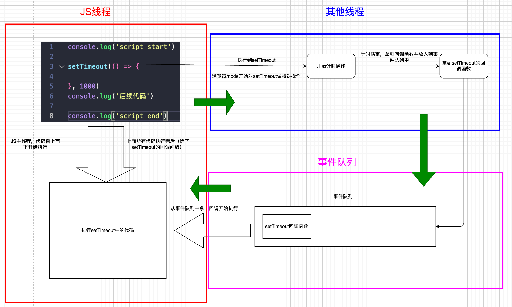

## 异步函数 async function

async关键字用于声明一个异步函数：

- async是`asynchronous`单词的缩写，异步、非同步；
- sync是`synchronous`单词的缩写，同步、同时；

async异步函数可以有很多中写法：

```js
async functio foo1() {}
const foo2 = async function () {}
const foo3 = async () => {}
class Person {
  async foo() {}
}
```


## 异步函数的执行流程

异步函数的内部代码执行过程和普通的函数是一致的，默认情况下也是会被同步执行。

```js
async function foo() {
  console.log('foo function start~')

  console.log('内部的代码执行1')
  console.log('内部的代码执行2')
  console.log('内部的代码执行3')

  console.log('foo function end~')
}

console.log('script start')
foo()
console.log('script end')

// script start
// foo function start~
// 内部的代码执行1
// 内部的代码执行2
// 内部的代码执行3
// foo function end~
// script end
```

如果加一个async的话，这个一步代码和普通的是一样的

异步函数有返回值时，和普通函数会有区别：

- 情况一：异步函数也可以有返回值，但是异步函数的返回值会被包裹到Promise.resolve中；

  ```js
  async function foo() {
    console.log('foo function start~')
    console.log('内部的代码执行')
    console.log('foo function end~')
  }
  // 异步函数的返回值一定是一个Promise
  const promise = foo()
  // 这里的then是在执行return的时候执行这个then,foo函数默认返回undefined
  promise.then(res => {
    console.log('promise then function exec:', res)
  })
  
  // foo function start~
  // 内部的代码执行
  // foo function end~
  // promise then function exec: undefined
  ```

- 情况二：如果我们的异步函数的返回值是Promise，Promise.resolve的状态会由Promise决定；

  ```js
  async function foo() {
    console.log('foo function start~')
    console.log('内部的代码执行')
    console.log('foo function end~')
    
    return new Promise((resolve, reject) => {
      setTimeout(() => {
        resolve('呵呵呵呵')
      }, 2000)
    })
  }
  // 异步函数的返回值一定是一个Promise
  const promise = foo()
  // 这里的then是在执行return的时候执行这个then,foo函数默认返回undefined
  promise.then(res => {
    console.log('promise then function exec:', res)
  })
  
  // foo function start~
  // 内部的代码执行
  // foo function end~
  // promise then function exec: 呵呵呵呵
  ```

- 情况三：如果我们的异步函数的返回值是一个对象并且实现了thenable，那么会由对象的then方法来决定；

  ```js
  async function foo() {
    console.log('foo function start~')
    console.log('内部的代码执行')
    console.log('foo function end~')
    
    return {
      then: (resolve, reject) => {
        resolve('呵呵呵呵')
      }
    }
  }
  // 异步函数的返回值一定是一个Promise
  const promise = foo()
  // 这里的then是在执行return的时候执行这个then,foo函数默认返回undefined
  promise.then(res => {
    console.log('promise then function exec:', res)
  })
  
  // foo function start~
  // 内部的代码执行
  // foo function end~
  // promise then function exec: 呵呵呵呵
  ```

如果我们在async中抛出了异常，那么程序它并不会像普通函数一样报错，而是会作为Promise的reject来传递；

同步代码中的异常，会让程序崩掉，后面的代码也不会再运行了

```js
function foo() {
  console.log('start')

  throw new Error('错误')

  console.log('end')
}

foo()
console.log('后面的代码')

// start
// /Users/shan/data/JS高级/课堂资料day01_32/课堂/code/exerice/exerice.js:4
//   throw new Error('错误')
//   ^

// Error: 错误
```

异步代码中的异常不会让程序崩掉，后面的代码会继续运行

```js
async function foo() {
  console.log('内部的代码执行')

  throw new Error('foo函数内部发生错误')

  return {
    then: (resolve, reject) => {
      resolve('呵呵呵呵')
    }
  }
}

const promise = foo()
promise.then(res => {
  console.log('promise then function exec:', res)
}).catch(err => {
  console.log('err:', err)
})

console.log('后面的代码')

// 内部的代码执行
// 后面的代码
// err: Error: foo函数内部发生错误
```


## await关键字

async函数另外一个特殊之处就是可以在它内部使用await关键字，而普通函数中是不可以的。

await关键字有什么特点呢？

- 通常使用await是后面会跟上一个表达式，这个表达式会返回一个Promise；

- 那么await会等到Promise的状态变成fulfilled状态，之后继续执行异步函数；

  ```js
  function requestData() {
    return new Promise((resolve, reject) => {
      setTimeout(() => {
        resolve(222)
      }, 2000)
    })
  }
  
  async function foo() {
    const res = await requestData()
    // 后续代码相当于上面的Promise有结果之后的then里面执行
    console.log('后续代码', res)
  }
  
  foo()
  
  // 后续代码 222
  ```

如果await后面是一个普通的值，那么会直接返回这个值，相当于resolve了这个值；

如果await后面是一个thenable的对象，那么会根据对象的then方法调用来决定后续的值；

```js
// 返回一个thenable
async function foo() {
  const res = await {
    then: function(resolve, reject) {
      resolve('abc')
    }
  }
  console.log('res:', res)
}
foo()
// res: abc

// 返回一个Promise
async function foo() {
  const res = await new Promise((resolve, reject) => {
    resolve('abc')
  })
  console.log('res:', res)
}
foo()
// res: abc
```

如果await后面的表达式，返回的Promise是reject的状态，那么会将这个reject结果直接作为函数的Promise的 reject值；

```js
async function foo() {
  const res = await new Promise((resolve, reject) => {
    reject('abc')
  })
  console.log('res:', res)
}

foo()
console.log('后续代码')
// node:internal/process/promises:288
//             triggerUncaughtException(err, true /* fromPromise */);
//             ^

// [UnhandledPromiseRejection: This error originated either by throwing inside of an async function without a catch block, or by rejecting a promise which was not handled with .catch(). The promise rejected with the reason "abc".] {
//   code: 'ERR_UNHANDLED_REJECTION'
// }

// Node.js v18.16.0
```

捕获reject

```js
async function foo() {
  const res = await new Promise((resolve, reject) => {
    reject('abc')
  })
  console.log('res:', res)
}

let result = foo()
result.catch(err => {
  console.log(err)
})
console.log('后续代码')
// 后续代码
// abc
```

捕获抛出错误

```js
async function foo() {
  throw new Error('抛出错误')
  const res = await new Promise((resolve, reject) => {
    reject('abc')
  })
  console.log('res:', res)
}

let result = foo()
result.catch(err => {
  console.log(err)
})
console.log('后续代码')
// 后续代码
// Error: 抛出错误
//     at foo (/Users/shan/data/JS高级/课堂资料day01_32/课堂/code/exerice/exerice.js:2:9)
//     at Object.<anonymous> (/Users/shan/data/JS高级/课堂资料day01_32/课堂/code/exerice/exerice.js:9:14)
//     at Module._compile (node:internal/modules/cjs/loader:1254:14)
//     at Module._extensions..js (node:internal/modules/cjs/loader:1308:10)
//     at Module.load (node:internal/modules/cjs/loader:1117:32)
//     at Module._load (node:internal/modules/cjs/loader:958:12)
//     at Function.executeUserEntryPoint [as runMain] (node:internal/modules/run_main:81:12)
//     at node:internal/main/run_main_module:23:47
```


## 进程和线程

操作系统是硬件和软件之间链接的桥梁

线程和进程是操作系统中的两个概念：

- 进程（process）：计算机已经运行的程序，是操作系统管理程序的一种方式；
  - 一个应用程序就是一个进程，比如一个qq，一个微信，但是一个应用程序也不一定就只有一个进程
- 线程（thread）：操作系统能够运行运算调度的最小单位，通常情况下它被包含在进程中；
  - 微信也是有很多代码的，执行这些代码就是通过线程来执行的

听起来很抽象，这里还是给出我的解释：

- 进程：我们可以认为，启动一个应用程序，就会默认启动一个进程（也可能是多个进程）；
- 线程：每一个进程中，都会启动至少一个线程用来执行程序中的代码，这个线程被称之为主线程；
  - 一个进程可能有很多线程，但是至少有一个线程
- 所以我们也可以说进程是线程的容器；

再用一个形象的例子解释：

- 操作系统类似于一个大工厂；
- 工厂中里有很多车间，这个车间就是进程，进程本身不做事情；
- 每个车间可能有一个以上的工人在工厂，这个工人就是线程，事情都是工人在做的；


## 操作系统 – 进程 – 线程


## 操作系统的工作方式

操作系统是如何做到同时让多个进程（边听歌、边写代码、边查阅资料）同时工作呢？

如果cpu是单核的会在线程中快速切换，如果是多核的会同时运行多个线程。

CPU的运算速度非常快，它可以快速的在多个进程之间迅速的切换，当我们进程中的线程获取到时间片时，就可以快速执行我们编写的代码，对于用户来说是感受不到这种快速的切换的；

可以在Mac的活动监视器或者Windows的资源管理器中查看到很多进程：


这里有进程名称，还有线程，比如网易云音乐是一个进程，它开启了19个线程


## 浏览器中的JavaScript线程

我们经常会说JavaScript是单线程的，但是JavaScript的线程应该有自己的进程容器：浏览器或者Node。 

浏览器是一个进程吗，它里面只有一个线程吗？

- 目前多数的浏览器其实都是多进程的，当我们打开一个tab页面时就会开启一个新的进程，这是为了防止一个页面卡死而造成所有页面无法响应，整个浏览器需要强制退出；
- 每个进程中又有很多的线程，其中包括执行JavaScript代码的线程；


JavaScript的代码执行是在一个单独的线程中执行的，这就意味着JavaScript的代码，在同一个时刻只能做一件事，如果这件事是非常耗时的，就意味着当前的线程就会被阻塞；

所以真正耗时的操作，实际上并不是由JavaScript线程在执行的，浏览器的每个进程是多线程的，那么其他线程可以来完成这个耗时的操作，比如网络请求、定时器，我们只需要在特性的时候执行应该有的回调即可，比如：

- 网络请求，只是你发了一个指令，发送指令以后，浏览器建立链接，发送数据，断开链接，等等（浏览器的其他线程做的）这些事情不是js做的，沟通完了以后，告诉js线程，也就是再回调，这个网络请求执行完了
- 定时器，当我们开启定时器的时候，我们给浏览器发送一个指令，告诉浏览器我们要做一个2秒钟的定时，浏览器拿到这个指令以后会做一个两秒钟的定时，然后再放回到js线程，回调2秒钟的函数
  - 这个两秒钟是由浏览器的其他线程做的
  - 当其他线程把这个两秒钟的计时操作完成了以后，浏览器就会把这个定时器的回调函数放到事件队列中去
  - JS线程会去事件队列中取到这个回调函数并执行
- dom的点击事件、promise也是异步的


## 浏览器的事件循环

如果在执行JavaScript代码的过程中，有异步操作呢？

- 代码中如果插入了一个setTimeout的函数调用；
- 这个函数被放到入调用栈中，执行会立即结束，并不会阻塞后续代码的执行；
- 这表示setTimeout是同步的，之所以说setTimeout异步，是只setTimeout传入的函数是异步函数

所以下面这段代码的执行过程：

```js
console.log('script start')

setTimeout(() => {

}, 1000)
console.log('后续代码')

console.log('script end')
```

在执行的过程中，setTimeout不会立即执行这个函数，而是在1秒钟之后执行，但是这个时候js线程不会等待一秒钟之后执行后面的代码，而是马上执行后面的代码，并且浏览器会开启一个新的线程执行一秒钟的计时操作，一秒钟之后执行的函数会被浏览器放到事件队列中，等到所有代码执行完了以后, JS主线程会去事件队列中依次（先进先出）拿到需要执行的代码，也就是setTimeout的回调函数

> 浏览器维护着一个队列的，被称为事件队列，默认是空的
>
> 队列本身是一个数据结构，是一个线性结构，特点是先进先出
>
> 当我们执行到计时器，发现有一个函数是一秒钟之后执行，那么我们会把这个函数放到队列中
>
> 当我们的时间到了以后，js线程会从这个队列中取到这个函数并执行




js进程、其他进程、事件队列这三部分组成了一个环，这个环就被称为浏览器的事件循环


## 宏任务和微任务

但是事件循环中并非只维护着一个队列，事实上是有两个队列：

- 宏任务队列（macrotask queue）：ajax、setTimeout、setInterval、DOM监听、UI Rendering等
- 微任务队列（microtask queue）：Promise的then回调、 Mutation Observer API、queueMicrotask()等

```js
setTimeout(() => {
  console.log('setTimeout')	// 回调，不会立即执行
}, 1000)
queueMicrotask(() => {
  console.log('queueMicrotask')	// 回调，不会立即执行
})
Promise.resolve().then(() => {
  console.log('Promise then')	// 回调，不会立即执行
})

// 下面这些代码才是立即执行的代码，它是在最顶层的，被称为main script
function foo() {
  console.log('foo')
}
function bar() {
  console.log('bar')
  foo()
}
bar()
console.log('其他代码')

// bar
// foo
// 其他代码
// queueMicrotask
// Promise then
// setTimeout
```

在js线程中，立即执行的函数，都不是setTimeout、queueMicrotask、Promise这些传入的回调函数

queuemicrotask的回调和setTimeout有什么区别？

- setTimeout先加到浏览器中，浏览器用其他的流程进行计时，计时结束后再加入到事件队列中
- queueMicrotask直接加入到任务队列

queuemicrotask的回调和setTimeout中的回调是加入到同一个队列的吗？

并不是,他们加入的队列是不一样的

事实上有两个队列，一个称为宏任务队列（macrotask queue），另一个称为微任务队列(microtask queue)，不同的操作放到不同的队列

宏任务队列（macrotask queue）

- 定时器、ajax、DOM、UI Rendering

微任务队列(microtask queue)

- queueMicrotask、Promise的then


那么怎么执行这两个队列的事件呢？事件循环对于两个队列的优先级是怎么样的呢？

是有一些规范的

- 1.main script中的代码优先执行（编写的顶层script代码）；
- 2.在执行任何一个宏任务之前（不是队列，是一个宏任务），都会先查看微任务队列中是否有任务需要执行
  - 也就是宏任务执行之前，必须保证微任务队列是空的；
  - 如果不为空，那么就优先执行微任务队列中的任务（回调）；


## Promise面试题


## promise async await 面试题


## Promise较难面试题


```js
Promise.resolve().then(() => {
  console.log(0);
  // 1.直接return一个值 相当于resolve(4)
  // return 4

  // 2.return thenable的值
  return {
    then: function(resolve) {
      // 大量的计算
      resolve(4)
    }
  }

  // 3.return Promise
  // 不是普通的值, 多加一次微任务
  // Promise.resolve(4), 多加一次微任务
  // 一共多加两次微任务
  return Promise.resolve(4)
}).then((res) => {
  console.log(res)
})

Promise.resolve().then(() => {
  console.log(1);
}).then(() => {
  console.log(2);
}).then(() => {
  console.log(3);
}).then(() => {
  console.log(5);
}).then(() =>{
  console.log(6);
})

// 1.return 4
// 0
// 1
// 4
// 2
// 3
// 5
// 6

// 2.return thenable
// 0
// 1
// 2
// 4
// 3
// 5
// 6

// 3.return promise
// 0
// 1
// 2
// 3
// 4
// 5
// 6
```

注意：如果返回的是普通的值，那么正常按照微任务来看，如果返回的是thenable，那么多加一次微任务，如果返回的是Promise.resolve，那么多加两次微任务


## Node的事件循环

当用node来执行代码的时候，它也会给你开启一个进程的，node进程里面它也是多线程的，其中有一个js线程，js线程是用来执行js代码的，其中有线程可以执行setTimeout操作，当然也有线程执行文件读取操作，也有线程执行网络请求操作，这些操作都是由node中的其他线程来做的，其他线程做完这些操作之后，将做完这些事情之后，执行一个回调函数，将回调函数加入到队列中，然后js线程回调这些函数，获取到结果，所有node的事件循环和浏览器的事件循环是差不多的

浏览器中的EventLoop是根据HTML5定义的规范来实现的，不同的浏览器可能会有不同的实现，而Node中是由 libuv实现的。

这里我们来给出一个Node的架构图：

- 我们会发现libuv中主要维护了一个EventLoop和worker threads（线程池）；
- EventLoop负责调用系统的一些其他操作：文件的IO、Network、child-processes等

libuv是一个多平台的专注于异步IO的库，它最初是为Node开发的，但是现在也被使用到Luvit、Julia、pyuv等其 他地方；


node其实更多的做的是一个文件的操作，浏览器做的更多的是渲染的操作，它们是的大同小异的


## Node事件循环的阶段

我们最前面就强调过，事件循环像是一个桥梁，是连接着应用程序的JavaScript和系统调用之间的通道：

无论是我们的文件IO、数据库、网络IO、定时器、子进程，在完成对应的操作后，都会将对应的结果和回调函数放到事件循环（任务队列）中，事件循环会不断的从任务队列中取出对应的事件（回调函数）来执行，所以js是不会发送网络请求的，网络请求是浏览器去做的，浏览器是调用操作系统去做的，这样一来，事件循环更像是一个桥梁，它是链接我们js做不了的东西。

> 为什么说早期js是用在浏览器的？但是现在js也可以用在浏览器开发中，为什么可以用在服务器中呢？服务器开发有什么要求呢？
>
> 就是进行IO的操作，I就是input，O就是output操作，也就是读取一些到程序里面，写入一些到程序外面，可以写入一个文件到本地里面，也可以输入一些文件到数据库中，但是现在可以通过libuv来调用相对的任务写入或者输出任务，这就是为什么js可以用在服务器开发，就是因为node通过libuv可以操作很多东西
>
> 

node中的事件循环比较复杂一些，浏览器中可能维护着两个队列，但是node中维护的队列会更多，一次完整的事件循环就是一个tick，tick可以想象成钟表中秒针的一次滴答，一次tick就称为一次滴答，一次完整的事件循环Tick分成很多个阶段：

- 定时器（Timers）：本阶段执行已经被 setTimeout() 和 setInterval() 的调度回调函数。
- 待定回调（Pending Callback）：对某些系统操作（如TCP错误类型）执行回调，比如TCP连接时接收到 ECONNREFUSED（error connection refused)。
- idle, prepare：仅系统内部使用（供node内部来使用）。
- 轮询（Poll）：检索新的 I/O 事件；执行与 I/O 相关的回调；
- 检测（check）：setImmediate() 回调函数在这里执行。
- 关闭的回调函数：一些关闭的回调函数，如：socket.on('close', ...)。

node实际上维护了非常多的队列，这些每一个可能都属于一个队列，也就是说node实际维护着非常多的队列


上面这些都是宏任务，那么为什么没有把微任务给画出来呢？因为宏任务在执行之前都是优先执行微任务的，不管执行到poll还是check还是任何位置，只要队列中存在微任务，就会优先执行微任务，所以不需要把微任务画出来


## Node的宏任务和微任务

我们会发现从一次事件循环的Tick来说，Node的事件循环更复杂，它也分为微任务和宏任务：

- 宏任务（macrotask）：setTimeout、setInterval、IO事件、setImmediate、close事件；
- 微任务（microtask）：Promise的then回调、process.nextTick、queueMicrotask；

但是，Node中的事件循环不只是微任务队列和宏任务队列：

- 微任务队列：
  - next tick queue：process.nextTick，下一次tick的时候先执行这个微任务队列；
  - other queue：Promise的then回调、queueMicrotask；
- 宏任务队列：
  - timer queue：setTimeout、setInterval；
  - poll queue：IO事件；
  - check queue：setImmediate；
  - close queue：close事件；

node的宏任务和微任务也是和浏览器一样的，都是微任务执行完了以后才执行宏任务的


## Node事件循环的顺序

所以，在每一次事件循环的tick中，会按照如下顺序来执行代码：

- next tick microtask queue；
- other microtask queue；
- timer queue；
- poll queue；
- check queue；
- close queue；


## Node执行面试题


## 错误处理方案

开发中我们会封装一些工具函数，封装之后给别人使用：

- 在其他人使用的过程中，可能会传递一些参数；
- 对于函数来说，需要对这些参数进行验证，否则可能得到的是我们不想要的结果；

```js
function fum(num1, num2) {
  return num1 + num2
}
console.log(sum({name: 'wts'}, true))
```


很多时候我们可能验证到不是希望得到的参数时，就会直接return：

```js
function fum(num1, num2) {
  if (typeof num1 !== 'number' || typeof num2 !== 'number') {
    return undefined
  }
  return num1 + num2
}
console.log(sum({name: 'wts'}, true))
```

但是return存在很大的弊端：调用者不知道是因为函数内部没有正常执行，还是执行结果就是一个undefined，那么调用者不知道是什么错误，事实上，正确的做法应该是如果没有通过某些验证，那么应该让外界知道函数内部报错了；

如何可以让一个函数告知外界自己内部出现了错误呢？

- 通过throw关键字，抛出一个异常；

throw语句：

- throw语句用于抛出一个用户自定义的异常；
- 当遇到throw语句时，当前的函数执行会被停止（throw后面的语句不会执行）；

如果我们执行代码，就会报错，拿到错误信息的时候我们可以及时的去修正代码。

```js
/**
 * 如果我们有一个函数, 在调用这个函数时, 如果出现了错误, 那么我们应该是去修复这个错误.
 */

function sum(num1, num2) {
  // 当传入的参数的类型不正确时, 应该告知调用者一个错误
  if (typeof num1 !== "number" || typeof num2 !== "number") {
    throw "parameters is error type~"	// 程序停止
  }

  return num1 + num2
}

// 调用者(如果没有对错误进行处理, 那么程序会直接终止)，但是如果是return，后续程序会继续运行
console.log(sum({ name: "why" }, true))

console.log("后续的代码会继续运行~")
```


## throw关键字

throw表达式就是在throw后面可以跟上一个表达式来表示具体的异常信息：


throw关键字可以跟上哪些类型呢？

- 基本数据类型：比如number、string、Boolean
- 对象类型：对象类型可以包含更多的信息

但是每次写这么长的对象又有点麻烦，所以我们可以创建一个类：

```js
class TSError {
  constructor(errCode, errMessage) {
    this.errCode = errCode
    this.errMessage = errMessage
  }
}

function sum(num1, num2) {
  if (typeof num1 !== "number" || typeof num2 !== "number") {
    throw new TSError(400, 'parameters is error type~')
  }

  return num1 + num2
}

console.log(sum({ name: "why" }, true))


// /Users/shan/data/JS高级/课堂资料day01_32/课堂/code/exerice/exerice.js:10
//     throw new TsError(400, 'parameters is error type~')
//     ^
// TsError { errCode: 400, errMessage: 'parameters is error type~' }

// Node.js v18.16.0
```


## Error类型

事实上，JavaScript已经给我们提供了一个Error类，我们可以直接创建这个类的对象：

```js
function foo() {
  throw new Error('error message', '123')
}
```

Error包含三个属性：

- messsage：创建Error对象时传入的message；
- name：Error的名称，通常和类的名称一致；
- stack：整个Error的错误信息，包括函数的调用栈，当我们直接打印Error对象时，打印的就是stack；

Error有一些自己的子类：

- RangeError：下标值越界时使用的错误类型；
- SyntaxError：解析语法错误时使用的错误类型；
- TypeError：出现类型错误时，使用的错误类型；

> 使用throw抛出错误的方案：
>
> 1. 抛出一个字符串类型(基本的数据类型)
>
>    1. throw "error"
>
> 2. 比较常见的是抛出一个对象类型
>
>    1. throw { errorCode: -1001, errorMessage: "type不能为0~" }
>
> 3. 创建类, 并且创建这个类对应的对象
>
>    ```js
>    class TSError {
>      constructor(errCode, errMessage) {
>        this.errCode = errCode
>        this.errMessage = errMessage
>      }
>    }
>    throw new TSError(-1001, "type不能为0~")
>    ```
>
> 4. 提供了一个Error
>
>    ```js
>    const err = new Error("type不能为0")
>    err.name = "why" // 错误名称
>    err.stack = "aaaa" // stack是函数的调用栈
>    // name和stack可以修改，但是一般不修改它
>    throw new Error('type不能为0')
>    ```
>
> 5. Error的子类
>
>    ```js
>    const err = new TypeError("当前type类型是错误的~")
>    throw err
>    ```
>
> 使用 new Error抛出的错误会显示函数调用栈


## 异常的处理

我们会发现在之前的代码中，一个函数抛出了异常，调用它的时候程序会被强制终止：

- 这是因为如果我们在调用一个函数时，这个函数抛出了异常，但是我们并没有对这个异常进行处理，那么这个异常会继续传 递到上一个函数调用中；
- 而如果到了最顶层（全局）的代码中依然没有对这个异常的处理代码，这个时候就会报错并且终止程序的运行；

我们先来看一下这段代码的异常传递过程：

- foo函数在被执行时会抛出异常，也就是我们的bar函数会拿到这个异常；
- 但是bar函数并没有对这个异常进行处理，那么这个异常就会被继续传递到调用bar函数的函数，也就是test函数；
- 但是test函数依然没有处理，就会继续传递到我们的全局代码逻辑中；
- 依然没有被处理，这个时候程序会终止执行，后续代码都不会再执行了；

```js
function foo(type) {
  if (type === 0) {
    throw new Error("foo error message~")
  }
}
function bar() {
  foo(0)
}

function test() {
  bar()
}

function demo() {
  test()
}
demo()
console.log('后面的代码') // 这行代码没有被执行

// /Users/shan/data/JS高级/课堂资料day01_32/课堂/code/exerice/exerice.js:3
//     throw new Error("foo error message~")
//     ^

// Error: foo error message~
//     at foo (/Users/shan/data/JS高级/课堂资料day01_32/课堂/code/exerice/exerice.js:3:11)
//     at bar (/Users/shan/data/JS高级/课堂资料day01_32/课堂/code/exerice/exerice.js:7:3)
//     at test (/Users/shan/data/JS高级/课堂资料day01_32/课堂/code/exerice/exerice.js:11:3)
//     at demo (/Users/shan/data/JS高级/课堂资料day01_32/课堂/code/exerice/exerice.js:15:3)
//     at Object.<anonymous> (/Users/shan/data/JS高级/课堂资料day01_32/课堂/code/exerice/exerice.js:17:1)
//     at Module._compile (node:internal/modules/cjs/loader:1254:14)
//     at Module._extensions..js (node:internal/modules/cjs/loader:1308:10)
//     at Module.load (node:internal/modules/cjs/loader:1117:32)
//     at Module._load (node:internal/modules/cjs/loader:958:12)
//     at Function.executeUserEntryPoint [as runMain] (node:internal/modules/run_main:81:12)
```


```js
function foo(type) {
  if (type === 0) {
    throw new Error("foo error message~")
  }
}

// 1.第一种是不处理, bar函数会继续将收到的异常直接抛出去
function bar() {
  // try {
  foo(0)
  //   console.log("bar函数后续的继续运行")
  // } catch(err) {
  //   console.log("err:", err.message)
  //   // alert(err.message)
  // } finally {
  //   console.log("finally代码执行~, close操作")
  // }
}

function test() {
  try {
    bar()
  } catch (error) {
    console.log("error:", error)
  }
}

function demo() {
  test()
}


// 两种处理方法:
// 1.第一种是不处理, 那么异常会进一步的抛出, 直到最顶层的调用
// 如果在最顶层也没有对这个异常进行处理, 那么我们的程序就会终止执行, 并且报错
// foo()
```


## 异常的捕获

但是很多情况下当出现异常时，我们并不希望程序直接推出，而是希望可以正确的处理异常：

- 这个时候我们就可以使用try catch


方案1：

在bar函数捕获异常

```js
function foo(type) {
  if (type === 0) {
    throw new Error("foo error message~")
  }
}

function bar() {
  try {
    foo(0)
    console.log("bar函数后续的继续运行")
  } catch(err) {
    console.log("err:", err)
  } finally {
    console.log("finally代码执行~, close操作")
  }
}

function test() {
  bar()
}

function demo() {
  test()
}
demo()

// err: Error: foo error message~
//     at foo (/Users/shan/data/JS高级/课堂资料day01_32/课堂/code/exerice/exerice.js:3:11)
//     at bar (/Users/shan/data/JS高级/课堂资料day01_32/课堂/code/exerice/exerice.js:9:5)
//     at test (/Users/shan/data/JS高级/课堂资料day01_32/课堂/code/exerice/exerice.js:19:3)
//     at demo (/Users/shan/data/JS高级/课堂资料day01_32/课堂/code/exerice/exerice.js:23:3)
//     at Object.<anonymous> (/Users/shan/data/JS高级/课堂资料day01_32/课堂/code/exerice/exerice.js:25:1)
//     at Module._compile (node:internal/modules/cjs/loader:1254:14)
//     at Module._extensions..js (node:internal/modules/cjs/loader:1308:10)
//     at Module.load (node:internal/modules/cjs/loader:1117:32)
//     at Module._load (node:internal/modules/cjs/loader:958:12)
//     at Function.executeUserEntryPoint [as runMain] (node:internal/modules/run_main:81:12)
// finally代码执行~, close操作
```

方案2：

在test函数捕获异常

```js
function foo(type) {
  if (type === 0) {
    throw new Error("foo error message~")
  }
}

// bar函数不处理异常会继续将收到的异常直接抛出去
function bar() {
  foo(0)
}

// 异常在test函数处理的
function test() {
  try {
    bar()
  } catch (error) {
    console.log("error:", error)
  }
}

function demo() {
  test()
}

demo()

console.log('后续代码')

// 两种处理方法:
// 1.第一种是不处理, 那么异常会进一步的抛出, 直到最顶层的调用
// 如果在最顶层也没有对这个异常进行处理, 那么我们的程序就会终止执行, 并且报错
// foo()

// error: Error: foo error message~
//     at foo (/Users/shan/data/JS高级/课堂资料day01_32/课堂/code/exerice/exerice.js:3:11)
//     at bar (/Users/shan/data/JS高级/课堂资料day01_32/课堂/code/exerice/exerice.js:9:3)
//     at test (/Users/shan/data/JS高级/课堂资料day01_32/课堂/code/exerice/exerice.js:15:5)
//     at demo (/Users/shan/data/JS高级/课堂资料day01_32/课堂/code/exerice/exerice.js:22:3)
//     at Object.<anonymous> (/Users/shan/data/JS高级/课堂资料day01_32/课堂/code/exerice/exerice.js:25:1)
//     at Module._compile (node:internal/modules/cjs/loader:1254:14)
//     at Module._extensions..js (node:internal/modules/cjs/loader:1308:10)
//     at Module.load (node:internal/modules/cjs/loader:1117:32)
//     at Module._load (node:internal/modules/cjs/loader:958:12)
//     at Function.executeUserEntryPoint [as runMain] (node:internal/modules/run_main:81:12)
// 后续代码
```

当然，还可以在test捕获异常，甚至在demo调用捕获异常，因为错误，会一层一层的随着调用栈往上抛，所以，我们可以在调用栈的任何一层来捕获错误，通过try-catch,但是如果我们在任何一层都没有捕获的话，那么就会抛出错误

在ES10（ES2019）中，catch后面绑定的error可以省略。

```js
  try {
    bar()
  } catch {
    console.log("error要做的事")
  } finally {
    console.log('finally代码执行')
  }
```

当然，如果有一些必须要执行的代码，我们可以使用finally来执行：

- finally表示最终一定会被执行的代码结构；
- 注意：如果try和finally中都有返回值，那么会使用finally当中的返回值；


