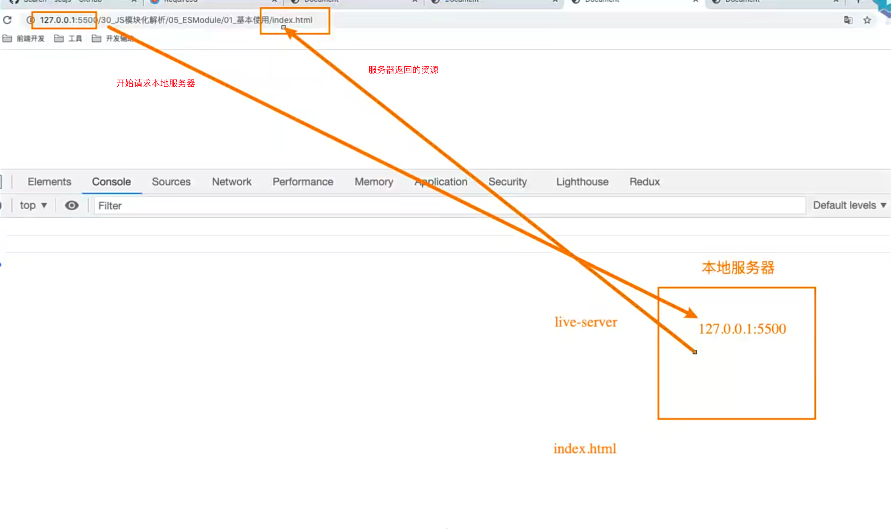
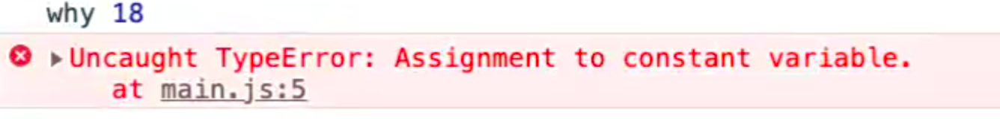
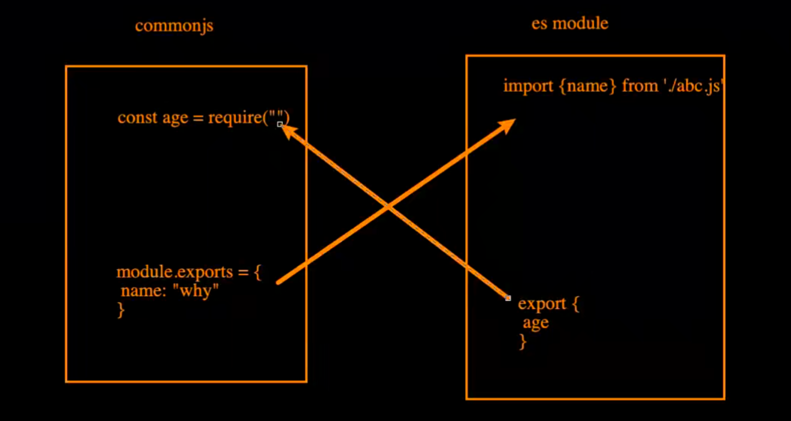
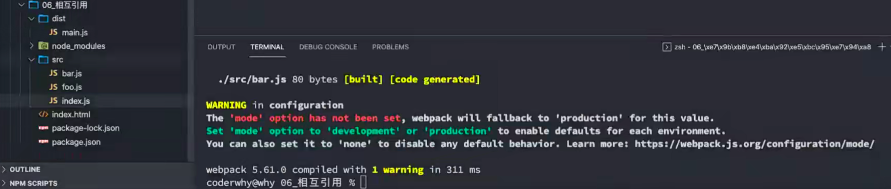

## 什么是模块化？

到底什么是模块化、模块化开发呢？

- 事实上模块化开发最终的目的是将程序划分成一个个小的结构；
- 这个结构中编写属于自己的逻辑代码，有自己的作用域，不会影响到其他的结构；
- 这个结构可以将自己希望暴露的变量、函数、对象等导出给其结构使用；
- 也可以通过某种方式，导入另外结构中的变量、函数、对象等；

上面说提到的结构，就是模块；按照这种结构划分开发程序的过程，就是模块化开发的过程；


它们是没有独立空间的，也就是说在aaa.js里面定义的name在bbb可以访问的，那么在bbb定义了name它们就会冲突的那么我们想做的其实是上面四个JS文件，每一个都有自己独立的作用域，自己作用域的代码对外部其他JS作用域的代码不会有影响，它们是无法访问的，也就是我在a文件定义了sum，b文件是无法访问的，如果你想访问，那么可以通过在a文件抛出，在b文件引入的方式来获取。

一般来说，一个独立的文件就是一个模块，这种开发模式就是模块化开发。

无论你多么喜欢JavaScript，以及它现在发展的有多好，它都有很多的缺陷：

- 比如var定义的变量作用域问题；
- 比如JavaScript的面向对象并不能像常规面向对象语言一样使用class；
- 比如JavaScript没有模块化的问题；

Brendan Eich本人也多次承认过JavaScript设计之初的缺陷，但是随着JavaScript的发展以及标准化，存在的缺陷问题基 本都得到了完善。


## 模块化的历史

在网页开发的早期，Brendan Eich开发JavaScript仅仅作为一种脚本语言，做一些简单的表单验证或动画实现等，那个时 候代码还是很少的，我们只需要将JavaScript代码写到`<script>`标签中即可，并没有必要放到多个文件中来编写，通常来说 JavaScript 程序的长度只有一行，但是随着前端和JavaScript的快速发展，JavaScript代码变得越来越复杂了，例如：

- ajax的出现，前后端开发分离，意味着后端返回数据后，我们需要通过JavaScript进行前端页面的渲染；
- SPA的出现，前端页面变得更加复杂：包括前端路由、状态管理等等一系列复杂的需求需要通过JavaScript来实现；
- 包括Node的实现，JavaScript编写复杂的后端程序，没有模块化是致命的硬伤；

所以，模块化已经是JavaScript一个非常迫切的需求：

- 但是JavaScript本身，直到ES6（2015）才推出了自己的模块化方案；
- 在此之前，为了让JavaScript支持模块化，涌现出了很多不同的模块化规范：AMD、CMD、CommonJS等；


## 没有模块化带来的问题

早期没有模块化带来了很多的问题：比如命名冲突的问题

当然，我们有办法可以解决上面的问题：立即函数调用表达式（IIFE）

- IIFE (Immediately Invoked Function Expression)

变量这样定义

每个文件中的代码都写到函数中

文件1：

```js
var moduleA = (function() {
  var name = 'wts'
  var age = 18
  var isFlag = true
  return {
    name: name,
    age: age,
    isFlag: isFlag
  }
})()
```

文件2(使用)：

```js
(function() {
  if (moduleA.isFlag) {
    console.log('我的名字是' + moduleA.name)
  }
})()
```

但是，我们其实带来了新的问题：

- 第一，我必须记得每一个模块中返回对象的命名，才能在其他模块使用过程中正确的使用；
- 第二，代码写起来混乱不堪，每个文件中的代码都需要包裹在一个匿名函数中来编写；
- 第三，在没有合适的规范情况下，每个人、每个公司都可能会任意命名、甚至出现模块名称相同的情况；

所以，我们会发现，虽然实现了模块化，但是我们的实现过于简单，并且是没有规范的。

- 我们需要制定一定的规范来约束每个人都按照这个规范去编写模块化的代码;
- 这个规范中应该包括核心功能：模块本身可以导出暴露的属性，模块又可以导入自己需要的属性；
- JavaScript社区为了解决上面的问题，涌现出一系列好用的规范，接下来我们就学习具有代表性的一些规范。


## CommonJS规范和Node关系

我们需要知道CommonJS是一个规范，最初提出来是在浏览器以外的地方使用，并且当时被命名为ServerJS，后来为了 体现它的广泛性，修改为CommonJS，平时我们也会简称为CJS，所以有些文件的后缀为.cjs，表示这个文件符合commonjs规范的。

- Node是CommonJS在服务器端一个具有代表性的实现；
- Browserify是CommonJS在浏览器中的一种实现（现在用的比较少）；
- webpack打包工具具备对CommonJS的支持和转换；

所以，Node中对CommonJS进行了支持和实现，让我们在开发node的过程中可以方便的进行模块化开发：

- 在Node中每一个js文件都是一个单独的模块；
- 这个模块中包括CommonJS规范的核心变量：exports、module.exports、require；
- 我们可以使用这些变量来方便的进行模块化开发；

前面我们提到过模块化的核心是导出和导入，Node中对其进行了实现：

- exports和module.exports可以负责对模块中的内容进行导出；
- require函数可以帮助我们导入其他模块（自定义模块、系统模块、第三方库模块）中的内容；


## 模块化案例

我们来看一下两个文件：

main.js

main必须进行导入

```js
console.log(name)
console.log(age)

sayHello('kobe')
```


bar.js

bar必须导出自己的内容

```js
const name = 'wts'
const age = 18
function sayHello(name) {
  console.log('Hello ' + name)
}
```

两个单独的文件是两个独立的模块，相互是访问不到对面的内容的


## module.exports导出

注意：exports是一个对象，我们可以在这个对象中添加很多个属性，添加的属性会导出；

bar.js

```js
const name = 'wts'
const age = 18
function sayHello(name) {
  console.log('Hello ' + name)
}

// 1.导出方案 module.exports
module.exports.name = name
module.exports.age = age
module.exports.sayHello = sayHello
// 或者
module.exports = {
  name,	// ES2015的对象增强写法
  age: age
  sayHello: sayHello
}
```

从bar.js导入

main.js

```js
const info = require('./bar.js')
const { name, age, sayHello } = require('./bar.js')	// 可以对info进行解构
console.log(info.name)
console.log(info.age)

info.sayHello('kobe')
```

上面bar.js导出的这个对象，实际上就是main.js导入的对象，他们是同一个引用，可以通过setTimeout的方式来验证，例如在bar.js中一秒钟后改变name的值，在main.js中两秒钟打印name的值，会发现他们是同一个值。

> 可以把require('./bar.js')这个函数想象成这样，它们指向的是同一个引用地址
>
> ```js
> function require('id') {
>   // 返回的这个就是导出的对象
>   return module.exports
> }
> ```


## exports导出

bar.js

```js
const name = 'wts'
const age = 18
function sum(num1, num2) {
  return num1 + num2
}
exports.name = name
exports.age = age
exports.sum = sum
```

从bar.js导入

main.js

```js
const info = require('./bar.js')
console.log(info.name)
console.log(info.age)

info.sum(1, 2)
```

> 为什么module.exports可以导出，exports也可以导出呢？
>
> 源码里面是这样写的：
>
> ```js
> module.exports = {}
> exports = module.exports
> ```
>
> 这个时候给exports加属性，实际上就是给module.exports加属性了
>
> 我们最终导出的是module.exports这个对象，但是因为exports加了属性，所以它也就有值了（他们的引用地址相同），这也是为什么通过exports也可以导出的原因.
>
> 注意1：
>
> 如果我们强行把exports对module.exports的引用给取消了，而赋值其他对象，是没办法导出的了，因为module.exports和exports指向的不是同一个引用了
>
> ```js
> exports = {
>   name,
>   age,
>   sum
> }
> ```
>
> 注意2：
>
> 如果我们的module.exports指向新对象了，exports也无法导出，同理，module.exports和exports指向的引用不是同一个了
>
> ```js
> exports.name = name
> exports.age = age
> module.exports = {}
> ```
>
> 注意3：
>
> 源码的这种引用赋值是在开始就赋值了，所以后面在文件代码中修改了他们的引用可能会出现无法导出的情况
>
> ```js
> module.exports = {}
> exports = module.exports
> ```
>
> 


## module.exports

但是Node中我们经常导出东西的时候，是通过module.exports导出的：

- module.exports和exports有什么关系或者区别呢？

我们追根溯源，通过维基百科中对CommonJS规范的解析：

- CommonJS中是没有module.exports的概念的；
- 但是为了实现模块的导出，Node中使用的是Module的类，每一个模块都是Module的一个实例，也就是 module；
- 所以在Node中真正用于导出的其实根本不是exports，而是module.exports；
- 因为module才是导出的真正实现者；

但是，为什么exports也可以导出呢？

- 这是因为module对象的exports属性是exports对象的一个引用；
- 也就是说 module.exports = exports = main中的bar；


知道上面的内容，我们就可以回答这些问题了

在三者项目引用的情况下（require, export, module.export），修改exports中的name属性到底发生了什么？

在三者引用的情况下，修改了main中的bar的name属性，在bar模块中会发生什么？

如果module.exports不再引用exports对象了，那么修改export还有意义吗？为了符合commonjs规范，加了一个exports变量，它的原理就是module.exports


## require细节

我们现在已经知道，require是一个函数，可以帮助我们引入一个文件（模块）中导出的对象。

那么，require的查找规则是怎么样的呢？

- https://nodejs.org/dist/latest-v14.x/docs/api/modules.html

这里我总结比较常见的查找规则：导入格式如下：require(X)

**情况一：X是一个Node核心模块，比如path、http**

- 直接返回核心模块，并且停止查找


**情况二：X是以 ./ 或 ../ 或 /（根目录）开头的**

第一步：将X当做一个文件在对应的目录下查找；

- 1.如果有后缀名，按照后缀名的格式查找对应的文件
- 2.如果没有后缀名，会按照如下顺序：
  - 1> 直接查找文件X
  - 2> 查找X.js文件
  - 3> 查找X.json文件
  - 4> 查找X.node文件
  

第二步：没有找到对应的文件，将X作为一个目录

- 查找目录下面的index文件
  - 1> 查找X/index.js文件
  - 2> 查找X/index.json文件
  - 3> 查找X/index.node文件

  如果没有找到，那么报错：not found

  

**情况三：直接是一个X（没有路径），并且X不是一个核心模块**

/Users/coderwhy/Desktop/Node/TestCode/04_learn_node/05_javascript-module/02_commonjs/main.js中编写 require('why’)


它首先会在当前文件目录下的node_modules查找这个文件，如果找不到就会去上一层目录，如果还找不到的话，就会在上一层目录，一直到顶层文件夹，如果再找不到，那么报错：not found

所以假设我们下载了一个axios，它的查找规则就是在我们当前的文件夹的node_modules中去查找的


找到之后，会自动给我们拼接index.js，然后去里面找index.js文件的

如果我们全局安装，因为它是一层一层的往上查找的，所以也是可以找到的


## 模块的加载过程

结论一：模块在被第一次引入时，模块中的js代码会被运行一次

foo.js

```js
console.log('foo: wts')
```

main.js

```js
console.log('main.js代码开始运行')

require('./foo')

console.log('main.js代码后续运行')

// main.js代码开始运行
// foo: wts
// main.js代码后续运行
```


结论二：模块被多次引入时，会缓存，最终只加载（运行）一次

```js
console.log('main.js代码开始运行')

require('./foo')
require('./foo')
require('./foo')

console.log('main.js代码后续运行')

// main.js代码开始运行
// foo: wts
// main.js代码后续运行
```

为什么只会加载运行一次呢？这是因为每个模块对象module都有一个属性：loaded。为false表示还没有加载，为true表示已经加载；


结论三：如果有循环引入，那么加载顺序是什么？

如果出现下图图模块的引用关系，那么加载顺序是什么呢？


这个其实是一种数据结构：图结构；

图结构在遍历的过程中，有深度优先搜索（DFS, depth first search）和广度优先搜索（BFS, breadth first search）；

Node采用的是深度优先算法：main -> aaa -> ccc -> ddd -> eee ->bbb


## CommonJS规范缺点

CommonJS规范缺点

- 同步的意味着只有等到对应的模块加载完毕，当前模块中的内容才能被运行；
- 这个在服务器不会有什么问题，因为服务器加载的js文件都是本地文件，加载速度非常快；

如果将它应用于浏览器呢？

- 浏览器加载js文件需要先从服务器将文件下载下来，之后再加载运行；
- 那么采用同步的就意味着后续的js代码都无法正常运行，即使是一些简单的DOM操作；

所以在浏览器中，我们通常不使用CommonJS规范：

- 当然在webpack中使用CommonJS是另外一回事；
- 因为它会将我们的代码转成浏览器可以直接执行的代码；

在早期为了可以在浏览器中使用模块化，通常会采用AMD或CMD：

- 但是目前一方面现代的浏览器已经支持ES Modules，另一方面借助于webpack等工具可以实现对CommonJS或者ES  Module代码的转换；
- AMD和CMD已经使用非常少了，所以这里我们进行简单的演练；


## AMD规范

AMD主要是应用于浏览器的一种模块化规范：

- AMD是Asynchronous Module Definition（异步模块定义）的缩写；
- 它采用的是异步加载模块；
- 事实上AMD的规范还要早于CommonJS，但是CommonJS目前依然在被使用，而AMD使用的较少了；

我们提到过，规范只是定义代码的应该如何去编写，只有有了具体的实现才能被应用：

- AMD实现的比较常用的库是require.js和curl.js；


## require.js的使用

第一步：下载require.js

- 下载地址：https://github.com/requirejs/requirejs
- 找到其中的require.js文件；

第二步：定义HTML的script标签引入require.js和定义入口文件：

- data-main属性的作用是在加载完src的文件后会加载执行该文件


不能直接上面这样引用，要在下面这样引用

```js
<script src="./lib/require.js" data-main="./index.js"></script>
// 当加载了require之后，再加载index.js
```


我们在文件中需要在define中写了


注意这里不需要src

上面的案例说明了一个问题，在foo中导出了东西，在main.js导入了东西，所以，这个就实现了模块化了


如果给baseUrl为空

那么就需要给foo加src


然后我们在bar模块中引入foo


## CMD规范

CMD规范也是应用于浏览器的一种模块化规范：

- CMD 是Common Module Definition（通用模块定义）的缩写；
- 它也采用了异步加载模块，但是它将CommonJS的优点吸收了过来；
- 但是目前CMD使用也非常少了；

CMD也有自己比较优秀的实现方案：

- SeaJS

它们都是用在浏览器上的，所以要有html文件


## SeaJS的使用

第一步：下载SeaJS

- 下载地址：https://github.com/seajs/seajs
- 找到dist文件夹下的sea.js

第二步：引入sea.js和使用主入口文件

- seajs是指定主入口文件的


导入


导出


## 认识 ES Module

JavaScript没有模块化一直是它的痛点，所以才会产生我们前面学习的社区规范：CommonJS、AMD、CMD等， 所以在ES推出自己的模块化系统时，大家也是兴奋异常。

ES Module和CommonJS的模块化有一些不同之处：

- 一方面它使用了import和export关键字；
- 另一方面它采用编译期的静态分析，并且也加入了动态引用的方式；

ES Module模块采用export和import关键字来实现模块化：

- export负责将模块内的内容导出；
- import负责从其他模块导入内容；

了解：采用ES Module将自动采用严格模式：use strict

- 如果你不熟悉严格模式可以简单看一下MDN上的解析；
- https://developer.mozilla.org/zh-CN/docs/Web/JavaScript/Reference/Strict_mode

foo.js

```js
export const name = 'wts'
export const age = 19
```

main.js

```js
import { name, age } from './foo.js' // 一定要加.js(因为不是在webpack或者其他环境中)
```

index.html

```js
<!DOCTYPE html>
<html lang="en">
<head>
  <meta charset="UTF-8">
  <meta name="viewport" content="width=device-width, initial-scale=1.0">
  <title>Document</title>
</head>
<body>
  <script src="./main.js"></script>
</body>
</html>
```

运行index.html, 浏览器会报错

```js
// Uncaught SyntaxError: Cannot use import statement outside a module (at main.js:1:1)
```

意思是：你现在在一个模块外面去使用了我的import这么一个语句

为什么会这样呢？因为我们看一下html文件，我们通过script加载main.js文件，会把main.js当成一个普通的js文件，也就是当成一个全局的js文件，代码也是从上往下一行一行的执行，并没有给他当成模块化

所以必须要这样

```js
<!DOCTYPE html>
<html lang="en">
<head>
  <meta charset="UTF-8">
  <meta name="viewport" content="width=device-width, initial-scale=1.0">
  <title>Document</title>
</head>
<body>
  <script src="./main.js" type="module"></script>
</body>
</html>
```

加上type后，这样就可以了，就会把他当成一个模块来执行了

live-server和本地文件打开的去呗：

live-server



使用live-server,我们的模块化文件都被放到了本地服务器中，浏览器每加载一个模块化文件，都是向本地服务器发送http请求，服务器再返回这个文件，浏览器进行解析。只有这样这样才能正确解析模块化文件


通过本地打开


是因为当前，如果要把一个文件当成一个模块，也就是把上面的foo和main.js当成模块的话，光在script标签上面添加`type='module'`是不行的，你不能用file这个url-scheme前缀（fille、https、http这些被称为url-scheme前缀），你可以用http、或者https，因为file不能正常的去加载一个模块


所以，要开启esmodule模块化:

- 开启一个本地服务
- 在加载入口文件的script标签中增加`type='module'`

这个在MDN上面有给出解释：

- https://developer.mozilla.org/zh-CN/docs/Web/JavaScript/Guide/Modules
- 你需要注意本地测试 — 如果你通过本地加载Html 文件 (比如一个 file:// 路径的文件), 你将会遇到 CORS 错误，因为 Javascript 模块安全性需要。
- 你需要通过一个服务器来测试。

我这里使用的VSCode，VSCode中有一个插件：Live Server


## exports关键字

export关键字将一个模块中的变量、函数、类等导出；

我们希望将其他中内容全部导出，它可以有如下的方式：

方式一：在语句声明的前面直接加上export关键字

方式二：将所有需要导出的标识符，放到export后面的 {}中

- 注意：这里的 {}里面不是ES6的对象字面量的增强写法，{}也不是表示一个对象的；
- 所以： export {name: name}，是错误的写法；

方式三：导出时给标识符起一个别名

```js
// 第一种方式： export 声明语句，注意，这里不是exports
export const name = 'why';
export function foo() {
	console.log('foo function')
}
export class Person{

}

// 第二种方式：export 导出和声明分开
const name = 'why';
const age = 19;
function foo() {
    console.log('foo function')
}

export {
	name,
    age,
    foo
}
// 这是一个固定语法，它不是一个对象,他就是一个大括号把要导出的东西挨个写在里面
// 千万不能这样写
export {
	name: name
}

// 第三种方式： 第二种的变种，第二种导出时起别名
export {
		name as fName,
    age as fAge,
    foo as fFoo
}
// 导入的时候就要用新的名字了
import {fName, fAge, fFoo} from './foo.js'
// 一般不在导出的时候起别名
// 习惯用哪种导出就用哪种
```


## import关键字

import关键字负责从另外一个模块中导入内容

导入内容的方式也有多种：

方式一：import {标识符列表} from '模块'；

- 注意：这里的{}也不是一个对象，里面只是存放导入的标识符列表内容；

方式二：导入时给标识符起别名

方式三：通过 * 将模块功能放到一个模块功能对象（a module object）上

```js
// 导入方式一：普通的导入
import {name, age, foo} from './foo.js'
// 导入方式二：起别名
import {name as fName, age as fAge, foo as fFoo} from './foo.js';
// 导入方式三： 将导出的所有内容放到一个标识符中
import * as foo from './foo.js'	// 说明将所有的东西都放到foo中
foo.name;
foo.age;
// 这样也可以避免命名冲突
```


## export和import结合使用

补充：export和import可以结合使用


为什么要这样做呢？

- 在开发和封装一个功能库时，通常我们希望将暴露的所有接口放到一个文件中；
- 这样方便指定统一的接口规范，也方便阅读；
- 这个时候，我们就可以使用export和import结合使用；

例如：我们封装了很多方法在一个utils的文件夹中，例如有format.js文件，math.js文件，这个时候我们要导出，一般的做法是先写一个index文件，然后在这个index.js的文件中导入utils中所有的方法，然后统一导出，这个时候我们可以这样来写index.js

方案一：

```js
import { add, sub } from './math.js'
import { timeFormat, priceFormat } from './format.js'

export {
	add,
  sub,
  timeFormat,
  priceFormat
}


import { 	add,  sub,  timeFormat,  priceFormat } from './utils/index.js'
```

方案二：

```js
export { add, sub } from './math.js'
export { timeFormat, priceFormat } from './format.js'


import { 	add,  sub,  timeFormat,  priceFormat } from './utils/index.js'
```

方案三：

```js
export * from './math.js'
export * from './format.js'


import { 	add,  sub,  timeFormat,  priceFormat } from './utils/index.js'
```


## default用法

前面我们学习的导出功能都是有名字的导出（named exports）：

- 在导出export时指定了名字；
- 在导入import时需要知道具体的名字；

还有一种导出叫做默认导出（default export）

- 默认导出export时可以不需要指定名字；
- 在导入时不需要使用 {}，并且可以自己来指定名字；
- 它也方便我们和现有的CommonJS等规范相互操作；


注意：在一个模块中，只能有一个默认导出（default export）；

foo.js

```js
const name = 'wts'
const age = 18
const foo = 'foo value'

export {
	name,
  age,
  foo as default	// 给他加上as default, 那么这个标识符的导出就变成了默认导出
}
```

index.js

```js
import wts from './foo.js'
console.log(wts)

// foo value
```

这种写法会把foo变成默认导出，在index中的写法就是导入了默认导出，所以wts就是foo

但是一般情况下默认导出还有其他的写法，并且用的比较多的也是接下来的这种用法

foo.js

```js
const name = 'wts'
const age = 18
const foo = 'foo value'

export {
	name,
  age,
  foo as default	// 给他加上as default, 那么这个标识符的导出就变成了默认导出
}

export default foo
```

index.js

```js
import wts from './foo.js'
console.log(wts)

// foo value
```

这种写法和上面的写法效果是一样的，只是第二种写法用的更多一些

注意： 

- 默认导出只能有一个
- 导出分为命名导出和默认导出，不带default的称为命名导出，带default的称为默认导出


## import函数

首先需要知道，引入的代码都是同步的

main.js

```js
import { name, age, foo } from './foo.js'

console.log(name)

console.log('后面的代码都是在foo.js解析完以后才会运行')
```

这里只有foo.js文件执行完了以后，才能打印name，才能走到下面的打印，他们是同步的

但是有些代码，不想等到上面的引入解析完以后再来运行，有些代码希望异步来解析，异步来运行，也就是说前面引入的代码不要阻塞后面代码的执行，而是采用异步的方案引入，异步的方案来运行

所以我们可以这样来处理

main.js

```js
import ('./foo.js')

console.log('main文件打印')
```

这样写了以后引入foo.js文件是不会阻塞下面这行打印的代码，也就是说这里会先执行打印的代码，再引入import，那么怎么拿到foo导出的变量呢？

import函数返回的是promise，他在返回后会调用内部的resolve，所以可以这样写

main.js

```js
import ('./foo.js').then(res => {
  console.log(res) // 这里的res就是{ name, age, foo }了
})

console.log('main文件打印')

// main文件打印
// { name, age, foo }
```

所以这里的顺序是，直行道import的时候会去现在会去解析，但是不会执行，而是先执行下面的console.log('main文件打印')，然后等内部调用了resolve后再执行then里面的打印。

> 注意：这里遇到import的时候虽然会下载和解析，但是下载和解析不是通过js线程做的，而是其他线程做的，所以这里不会阻塞js线程去执行下面的代码

假如在main.js中写了这两行代码，import的两种导入方式的区别就是：

方式一，```import { name, age, foo } from './foo.js'```，这种方式的导入是同步的，一定要等foo.js文件执行完以后才能main.js的其他代码

方式二：```import ('./foo.js')```， 这种方式的导入是异步的，会先执行main.js中其他代码，等其他代码执行完以后import内部会调用resolve后执行.then中的回调函数


ES2020给import新增了一个属性：meta，import.meta是一个给JavaScript模块暴露特定上下文的元数据属性的对象。

- 它包含了这个模块的信息，比如说这个模块的URL；
- 在ES11（ES2020）中新增的特性；

```js
console.log(import.meta)
```

import属性本身也是一个对象：{ url: 当前模块所在的路径 }


通过import加载一个模块，是不可以在其放到逻辑代码中的，比如：

为什么会出现这个情况呢？

- 这是因为ES Module在被JS引擎解析时，就必须知道它的依赖关系；
- 由于这个时候js代码没有任何的运行，所以无法在进行类似于if判断中根据代码的执行情况；
- 甚至下面的这种写法也是错误的：因为我们必须到运行时能确定path的值；

但是某些情况下，我们确确实实希望动态的来加载某一个模块：

- 如果根据不懂的条件，动态来选择加载模块的路径；
- 这个时候我们需要使用 import() 函数来动态加载；


这种情况下会报错的，因为代码在放到浏览器执行的时候，会先进行编译，在编译阶段的时候发现你的if中有import关键字，就会抛出错误，因为你不能确定你导出的是什么，他需要在编译的时候就确定一个依赖关系

因为，它当前在解析阶段，还不是运行阶段，所以他不知道flag是什么值，也就是要不要导入你

当然require是可以的，为什么呢？因为require是一个函数，它不是关键字，所以他不需要编译，他只需要在运行时解析就行，所以require导入是可以在if语句中使用的

那么如果你真的想用import导入怎么办呢？

其实import他还是一个函数，看下面，是在调import这个函数的


那么怎么保证有存在这个依赖还是没有存在这个依赖，import函数是异步加载，所以后面有then和catch，这个是ESmodule给我们提供的实际的函数


## ES Module的解析流程

ES Module是如何被浏览器解析并且让模块之间可以相互引用的呢？

- https://hacks.mozilla.org/2018/03/es-modules-a-cartoon-deep-dive/

ES Module的解析过程可以划分为三个阶段：

- 阶段一：构建（Construction），根据地址查找js文件，并且下载，将其解析成模块记录（Module Record）；
- 阶段二：实例化（Instantiation），对模块记录进行实例化，并且分配内存空间，解析模块的导入和导出语句，把模块指向 对应的内存地址。
- 阶段三：运行（Evaluation），运行代码，计算值，并且将值填充到内存地址中；


esmodule原理

浏览器如何对esmodule进行解析呢？

阶段一：构建

根据地址查找js文件，并且下载，将其解析成模块记录（Module Record）；


这些js文件应该是在服务器中，应该先找到js文件，然后给他下载下来，下载下来之后，esmodule才能对它进行解析

在main的js中还会引用其他的js文件


那么这些js文件应该会继续被下载，如果foo.js文件又有引用其他的文件，那么应该会继续被下载

应该是这样一个过程（只看阶段一）

因为file是本地的，但是esmodule是需要下载的，必须要通过http/https进行下载的，必须有这样一个过程

那么下载下来之后会怎么做呢？


这个就是阶段一，完成了构建

阶段二：实例化阶段

第二个过程被称为实例化

根据module Record这个数据结构来创建一个对象，并且专门分配一块内存空间，那么导入或者导出，会查找到的

那么创建对象的过程，被称为实例化的过程


第三个阶段是求值的过程

假设有一个模块，这个模块最后有一个export，在上面这个阶段将这个export导出，并且分配一块内存，这块内存其实就保存着name的值，保存着age的值，但是在第二个阶段实际保存的是空值也就是未定义的值(undefined)


为什么是未定义呢？因为在实例化的时候，内部代码没有运行


js引擎针对模块化文件，它是分开执行的，先执行import语句和export语句,也就是中间的代码不会执行的

当上面import和export都执行完了之后，才会运行中间的语句，才能确定name和age的值

也就是，我知道你导出了age，导出了name，但是我不知道它的值的，紧接着才会执行name赋值，age赋值

之后才能知道导出的name是什么，age是什么


这块内存就会保存具体值

所以有三个阶段


 

以下详细介绍每一个阶段：

阶段一构建：


假如说有一个script标签引入了main.js文件，这个main.js文件是在服务器当中，我会会下载这个文件，并且加上了`type='module'`就表示这个文件是一个模块化的文件，会先fetch进行下载，然后对这个js文件进行解析，这个解析被称为静态分析的过程，也就是不会运行这个文件，假设有这种代码

```js
let ifFlag = false
isFlag = true
if (isFlag) {
  import bar from './bar.js'
}
```

这种代码是不能解析的，因为只有代码真正运行的时候才能知道isFlag的值，不能确定要不要导入，所以对于Esmodule来说不能写这种代码，除非写的是

```js
let ifFlag = false
isFlag = true
if (isFlag) {
  import('./bar.js')
}
```

否则`import bar from './bar.js'`只能把他放到最顶层

```js
import bar from './bar.js'
import foo from './foo.js'
let ifFlag = false
isFlag = true
if (isFlag) {
  
}
```

当这样写的时候才能进行静态分析，当静态分析后会生成Module Record这样一个数据解构，他有一个专门的的属性是用来记录当前文件依赖哪些属性：RequestedModules，假设还依赖counter.js、display.js，这个时候还没有开始运行代码，他会接着继续下载counter.js和display.js文件，然后继续解析成Module Record这样的数据结构，如果没有依赖其他文件就不再请求了，如果这两个文件还依赖其他文件，那么依然会重复上面的下载和解析。


如果有两个文件依赖同一个文件，会不会重复下载呢？不会的，在实现EsModule的时候会用map做一个缓存的，一旦发现这个文件已经下载过来，就不会再下载了


上面的图中就展示了这种隐射关系，比如比如main.js下载过来，他这个文件就对应右边的Module Record，counter也是一样，还有比如display处于正在下载的情况，也会存在隐射当着，那么其他文件需要依赖的话也不会重复下载了。

所以内部是有这样一个缓存的

以上就是第一个阶段，构建阶段，主要做的事情就是下载对应的文件然后生成Module Record


## 阶段二和三：实例化阶段 – 求值阶段

假设已经有了main.js、counter.js、display.js对应的Module Record了


有了他们之后暂时还不能使用的，我们可以把他理解为一个类一样，需要实例化。比如counter.js导出了count，那么经过实例化以后会生成Module Environment Record(模块环境记录)，这个东西有一个东西叫Bindings（绑定），这里绑定的是count，这里的count会记录着他的值，然后紧接着会在实例化后分配的空间记录着他的值，在记录的过程当中，首先他是一个undefined


这里display也有一个Module Record他也会导出一个render函数，然后在Module Environment Record进行绑定，然后也会在实例化后开辟的空间中进行保存，但是保存的最开始保存的也是undefined，因为不知道他的值是什么


这个时候main.js进行了一个导入（importEntries：导入了一些东西），它导入了count和render这两个变量，这个时候就可以在main.js对应的Module Record创建出来的Module Environment Record中绑定这两个变量，但是他绑定是通过导入绑定的这两个值。但是这个时候，在main.js中想要使用count和render他们都是undefined

所以这个时候就会进入第三个阶段求值阶段


进入求值阶段的话就会运行counter.js和render.js里面的代码，比如counter.js里面有一行代码是`counter=5`，那么这个时候counter就会有值了，就等于5，比如render.js中有代码写的是`function render(){}`，那么render也会有值了是一个函数地址。

这个时候再运行main.js中的代码的话引入的count和render也就有值了


这个时候我们打印count的时候就可以通过绑定的count去内存里面取那个5的值了，因为刚才在求值的过程中，已经把这个内存中的count赋值为5了，所以在log(count)得到的就是5了，render也是同样的道理

那么有一个场景是这样，在counter.js中有一个定时器，等这个定时器到时间的时候，给count重新赋值会怎么样呢？


他同样是可以改变的，他会在内存中把这个count改成100，那么在main.js中也写一个定时器，时间为两秒中，重新打印这个count的话，这个时候的count也会变成100

那么试想一下，导出和导入取得都是中间这块内存的话，在导出的时候可以通过修改count后，让导入的count发生变化，那么可不可以再导入的时候也修改中间这块内存中count的值呢？答案是不可以的


是不允许的，所以有这幅图有一句话，exporting module can update variable value, but importing module cannot update variable value，也就是说导出的时候可以修改，但是导入的时候不能修改

以上就是ESmodule导入导出的原理


在代码上验证：


只有加上`type='module'`才表示这个文件的类型是module，

首先会把main.js这个文件进行下载，然后解析main.js解析出来一个Module Record这个数据结构，在解析出来main.js的Module Record这个数据解构中有一个属性叫做requestedModules，这个属性记录着main.js中依赖的其他文件，所以发现main.js还依赖foo.js，那么会接着下载foo.js这个文件，然后接着解析foo.js的Module Record这样的数据解构，然后在发现Module Record这个数据解构中的requestedModules没有依赖其他文件，这个静态解析就结束了


静态解析结束以后，就会实例化我们的Module Record然后生成它的Module enverionment record，也就是模块环境记录，它里面有一个属性叫做bingdings，绑定着我们导出的变量

但是在初始的时候，导出的实际上都是undefined，然后会运行代码，给这些导出赋值（阶段三）


经历以上的步骤之后，我们的main.js才算能真正拿到foo.js导出的值。

注意：

在导入的文件中不能修改导出的值，也就是第五行的代码是不能赋值的，因为不允许在导入位置给导出的变量赋值


否则会报错



但是在导出的文件中可以修改导出的值，这个时候再导入的时候是可以拿到修改后的值


## commonjs和esmodule相互调用



能不能再commonjs中导出，在esmodule中导入呢？或者在esmodule中导出，在commonjs中导入呢？

能或者不能，需要有一个前提，就是处于什么环境

- 在浏览器中：
  - 不能，因为浏览器中默认不支持commonjs的
- 在node环境中：
  - 区分不同的node版本，因为有些node版本不支持esmodule
- 平时开发（webpack环境)：
  - 它支持两个（commonjs、esmodule), 它们支不支持相互引用呢？ 在webpack中，它们是支持相互引用的，所以在vue项目中或者react项目中，相互引用是没有问题

怎么证明呢？

初始化package.json

```js
npm init -y
```

下载webpack

```js
npm install webpack webpack-cli
```

然后写三个文件，分别用commonjs导出，esmodule导入或者esmodule导出，commonjs导入

然后打包 `npm webpack`,就会生成一个dist文件夹，文件夹生成一个main.js文件，然后在html文件中引入main.js文件就可以发现，它们是支持commonjs导出，ESModule导入，或者ESModule导出，commonjs导入

