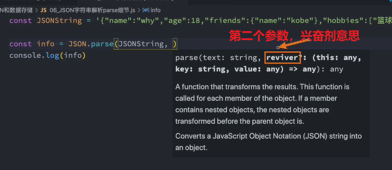

## JSON的由来

在目前的开发中，JSON是一种非常重要的**数据格式**，它**并不是编程语言**，而是一种可以在服务器和客户端之间传输的数据格式。

JSON的全称是JavaScript Object Notation（JavaScript对象符号）：

- Notation： 标记、符号

- JSON是由Douglas Crockford构想和设计的一种轻量级资料交换格式，算是JavaScript的一个子集；
- 但是虽然JSON被提出来的时候是主要应用JavaScript中，但是目前已经独立于编程语言，可以在各个编程语言中使用；
- 很多编程语言都实现了将JSON转成对应模型的方式；

其他的传输格式(早期使用的)：

- XML：类似于html，在早期的网络传输中主要是使用XML来进行数据交换的，但是这种格式在解析、传输等各方面都弱于JSON，所以目前已经很 少在被使用了；
- Protobuf：另外一个在网络传输中目前已经越来越多使用的传输格式是protobuf，但是直到2021年的3.x版本才支持JavaScript，所以目前在前端使用的较少；

目前JSON被使用的场景也越来越多：

- 网络数据的传输JSON数据；
- 项目的某些配置文件；
- 非关系型数据库（NoSQL）将json作为存储格式；

例如：小程序的配置文件使用的是JSON


## JSON基本语法

JSON的顶层支持三种类型的值：

- 简单值：数字（Number）、字符串（String，不支持单引号）、布尔类型（Boolean）、null类型；
- 对象值：由key、value组成，key是字符串类型，并且必须添加双引号，值可以是简单值、对象值、数组值；
- 数组值：数组的值可以是简单值、对象值、数组值；

注意：

- JSON是不支持undefined的
- JSON里面是不能加注释的
- JSON最后的位置是不能加逗号的

简单值：

```json
123
"abc"
false
null
```

对象值：

```json
{
  "name": "wts",
  "age": 18
}
```

数组值：

```json
[
  123,
  "abc",
  {
    "name": "wts",
    "age": 18
  }
]
```


## JSON序列化

某些情况下我们希望将JavaScript中的复杂类型转化成JSON格式的字符串，这样方便对其进行处理：

- 比如我们希望将一个对象保存到localStorage中；
- localStorage要求，存入的数据必须是字符串
- 但是如果我们直接存放一个对象，这个对象会被转化成 [object Object] 格式的字符串，并不是我们想要的结果；


所以要把对象转成JSON格式的字符串


## JSON序列化方法

在ES5中引用了JSON全局对象，该对象有两个常用的方法：

- stringify方法：将JavaScript类型转成对应的JSON字符串；
- parse方法：解析JSON字符串，转回对应的JavaScript类型；

那么上面的代码我们可以通过如下的方法来使用：

```js
const obj = {
  name: 'wts',
  age: 18,
  friends: ['cj', 'wyf']
}

const objStr = JSON.stringify(obj) 
console.log(objStr)
// {"name":"wts","age":18,"friends":["cj","wyf"]}
localStorage.setItem("info", objStr)

const itemStr = localStorage.getItem("info")
const objObj = JSON.parse(itemStr)
console.log(objObj)
// {
//     "name": "wts",
//     "age": 18,
//     "friends": [
//         "cj",
//         "wyf"
//     ]
// }

```


## Stringify的参数replace

replace是json.Stringify的第二个参数，是可选的

JSON.stringify() 方法将一个 JavaScript 对象或值转换为 JSON 字符串：

- 如果指定的 replacer 是数组，则可选择性地仅包含数组指定的属性；
- 如果指定了一个 replacer 函数，则可以选择性地替换值；

传入一个数组：

```js
const obj = {
  name: "why",
  age: 18,
  friends: {
    name: "kobe"
  },
  hobbies: ["篮球", "足球"],
}

// 只会将name和friends进行序列化
const jsonString2 = JSON.stringify(obj, ["name", "friends"])
console.log(jsonString2)

// {"name":"why","friends":{"name":"kobe"}}
```

传入一个回调函数：

```js
const obj = {
  name: "why",
  age: 18,
  friends: {
    name: "kobe"
  },
  hobbies: ["篮球", "足球"],
}

// 如果需要把age+1的话可以通过回调函数处理
const jsonString3 = JSON.stringify(obj, (key, value) => {
  if (key === "age") {
    return value + 1
  }
  return value
})
console.log(jsonString3)

// {"name":"why","age":19,"friends":{"name":"kobe"},"hobbies":["篮球","足球"]}
```


## Stringify的参数space

当然，它还可以跟上第三个参数space：

第三个参数可以传入两种类型，一个是number，另一个是string类型

number类型：

```js
const obj = {
  name: "why",
  age: 18,
  friends: {
    name: "kobe"
  },
  hobbies: ["篮球", "足球"],
}

// 格式化后的字符串的每一个key前面有两个空格
const jsonString = JSON.stringify(obj, null, 2)
console.log(jsonString)
```


他会转成这种格式，因为我们前面传的是2，所以这里有两个空格，当然我们也可以传个4，那我们前面就会有四个空格，这样阅读性会比较强。

当然我们也可以传入字符串，如果我们传入的是--，那么就是这样了

```js
const obj = {
  name: "why",
  age: 18,
  friends: {
    name: "kobe"
  },
  hobbies: ["篮球", "足球"],
}

// 如果需要把age+1的话可以通过回调函数处理
const jsonString = JSON.stringify(obj, null, '--')
console.log(jsonString)
```


## toJSON方法

如果对象本身包含toJSON方法，那么会直接使用toJSON方法的结果：

```js
const obj = {
  name: "why",
  age: 18,
  friends: {
    name: "kobe"
  },
  hobbies: ["篮球", "足球"],
  toJSON: function() {
    return "wts"
  }
}
const jsonString = JSON.stringify(obj)
console.log(jsonString)

// wts
```

也就是说不会出现name，age这样东西了，会直接调用toJSON方法。


## parse方法

JSON.parse() 方法用来解析JSON字符串，构造由字符串描述的JavaScript值或对象。

```js
const obj = {
  name: 'wts',
  age: 18,
  friends: ['cj', 'wyf']
}

const objStr = JSON.stringify(obj) 
const objObj = JSON.parse(objStr)
console.log(objObj)
// {
//     "name": "wts",
//     "age": 18,
//     "friends": [
//         "cj",
//         "wyf"
//     ]
// }

```


## parse的reviver

parse的第二个参数是reviver



提供可选的 reviver 函数用以在返回之前对所得到的对象执行变换(操作)。

```js
const obj = {
  name: 'wts',
  age: 18,
  time: '2025-07-15',
  friends: ['cj', 'wyf']
}
// 转成字符串
const objStr = JSON.stringify(obj) 

// 对返回的time进行操作
const objObj = JSON.parse(objStr, (key, value) => {
  if (key === 'time') {
    return new Date(value)
  } else if (key === 'age') {
    return value + 1
  }
  return value
})
console.log(objObj)
// {
//     "name": "wts",
//     "age": 19,
//     "time": "2025-07-15T00:00:00.000Z",
//     "friends": [
//         "cj",
//         "wyf"
//     ]
// }
```


## 使用JSON序列化深拷贝

JSON序列化生成的对象和之前的对象并不是同一个对象：

- 相当于是进行了一次深拷贝；

```js
const obj = {
  name: 'wts',
  age: 18,
  time: '2025-07-15',
  friend: {
    name: 'wyf'
  }
}
// 转成字符串
const objStr = JSON.stringify(obj) 
const info = JSON.parse(objStr)
console.log(info)
// {
//     "name": "wts",
//     "age": 18,
//     "time": "2025-07-15",
//     "friend": {
//         "name": "cj"
//     }
// }

console.log(info === obj)	// false
info.friend.name = 'cj'
console.log(obj.friend.name) // wts
```

注意：这种方法它对函数是无能为力的

- 创建出来的info中是没有foo函数的，这是因为stringify并不会对函数进行处理；
- 我们后续会讲解如何编写深拷贝的工具函数，那么这样就可以对函数的拷贝进行处理了；


引用赋值


注意数组里面是索引，保存的是基本数据类型


## 浅拷贝

通过展开运算符或者Object.assign


info2和obj是两个地址，如果obj中的friends里面的name发生了修改，那么info2中的name也会发生修改，因为它们指向的就是同一个对象地址，这种拷贝就被称为浅拷贝。

那么如果想进行深拷贝，需要怎么办呢？


## 深拷贝

可以利用stringify和parse来实现


因为它们在内存中是没有关系的，但是有一个问题，假设里面有函数，不会被json处理。因为json不支持函数，

那么如果有函数，会怎么办呢？默认会移除掉的所以，可以利用json.stringify和json.parse来实现深拷贝，但是如果里面有函数的话，是不能对函数进行拷贝的


## 认识Storage

storege是存储的意思，仓库的意思


WebStorage主要提供了一种机制，可以让浏览器提供一种比cookie更直观的key、value存储方式：

- localStorage：本地存储，提供的是一种永久性的存储方法，在关闭掉网页重新打开时，存储的内容依然保留；
- sessionStorage：会话存储，提供的是本次会话的存储，在关闭掉会话时，存储的内容会被清除；

```js
localStorage.setItem("name", "localStorage")
sessionStorage.setItem("name", "sessionStorage")
```


## localStorage和sessionStorage的区别

我们会发现localStorage和sessionStorage看起来非常的相似。

那么它们有什么区别呢？

- 验证一：关闭网页后重新打开，localStorage会保留，而sessionStorage会被删除；
- 验证二：在页面内实现跳转，localStorage会保留，sessionStorage也会保留；
- 验证三：在页面外实现跳转（打开新的网页），localStorage会保留，sessionStorage不会被保留；


如果有网页跳转，并打开新网页


localStorage是有的，sessionStorage是没有的


## Storage常见的方法和属性

Storage有如下的属性和方法：

属性：

- Storage.length：只读属性
  - 返回一个整数，表示存储在Storage对象中的数据项数量；

方法：

- Storage.key()：该方法接受一个数值n作为参数，返回存储中的第n个key名称；
- Storage.getItem()：该方法接受一个key作为参数，并且返回key对应的value；
- Storage.setItem()：该方法接受一个key和value，并且将会把key和value添加到存储中。
  - 如果key存储，则更新其对应的值；
- Storage.removeItem()：该方法接受一个key作为参数，并把该key从存储中删除；
- Storage.clear()：该方法的作用是清空存储中的所有key；


## 封装Storage

在开发中，为了让我们对Storage使用更加方便，我们可以对其进行一些封装：

```js
class HYCache {
  constructor(isLocal = true) {
    this.storage = isLocal ? localStorage: sessionStorage
  }

  setItem(key, value) {
    if (value) {
      this.storage.setItem(key, JSON.stringify(value))
    }
  }

  getItem(key) {
    let value = this.storage.getItem(key)
    if (value) {
      value = JSON.parse(value)
      return value
    } 
  }

  removeItem(key) {
    this.storage.removeItem(key)
  }

  clear() {
    this.storage.clear()
  }

  key(index) {
    return this.storage.key(index)
  }

  length() {
    return this.storage.length
  }
}

const localCache = new HYCache()
const sessionCache = new HYCache(false)

export {
  localCache,
  sessionCache
}

```


## 认识IndexedDB

什么是IndexedDB呢？

- 我们能看到DB这个词，就说明它其实是一种数据库（Database），通常情况下在服务器端比较常见；
- 在实际的开发中，大量的数据都是存储在数据库的，客户端主要是请求这些数据并且展示；
- 有时候我们可能会存储一些简单的数据到本地（浏览器中），比如token、用户名、密码、用户信息等，比较少存储大量的数据；
- 那么如果确实有大量的数据需要存储，这个时候可以选择使用IndexedDB；


这种就被称为事务，简单来讲，就是对数据库操作的时候，操作的是一个完整的操作单元，操作单元完成，这个操作就ok，操作单元只有有一部分失败，这个操作就需要回滚失败

IndexedDB是一种底层的API，用于在客户端存储大量的结构化数据。

- 它是一种事务型数据库系统，是一种基于JavaScript面向对象数据库，有点类似于NoSQL（非关系型数据库）；
- IndexDB本身就是基于事务的，我们只需要指定数据库模式，打开与数据库的连接，然后检索和更新一系列事务即可；


和localStorage的区别，localStorage存的是字符串,但是这个是对象

如果localStorage要搜索，要遍历，才能找到，indexDB通过数据库的方式保存，它检索的效率要很高的，他有自己的数据结构，有自己的算法，效率很高的


## IndexedDB的连接数据库

第一步：打开indexedDB的某一个数据库；

- 通过indexDB.open(数据库名称, 数据库版本)方法；
- 如果数据库不存在，那么会创建这个数据；
- 如果数据库已经存在，那么会打开这个数据库；

第二步：通过监听回调得到数据库连接结果；

- 数据库的open方法会得到一个IDBOpenDBRequest类型
- 我们可以通过下面的三个回调来确定结果：
  - onerror：当数据库连接失败时；
  - onsuccess：当数据库连接成功时回调；
  - onupgradeneeded：当数据库的version发生变化并且高于之前版本时回调；
    - 通常我们在这里会创建具体的存储对象：db.createObjectStore(存储对象名称, { keypath: 存储的主键 })
  - 我们可以通过onsuccess回调的event获取到db对象：event.target.result


## IndexedDB的数据库操作

我们对数据库的操作要通过事务对象来完成：

- 第一步：通过db获取对应存储的事务 db.transaction(存储名称, 可写操作)；
- 第二步：通过事务获取对应的存储对象 transaction.objectStore(存储名称)；

接下来我们就可以进行增删改查操作了：

- 新增数据 store.add
- 查询数据
  - 方式一：store.get(key)
  - 方式二：通过 store.openCursor 拿到游标对象
    - 在request.onsuccess中获取cursor：event.target.result
    - 获取对应的key：cursor.key；
    - 获取对应的value：cursor.value；
    - 可以通过cursor.continue来继续执行；
  - 修改数据 cursor.update(value)
  - 删除数据 cursor.delete()

```js
// 1、打开数据(和数据库建立连接), 3表示版本号，也可以不写
// 如果没有数据库就是创建，如果有了就是打开，返回一个request（对象）
// 这个对象有什么用，可以拿到对象，监听一些回调函数
const dbRequest = indexedDB.open("why", 3)


// 1-1：可以写一些回调
// 可能浏览器就不支持
dbRequest.onerror = function(err) {
  console.log("打开数据库失败~")
}
let db = null
// 成功的回调
dbRequest.onsuccess = function(event) {
    // 拿到db
  db = event.target.result
}
// 第一次打开/或者版本发生升级
// 一个数据库软件可以有多个数据库，一个数据库又可以有多个表
// 第一次打开回来到这里，后面打开就不会来到这里了，有个问题，就是待会操作数据库的时候要用到这个db，怎么拿到这个db呢，所以我们在上面定义一个db，赋值为null
dbRequest.onupgradeneeded = function(event) {
   // 建立完链接以后，拿到数据库，可以对数据库做操作
  const db = event.target.result
  console.log(db)
  // 创建一些存储对象，比如想创建一些用户信息，第二个参数是keypath，就是作为表的主键（图：1-1）
  // 也就是，你等下存到数据库里面的东西，会有id这个东西，users就是表的名字
  db.createObjectStore("users", { keyPath: "id" })
}
// 现在就创建了一个数据库图：1-2


class User {
  constructor(id, name, age) {
    this.id = id
    this.name = name
    this.age = age
  }
}

// 2-3: 创建数据对象
const users = [
  new User(100, "why", 18),
  new User(101, "kobe", 40),
  new User(102, "james", 30),
]

// 2: 操作数据库
// 我们现在要新增数据，因为它是一个事务型数据库，所以必须要有一个事务
// 事务对象每次点击新增的时候都创建一个新的事务
// 获取btns, 监听点击
const btns = document.querySelectorAll("button")
for (let i = 0; i < btns.length; i++) {
  btns[i].onclick = function() {
     // 2-1: 创建一个事务，操作的表的名字:user，操作模式：readwrite
    const transaction = db.transaction("users", "readwrite")
    console.log(transaction)
    // 2-2：从transaction这个事务里面拿users这个store对象，这里可以传多个，传数组，也就是操作哪个表
    // 这个时候就可以往里面放东西了
    const store = transaction.objectStore("users")

    switch(i) {
      case 0:
        console.log("点击了新增")
        // 3: 新增数据到表中
        for (const user of users) {
          // 3-1: 拿到store对象，调用它的add方法将user传进去就行了
          const request = store.add(user)
		 // 每一次操作都会有一个回调，告诉你是否会成功
          request.onsuccess = function() {
            console.log(`${user.name}插入成功`)
          }
        }
        // 当本次事务操作全部完成就会回调这个
        transaction.oncomplete = function() {
          console.log("添加操作全部完成")
        }
        // 插入成功之后就是这个样子图3-1
        break
      case 1:
        console.log("点击了查询")
	    //4：查询
        // 4-1.查询方式一(知道主键, 根据主键查询, 查询单个数据), 给我们的不是一个结果，给的是一个request
        // const request = store.get(102)
        // 4-1-1.拿到查询结果
        // request.onsuccess = function(event) {
        //   console.log(event.target.result)
        // }

        // 4-2.查询方式二（查询数据库所有数据）:
        // 打开一个游标，类似于指针的一个东西，当我们打开的时候他指向第一个数据，当调用continue的时候他会指向第二条数据...依次往后
        const request = store.openCursor()
        request.onsuccess = function(event) {
		 // 4-2-1: 这里获得游标
          const cursor = event.target.result
          // 4-2-2: 判断是否有值，当游标有值的时候，就会进入，游标的指向没有值了，那么就不会进入if了
          if (cursor) {
            if (cursor.key === 101) {
              console.log(cursor.key, cursor.value)
                // 继续找到后一条数据
              cursor.continue()
            } else {
              cursor.continue()
            }
          } else {
            console.log("查询完成")
          }
        }
        break
      case 2:
        // 6：删除数据
        console.log("点击了删除")
        const deleteRequest = store.openCursor()
        deleteRequest.onsuccess = function(event) {
          const cursor = event.target.result
          if (cursor) {
            if (cursor.key === 101) {
              //删除数据
              cursor.delete()
            } else {
              cursor.continue()
            }
          } else {
            console.log("查询完成")
          }
        }
        break
      case 3:
        // 5: 修改，修改是基于查询的
        console.log("点击了修改")
        const updateRequest = store.openCursor()
        updateRequest.onsuccess = function(event) {
          const cursor = event.target.result
          if (cursor) {
            if (cursor.key === 101) {
              // 通过游标可以拿到这个数据的value
              const value = cursor.value;
              // 对这个value的数据进行修改
              value.name = "curry"
              // 更新这个游标指向的数据
              cursor.update(value)
            } else {
              cursor.continue()
            }
          } else {
            console.log("查询完成")
          }
        }
        break
    }
  }
}

```


1-1：


1-2：


3-1：


## 认识Cookie

cookie跟服务器的关系会紧密一点，跟客户端的关系没那么紧密，一般就是请求服务器的时候服务器设置一些cookie，然后前端再次请求服务器的时候会给服务器带过去

Cookie（复数形态Cookies），又称为“小甜饼”。类型为“小型文本文件”，某些网站为了辨别用户身份而存储在用户本地终端 （Client Side）上的数据。

- 浏览器会在特定的情况下携带上cookie来发送请求，我们可以通过cookie来获取一些信息；

Cookie总是保存在客户端中，按在客户端中的存储位置，Cookie可以分为内存Cookie和硬盘Cookie。

- 内存Cookie由浏览器维护，保存在内存中，浏览器关闭时Cookie就会消失，其存在时间是短暂的；
- 硬盘Cookie保存在硬盘中，有一个过期时间，用户手动清理或者过期时间到时，才会被清理；

如果判断一个cookie是内存cookie还是硬盘cookie呢？

- 没有设置过期时间，默认情况下cookie是内存cookie，在关闭浏览器时会自动删除；
- 有设置过期时间，并且过期时间不为0或者负数的cookie，是硬盘cookie，需要手动或者到期时，才会删除；


这个是服务器响应的数据，这里的set-cookie就是服务器设置的cookie内容，前端不需要读取这个cookie，浏览器会自动读取，并且设置到客户端

等到我们下一次发送请求的时候，请求中就会自动携带这个cookie，服务器就会获取到这个cookie


这视频中演示了用koa写的一个服务器设置cookie，然后在前端拿到这个cookie，可以看下视频day30，并在资料中拿到数据 


## cookie常见的属性

cookie的生命周期：

默认情况下的cookie是内存cookie，也称之为会话cookie，也就是在浏览器关闭时会自动被删除；

我们可以通过设置expires或者max-age来设置过期的时间；

- expires：设置的是Date.toUTCString()，设置格式是;expires=date-in-GMTString-format；
- max-age：设置过期的秒钟，;max-age=max-age-in-seconds (例如一年为60*60*24*365)；

cookie的作用域：（允许cookie发送给哪些URL）

Domain：指定哪些主机可以接受cookie

- 如果不指定，那么默认是 origin，不包括子域名。
- 如果指定Domain，则包含子域名。例如，如果设置 Domain=mozilla.org，则 Cookie 也包含在子域名中（如developer.mozilla.org）。

Path：指定主机下哪些路径可以接受cookie

- 例如，设置 Path=/docs，则以下地址都会匹配：
  - /docs
  - /docs/Web/
  - /docs/Web/HTTP


## 客户端设置cookie


那怎么删呢？


但是有些cookie是删不掉的，比如：


如果有这么一个属性，如果打了√，表示这个cookie只能通过http来对它做操作，否则我们不能对服务器设置的cookie做操作（也就是上面的方法无法删除），所以前端如果想操作cookie，需要后端把httponly这个配置改成false才能修改。


js直接设置和获取cookie：


这个cookie会在会话关闭时被删除掉；


设置cookie，同时设置过期时间（默认单位是秒钟）


cookie 缺点：

- 将cookie附加到每一次的http请求中，有时候不需要，它也会自动加上cookie，会浪费一定的流量
- 明文传输的
- 大小限制：4kb
- cookie验证登录，客户端会自动加上浏览器，但是还有ios，android，小程序，它们是不能自动设置cookie，需要手动添加的

所以很多公司都不用cookie了，cookie现在用的越来越少了，现在用token的越来越多了


## 补充一道面试题

参数的作用域


这样一个题目的面试题


这个x = 3 到底是给哪个x赋值的呢？

这个是问题的关键

这里改的是这里这个x


把这个x改成了3，所以第三行的打印是3

第七行的打印是2，因为foo这个函数的作用域是访问不到y函数的作用域


在这个题目里面

一共有三个作用域

函数有默认值的情况下，会多形成一个作用域，叫参数作用域，函数作用域属于参数作用域


第四行在找x的时候在函数作用域找不到，他就会去找参数作用域的x，没有作用域提升吗？在这里是没有的，因为当前第四行是能访问到x的，所以不会访问变量提升的x 

ecma有这样一个文档


如有函数的参数没有包含默认参数的话，那么函数的参数和函数内部是放到同一个作用域下面的，如果函数的参数有默认值的话，那么默认值这里会有一个作用域，并且函数内部也有一个作用域