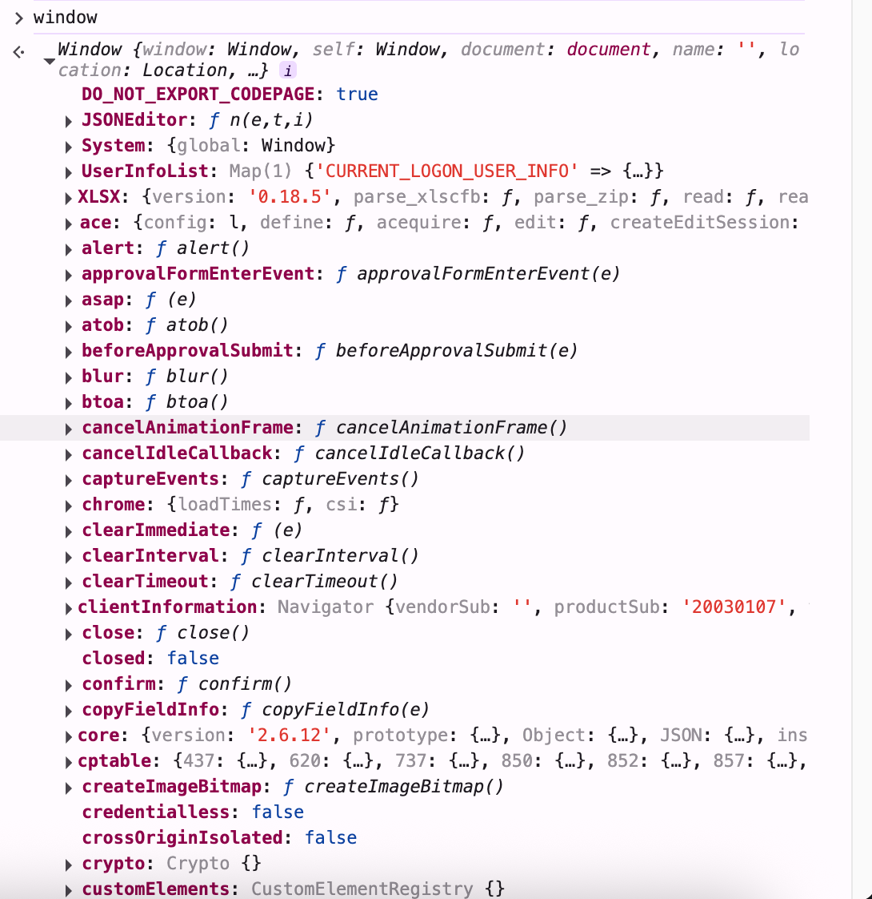
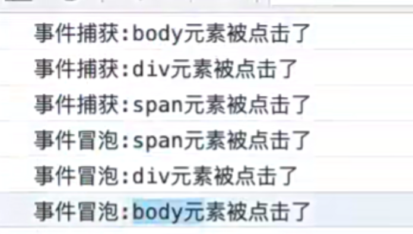

我们在学东西的时候，要注意，最好不要线性的去学习，先学1、在学2、在学3、要站在架构的层面上去学习，比如js在设计api的时候可能会设置API-A，又设置了API-B,那这两个如果有共同的API，那他可能就抽取了一个父类，它们共有的就抽到了父类中


无非就是用的时候就去查api就行了，从高处去看这个知识点就清晰很多了


## 认识BOM

JavaScript有一个非常重要的运行环境就是浏览器，而且浏览器本身又作为一个应用程序需要对其本身进行操作，所以通常浏览器会有对 应的对象模型（BOM，Browser Object Model）。

浏览器本事是一个程序，我们学习了很多东西promise、proxy

但是window它不是属于js本身的

但是我们可能需要操作浏览器

所以BOM给我们提供了一些api用来去操作浏览器

我们可以将BOM看成是连接JavaScript脚本与浏览器窗口的桥梁，他提供了一系列的API，js通过操作这些API，然后来让浏览器执行对应的操作。


BOM主要包括一下的对象模型：

- window：包括全局属性、方法，控制浏览器窗口相关的属性、方法；
- location：浏览器连接到的对象的位置（URL），可以通过它操作url；
- history：操作浏览器的历史；
- document：当前窗口操作文档的对象（html body这些东西， 叫做Decument Object model)；

 在js环境里面本来就有一个全局对象（GO, root object)

window对象在浏览器中有两个身份：

- 身份一：js的全局对象。
  - 我们知道ECMAScript其实是有一个全局对象（GO，root object）的，这个全局对象在Node中是global；
  - 在浏览器中就是window对象；
  
  ```js
  var message = 'wts'
  var age = 18
  window.setTimeout(() => {
    console.log('setTimeout')
  }, 2000)
  const obj = new Window.Date()
  ```

这些都是作为js的全局对象来使用的，它们都会被加入到全局对象中


- 身份二：浏览器窗口对象。
  - 作为浏览器窗口时，提供了对浏览器操作的相关的API；




## Window全局对象

在浏览器中，window对象就是之前经常提到的全局对象，也就是我们之前提到过GO对象：

- 比如在全局通过var声明的变量，会被添加到GO中，也就是会被添加到window上；
- 比如window默认给我们提供了全局的函数和类：setTimeout、Math、Date、Object等；

通过var声明的变量，全局提供的类和方法：

```js
var message = 'Hello world'
function foo() {
  console.log('foo function')
}
console.log(window.message)
window.foo

window.setTimeout(() => {
  console.log('setTimeout')
}, 1000)

const obj = new window.Object()
console.log(obj)

const date = new window.Date()
console.log(date)
```

这些用法是我们之前讲过的，并且也是作为JavaScript语言本身所拥有的一些特性。

- 那么接下来我们来看一下作为窗口对象（作为BOM对象），它拥有哪些特性。


## Window窗口对象

事实上window对象上肩负的重担是非常大的：

- 第一：包含大量的属性，localStorage、console、location、history、screenX、scrollX等等（大概60+个属性）；
- 第二：包含大量的方法，alert、close、scrollTo、open等等（大概40+个方法）；
- 第三：包含大量的事件，focus、blur、load、hashchange等等（大概30+个事件）；
- 第四：包含从EventTarget继承过来的方法，addEventListener、removeEventListener、dispatchEvent方法；

那么这些大量的属性、方法、事件在哪里查看呢？

- MDN文档：https://developer.mozilla.org/zh-CN/docs/Web/API/Window

查看MDN文档时，我们会发现有很多不同的符号，这里我解释一下是什么意思：

- 删除符号：表示这个API已经废弃，不推荐继续使用了；
- 点踩符号：表示这个API不属于W3C规范，某些浏览器有实现（所以存在兼容性的问题）；
- 实验符号：该API是实验性特性，以后可能会修改，并且存在兼容性问题；

window是一个对象，对象都是由构造函数来创建的，那么window的构造函数就是Window创建出来的，那么Window这个构造函数它其实是继承EventTarget这个类的，继承就以为着EventTarget里面的方法Window都可以用，也就以为着window是可以用的，那么有哪些呢？

window.addEventListener、window.removeEventListener等

为什么有这么多东西，因为就是继承来的，但是我们也发现div.addEventListener、document.addEventListener也是有这些方法的。因为不管是div，还是document都有对应的类，而这些类也是继承自EventTarget的


这就是为什么会有这些东西了

mdn有一幅图


那么window本身有哪些属性、方法呢


这些东西不需要记，查文档就行


## window常见的属性

我们来看一下常见的window属性：

```js
// 浏览器高度
console.log(window.outerHeight)
console.log(window.innerHeight)

console.log('screenX:', window.screenX)
console.log('screenY:', window.screenY)

// 监听
window.addEventListener('scroll', (event) => {
  console.log(window.scrollY)
  console.log(window.scrollX)
})
```


## window常见的方法

我们来看一下常见的window方法：

```js
// close方法
const closeBtn = document.querySelector('#close')
closeBtn.onclick = function () {
  close()
}

// scrollTo
const scrollBtn = document.querySelector('#scroll')
scrollBtn.onclick = function () {
  scrollTo({ top: 1000 })
}

// 打开新创建
const openBtn = document.querySelector('#open')
openBtn.onclick = function () {
  open('./about.html', '_self')
}

window.onFocus = function () {
  console.log('窗口获取到焦点')
}

window.onblur = function () {
  console.log('窗口失去了焦点')
}

// 整个页面以及所有的资源都加载完成
window.onload = function () {
  console.log('页面加载完成')
}

// hash改变
const hashBtn = document.querySelector('#hash')
hashBtn.onclick = function () {
  location.hash = 'aaa'
}
//前端路由就是通过监听hash改变，然后对应的展示不同的控件
window.onhashchange = function () {
  console.log('hash被修改了')
}
```


window是哪里来的呢？


它里面最主要有三个方法


window之所以有这三个方法，是因为这些是window继承过来的

## EventTarget

Window继承自EventTarget，所以会继承其中的属性和方法：

- addEventListener：注册某个事件类型以及事件处理函数；
- removeEventListener：移除某个事件类型以及事件处理函数；
- dispatchEvent：派发某个事件类型到EventTarget上；

```js
const scrollHandler = () => {
  console.log('window发生了滚动~')
}
const clickHandler = () => {
  console.log('window发生了点击')
}
// 监听事件
window.addEventListener('scroll', scrollHandler)
window.addEventListener('click', clickHandler)

const removeBtn = document.querySelector('#removeEvent')
removeBtn.onclick = function () {
  console.log('---')
  // 删除上面监听的事件
  window.removeEventListener('click', scrollHandler)
  window.removeEventListener('scroll', clickHandler)
}

const dispatchBtn = document.querySelector('#dispatch')
dispatchBtn.onclick = functionn () {
  // 派发一个事件
  window.dispatchEvent(new Event('wts'))
}
// 监听派发的事件
window.addEventListener('wts', () => {
  console.log('监听到了wts事件')
})
```

默认事件监听： https://developer.mozilla.org/zh-CN/docs/Web/Events

前面都是window对象


## Location对象常见的属性

Location对象用于表示window上当前链接到的URL信息。

常见的属性有哪些呢？

- href: 当前window对应的超链接URL, 整个URL（完整的url地址）；
- protocol: 当前的协议（http）；
- host: 主机地址(127.0.0.1:5500)；
- hostname: 主机地址(不带端口:127.0.0.1)；
- port: 端口(5500)；
- pathname: 路径(/abc/index.html)；
- search: 查询字符串；
- hash: 哈希值；
- username：URL中的username（很多浏览器已经禁用）；
- password：URL中的password（很多浏览器已经禁用）；


## Location对象常见的方法

我们会发现location其实是URL的一个抽象实现：


scheme:协议

location有如下常用的方法：

- assign：赋值一个新的URL，并且跳转到该URL中；
- replace：打开一个新的URL，并且跳转到该URL中（不同的是不会在浏览记录中留下之前的记录）；
- reload：重新加载页面，可以传入一个Boolean类型；

```js
const locationBtn = document.querySelector('#location')
locationBtn.onclick = function () {
  location.assign('http://www.baidu.com')
  location.replace('http://www.baidu.com')
  location.reload()
}
```


## history对象常见属性和方法

history对象允许我们访问浏览器曾经的会话历史记录。

有两个属性：

- length：会话中的记录条数；
- state：当前保留的状态值；

有五个方法：

- back()：返回上一页，等价于history.go(-1)；
- forward()：前进下一页，等价于history.go(1)；
- go()：加载历史中的某一页；
- pushState()：打开一个指定的地址（不会加载新资源，也就是不会网络请求，第一个参数就是state，就是跳转的时候保存的state，我可以在后来拿到这个state，也就是前面的state， 第二个参数是title，一般不传，浏览器会禁掉，第三个参数是要跳转的网页）；
- replaceState()：打开一个新的地址，并且使用replace；

```js
console.log(history.length)
console.log(history.state)

const jumpBtn = document.querySelector('#jump')
const backBtn = document.querySelector('#back')

jumpBtn.onclick = function () {
  // 打开新网页后通过history.state可以获取到{name: 'wts'}
  history.pushState({name: 'wts'}, '11', '/detail')
  console.log(history.length, history.state)
}

backBtn.onclick = function () {
  history.back()
  console.log(history.length, history.state)
}
```

可以保存一份state


就是我从coderwhy通过pushState跳转到detail的时候，它保存的，这个就是state的作用，但是它是不刷新网页的


## 认识DOM和架构


我们的html代码是可以直接交给浏览器处理的，浏览器在不执行js的情况下，是可以自己执行的，例如html标签span标签等，这些东西是不需要js处理的，但是现在越来越多需要js来处理，我们现在做的越来越多的是前端渲染，例如vue，react

以前的时候是服务器把一大堆东西(html)返回给浏览器，浏览器直接展示出来，但是现在一般是由javascript在服务器请求下来， 请求到的是一大堆的数据，比如请求到很多数组，对象等，这个时候浏览器不知道怎么展示这些数据，就由javascript把这些东西转成html代码，再交给浏览器，然后浏览器把他们渲染出来，这个就叫前端渲染

但是有一个问题，你是怎么让h2元素来显示后端返回的一个字段，交给浏览器，让浏览器解析呢？

这个时候就给我们提供了dom操作，document object model（文档对象模型）

h2,span都是文档模型，我们可以创建这些文档模型，然后让浏览器渲染

但是这些文档模型都是dom固定给我们提供的，不是我们随随便便提供一个模型，浏览器就能帮我们解析的

所以dom也是一个桥梁，它是沟通html标签这些元素和js脚本的一些桥梁

浏览器是用来展示网页的，而网页中最重要的就是里面各种的标签元素，JavaScript很多时候是需要操作这些元素的。

那么怎么设计呢？

首先整个html就是一个文档对象

文档对象可能包含很多标签、或者注释等


这些注释也能展示出来，说明这些注释应该也是对应一些对象的，每一个标签或者每一个对象不应该是一个东西，因为每个东西可能会有自己的特性，包括文字也是一种类型

所以在设计这些东西的时候可以通过设计多个模型，让多个模型存在继承关系，可以把共同的东西放到父类里面，把不同的东西设计一些子类，子类再有自己的特性

所以浏览器在设计自己的架构上就是这样设计的

- JavaScript如何操作元素呢？通过Document Object Model（DOM，文档对象模型）。
- DOM给我们提供了一系列的模型和对象，让我们可以方便的来操作Web页面。


这里有一个EventTarget,前面说过window继承自EventTarget

所以下面这些都是继承自EventTarget 所以不管是div，还是body，它们都有addEventTarget这个方法，因为它们都有继承

然后EventTarget下面有一个node，它是节点，因为对于文档来说它可以看成一个一个的节点，每一个节点都继承自EventTarget


所以对于节点所共有的特性，都可以放到node中

node还有子类

document表示整个文档


xml已经用的非常少了

node还有一个分支叫做element

element指的就是标签元素


所有的标签都叫做element，例如htmldivElement等


node下面还划分的右CharacterData

他就是字符数据


某些标签就会有文本，这些文本属于元素吗？不属于元素，属于元素里面的某些内容，那么在dom中怎么表示出来呢？它就是text

另外还有comment，他就是注释


node中还有Attr，他就是属性

attr指的就是name这些属性


整个dom就是这样一个架构，有相同的就放到父类中，有不同的就创建一个模型


## EventTarget

因为继承自EventTarget，所以也可以使用EventTarget的方法：

```js
// document是整个文档
document.addEventListener('click', () => {
  console.log('document被点击')
})

const boxDiv = document.querySelector('#box')
boxDiv.addEventListener('click', () => {
  console.log('box被点击')
})
```

document继承自EventTarget所以他也会有addEventListener事件

我们不能通过element拿到某一个元素，因为，element是封装到document中的


## Node节点

所有的DOM节点类型都继承自Node接口。

- https://developer.mozilla.org/zh-CN/docs/Web/API/Node

Node有几个非常重要的属性：

- nodeName：node节点的名称（例如：DIV）。
- nodeType：可以区分节点的类型（例如：1）。
- nodeValue：node节点的值（只有标签才可能有值，其他非标签节点的值可能为null）；
- childNodes：所有的子节点（例如：[某一个节点]）；


node.nodeType

我们的document的类型和标签的类型是不一样的

我们的注释类型和标签的类型也不一样

我们的文本类型和其他类型也是不一样的

它是按照这种大的结构来进行划分的

但是标签和标签的类型是一样的


注意：document虽然继承自node，但是不能使用appendChild方法，是浏览器做的特殊处理，只能通过document.body.appendChild来使用


## Document

 


Document节点表示的整个载入的网页，我们来看一下常见的属性和方法：

```js
// title
document.title = 'wts'

// body/head
console.log(document.body)
console.log(document.head)

// children
console.log(document.children)

// location
console.log(document.location)
console.log(window.location === document.location)	// true

// 方法
// 1. 创建和添加createElement
const h2El = document.createElement('h2')
h2El.textContent = 'Hello world'
document.body.appendChild(h2El)

// 创建img的两种方式
const imageEl = document.createElement("img")
const imageEl2 = new HTMLImageElement()	// 内部实际上就是这样创建的


// 2.删除元素
setTimeout(() => {
  document.body.removeChild(h2El)
}, 2000)

// 3.获取元素
const el1 = document.getElementsByName('abc')
const el2 = document.getElementsByTagName('div')

const el3 = document.querySelector('div')
const el4 = document.querySelectorAll('div')
```


## Element

我们平时创建的div、p、span等元素在DOM中表示为Element元素，我们来看一下常见的属性和方法：


 


## 认识事件监听

前面我们讲到了JavaScript脚本和浏览器之间交互时，浏览器给我们提供的BOM、DOM等一些对象模型。

- 事实上还有一种需要和浏览器经常交互的事情就是事件监听：
- 浏览器在某个时刻可能会发生一些事件，比如鼠标点击、移动、滚动、获取、失去焦点、输入内容等等一系列 的事件；

我们需要以某种方式（代码）来对其进行响应，进行一些事件的处理；

- 在Web当中，事件在浏览器窗口中被触发，并且通过绑定到某些元素上或者浏览器窗口本身，那么我们就可以 给这些元素或者window窗口来绑定事件的处理程序，来对事件进行监听。

如何进行事件监听呢？

- 事件监听方式一：在script中直接监听；

  ```html
  <div class="box" onclick="console.log('div元素被点击')"></div> 
  
  ```

- 事件监听方式二：通过元素的on来监听事件；

  ```js
  const divEl = document.querySelector(".box")
  // DOM0
  divEl.onclick = function() {
    console.log("div元素被点击3")
  }
  // 这种给divEl的onclick覆盖掉，所以div中的onclick会不生效
  ```

- 事件监听方式三：通过EventTarget中的addEventListener来监听；

  ```js
  const divEl = document.querySelector(".box")
  // DOM2
  divEl.addEventListener("click", () => {
    console.log("div元素被点击4")
  })
  divEl.addEventListener("click", () => {
    console.log("div元素被点击5")
  })
  divEl.addEventListener("click", () => {
    console.log("div元素被点击6")
  })
  // 可以执行多个监听，也就是说，点击了divEl，那么这些函数都会执行
  ```


## 认识事件流的由来

事实上对于事件有一个概念叫做事件流，为什么会产生事件流呢？

- 我们可以想到一个问题：当我们在浏览器上对着一个元素点击时，你点击的不仅仅是这个元素本身；
- 这是因为我们的HTML元素是存在父子元素叠加层级的；
- 比如一个span元素是放在div元素上的，div元素是放在body元素上的，body元素是放在html元素上的；

```html
<body>
  <div class="box">
    <span class="span">我是span元素</span>
  </div>
</body>
<script>
	document.body.addEventListener('click', () => {
    console.log('body被点击')
  })
  const divEl = document.querySelector('.box')
  const spanEl = document.querySelector('.span')
  divEl.addEventListener('click', () => {
    console.log('div被点击')
  })
  spanEl.addEventListener('click', () => {
    console.log('span被点击')
  })
  
  // span被点击
  // div被点击
  // body被点击
</script>
```

这种事件传递被称为事件冒泡


## 事件冒泡和事件捕获

我们会发现默认情况下事件是从最内层的span向外依次传递的顺序，这个顺序我们称之为事件冒泡（Event  Bubble）。

- 事实上，还有另外一种监听事件流的方式就是从外层到内层（body -> span），这种称之为事件捕获（Event  Capture）；
- 为什么会产生两种不同的处理流呢？
  - 这是因为早期浏览器开发时，不管是IE还是Netscape公司都发现了这个问题，但是他们采用了完全相反的事件流来对事件进行了传递；
  - IE采用了事件冒泡的方式，Netscape采用了事件捕获的方式；

那么我们如何去监听事件捕获的过程呢？

```js
// 给addEventListener的第二个参数设置为true表示为事件捕获阶段
document.body.addEventListener('click', (event) => {
  console.log('事件捕获阶段：body被点击')
}, true)
```


## 冒泡和捕获的顺序

如果我们同时有事件冒泡和时间捕获的监听，那么会优先监听到事件捕获的：




他是先从外传到里，在从里传到外


## 事件对象event

当一个事件发生时，就会有和这个事件相关的很多信息：

- 比如事件的类型是什么，你点击的是哪一个元素，点击的位置是哪里等等相关的信息；
- 那么这些信息会被封装到一个Event对象中；
- 该对象给我们提供了想要的一些属性，以及可以通过该对象进行某些操作；

常见的属性：

- type：事件的类型；
- target：当前事件发生的元素；
- currentTarget：当前处理事件的元素；
- offsetX、offsetY：点击元素的位置；

常见的方法：

- preventDefault：取消事件的默认行为；
- stopPropagation：阻止事件的进一步传递；

```js
const spanEl = document.querySelector(".span")

spanEl.addEventListener("click", (event) => {
  console.log("span元素被点击:", event)
  console.log("事件的类型:", event.type)
  // 这两种当前是一样的值，因为不管是点击的对象还是监听的对象都是span，如果在span的父元素监听的话，currentTarget指向的就是span的父元素
  console.log("事件的元素:", event.target, event.currentTarget)
  console.log("事件发生的位置:", event.offsetX, event.offsetY)
})

const divEl = document.querySelector(".container")
divEl.addEventListener("click", (event) => {
  console.log("div元素被点击:", event.target, event.currentTarget)
})

// 常见的方法
// preventDefault
const aEl = document.querySelector("a")
// 拿到a标签，阻止a标签的跳转
aEl.addEventListener("click", (event) => {
  event.preventDefault()
})

// stopPropagation
// 见06_事件冒泡和事件捕获.js
```

事件类型：https://developer.mozilla.org/zh-CN/docs/Web/Events

