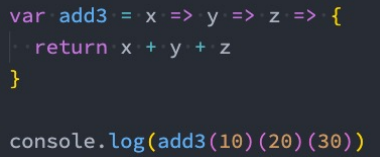
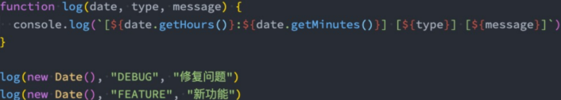

## 实现apply、call、bind


当使用call/apply/bind的时候实际上，会在调用栈中绑定一个this，这个this的地址指向的就是传进来的对象


### 剩余参数


### 展开运算符


### 接下来我们来实现一下apply、call、bind函数：

- 注意：我们的实现是练习函数、this、调用关系，不会过度考虑一些边界情况


```javascript
// 2、这里是构造函数Function，给他的原型增加方法，那么其他的地方都可以调用了
// 接收传过来的参数, 第一个参数是this，第二个参数是剩余参数，也就是需要传进来的参数
Function.prototype.tsCall = function (thisArg, ...arg) {
  // 3、问题1：得获取到哪一个函数调用了tsCall
  // 4、既然要手动实现call方法，就需要在这个函数里面调用调用这个方法的函数
  // 5、foo()  不能写死，不具备通用性
  // 6、这个this指向的就是调用tsCall的那个函数，这里是通过隐式绑定来确定这个this绑定的是谁的
  var fn = this;


  // 7、这样不就白实现call方法了吗，肯定不能这样做啦
  // fn.call(thisArg);


  // 8、这样就可以拿到调用tsCall这个函数，直接调用
  // fn();
  // 9、问题2：如果是数字类型，是不能添加属性的，下面这样操作,这样不管是数字还是字符串都是对象类型了
  //10、 如果有值就通过Object函数来处理，如果没有值就是window
  // 11、他的意思是把传过来的这个this也就是需要绑定的对象拿到，拿到以后转换成对象类型，如果是null或者是undefined则绑定window;
  thisArg = thisArg ? Object(thisArg) : window;
  // 12、给需要绑定的这个对象增加一个属性，这个属性就是调用tsCall的函数，为什么要加给他呢，这里是做隐式绑定
  // 这个时候fn里面的this指向的就是传进来的那个this了
  thisArg.fn = fn;


  // 13、这样调用的话，在调用的这个函数里面实际上会多出来一个属性，就是fn这个属性，
  // 是因为我们在上面给thisArg增加了这个属性，现在调用的话实际上这个属性是没有删除
  // 的，如果不想要这个属性我们可以在后面通过delete删除这个属性
  // 14、拿到除了thisArg之外剩余的参数，传给调用tsCall的函数
  var result = thisArg.fn(...arg);


  // 14、将这个函数的返回值也返回回去
  return result;


}


// 1、调用，并看下这个this是什么
function foo() {
  console.log('foo函数被执行了', this)
}


// 2、带返回值的情况
function sum(num1, num2) {
  return num1 + num2;
}


// 系统的call方法传入数字类型，或者字符串类型，是没有问题的
// foo.call(123);
// 这里是在隐式绑定this,所以在tsCall中的this就是foo函数
// foo.tsCall({name: 'wts'});


// 我们实现的call如果传入数字类型或者字符串就会有问题了
// 为什么会有问题呢，因为数字上面是不能加东西的，比如 123.fn这个是会报错的
// 如果想加怎么办呢，就需要 var num = new Number(123); 把他变成一个Number类型
// 但是你怎么知道我们传的是什么类型呢，有可能是number类型，有可能是boolean类型，也有可能是string类型
// 我们可以这样 Object(123)、Object('hehe');
// 这样的话就可以得到对象，比如Number类型、或者String类型
foo.tsCall(null)
console.log(sum.tsCall({}, 3, 45))
// sum.tsCall();
```


```javascript
// 自己实现hyapply
Function.prototype.hyapply = function(thisArg, argArray) {
  // 1.获取到要执行的函数
  var fn = this


  // 2.处理绑定的thisArg
  thisArg = (thisArg !== null && thisArg !== undefined) ? Object(thisArg): window


  // 3.执行函数
  thisArg.fn = fn
  var result
  // if (!argArray) { // argArray是没有值(没有传参数)
  //   result = thisArg.fn()
  // } else { // 有传参数
  //   result = thisArg.fn(...argArray)
  // }


  // argArray = argArray ? argArray: []
  argArray = argArray || []
  result = thisArg.fn(...argArray)


  delete thisArg.fn


  // 4.返回结果
  return result
}


function sum(num1, num2) {
  console.log("sum被调用", this, num1, num2)
  return num1 + num2
}


function foo(num) {
  return num
}


function bar() {
  console.log("bar函数被执行", this)
}


// 系统调用
// var result = sum.apply("abc", 20)
// console.log(result)


// 自己实现的调用
// var result = sum.hyapply("abc", [20, 30])
// console.log(result)


// var result2 = foo.hyapply("abc", [20])
// console.log(result2)


// edge case
bar.hyapply(0)
```


### bind实现

```javascript
Function.prototype.hybind = function(thisArg, ...argArray) {
  // 1.获取到真实需要调用的函数
  var fn = this


  // 2.绑定this
  thisArg = (thisArg !== null && thisArg !== undefined) ? Object(thisArg): window


  function proxyFn(...args) {
    // 3.将函数放到thisArg中进行调用
    thisArg.fn = fn
    // 特殊: 对两个传入的参数进行合并
    var finalArgs = [...argArray, ...args]
    var result = thisArg.fn(...finalArgs)
    delete thisArg.fn


    // 4.返回结果
    return result
  }


  return proxyFn
}


function foo() {
  console.log("foo被执行", this)
  return 20
}


function sum(num1, num2, num3, num4) {
  console.log(num1, num2, num3, num4)
}


// 系统的bind使用
var bar = foo.bind("abc")
bar()


// var newSum = sum.bind("aaa", 10, 20, 30, 40)
// newSum()


// var newSum = sum.bind("aaa")
// newSum(10, 20, 30, 40)


// var newSum = sum.bind("aaa", 10)
// newSum(20, 30, 40)


// 使用自己定义的bind
// var bar = foo.hybind("abc")
// var result = bar()
// console.log(result)


var newSum = sum.hybind("abc", 10, 20)
var result = newSum(30, 40)
```


## 认识arguments

arguments 是一个 对应于 传递给函数的参数 的 类数组(array-like)对象。


array-like意味着它不是一个数组类型，而是一个对象类型：

- 但是它却拥有数组的一些特性，比如说length，比如可以通过index索引来访问；
- 但是它却没有数组的一些方法，比如forEach、map等；


arguments实际上也是在AO里面的一个变量 

```javascript
var ao = {
	name: undefined,
	age: undefined
	arguments: {}   //他实际是一个对象
}
```

arguments.callee这个属性获取的是当前arguments所在的函数，如果使用arguments.callee()来调用会引起递归的问题注意：arguments可以通过for循环来遍历，但是不能通过forEach或者map来遍历


## arguments转成array


## slice的原理

```javascript
// 额外补充的知识点: Array中的slice实现
//slice的原理就是拿到传过来的数据，以及需要拿到的索引，然后遍历这个索引，拿到每一项的值，放到一个新的数组里面，并且将这个数组进行返回
Array.prototype.hyslice = function(start, end) {
  var arr = this
  start = start || 0
  end = end || arr.length
  var newArray = []
  for (var i = start; i < end; i++) {
    newArray.push(arr[i])
  }
  return newArray
}


var newArray = Array.prototype.hyslice.call(["aaaa", "bbb", "cccc"], 1, 3)
console.log(newArray)


var names = ["aaa", "bbb", "ccc", "ddd"]
names.slice(1, 3)

      // 这两种写法是一样的
      var arr = Array.prototype.slice.call(arguments);
      var arr = [].slice.call(arguments)
```

所以上面的arguments转成数组的第二种方法，就是利用slice的特点，来遍历arguments，然后生成一个新的array。用call的原因是arguments不是一个array，不能使用slice方法，所以我们借用了array的slice方法，但是改变它的this指向，让他来遍历argument，生成的新的数组就是我们需要的数组


## 箭头函数不绑定arguments

箭头函数是不绑定arguments的，所以我们在箭头函数中使用arguments会去上层作用域查找：


箭头函数中的arguments在浏览器中是没有的


箭头函数在nodejs中的arguments是存在的


为什么在node中会有这些东西呢，是因为每一个js文件在node中都是一个模块，最后这个模块会被一个函数包裹住

```javascript
//拿到那个包裹的函数执行call
.call({}, 参数一， 参数二， 参数三)
```


然后调用这个函数，这些参数都是arguments打印出来的东西


箭头函数没有arguments，那么如果想在箭头函数中拿到参数，该怎么办呢？

使用剩余参数


它的语法就是...args


## 副作用的理解

-  那么这里又有一个概念，叫做副作用，什么又是副作用呢？

- - 副作用（side effect）其实本身是医学的一个概念，比如我们经常说吃什么药本来是为了治病，可能会产生一 些其他的副作用；
  - 在计算机科学中，也引用了副作用的概念，表示在执行一个函数时，除了返回函数值之外，还对调用函数产生 了附加的影响，比如修改了全局变量，修改参数或者改变外部的存储；

- 纯函数在执行的过程中就是不能产生这样的副作用：

- - 副作用往往是产生bug的 “温床”。

- 什么是副作用呢？

```JS
var names = ["abc", "cba", "nba", "dna"]


// slice只要给它传入一个start/end, 那么对于同一个数组来说, 它会给我们返回确定的值
// slice函数本身它是不会修改原来的数组
// slice -> this
// slice函数本身就是一个纯函数
// var newNames1 = names.slice(0, 3)
// console.log(newNames1)
// console.log(names)


// ["abc", "cba", "nba", "dna"]
// splice在执行时, 有修改掉调用的数组对象本身, 修改的这个操作就是产生的副作用
// splice不是一个纯函数
var newNames2 = names.splice(2)
console.log(newNames2)
console.log(names)
```


- 纯函数练习

```js
// foo函数是否是一个纯函数?
// 1.相同的输入一定产生相同的输出
// 2.在执行的过程中不会产生任何的副作用
function foo(num1, num2) {
  return num1 * 2 + num2 * num2
}


// bar不是一个纯函数, 因为它修改了外界的变量
var name = "abc"
function bar() {
  console.log("bar其他的代码执行")
  name = "cba"
}


bar()


console.log(name)


// baz也不是一个纯函数, 因为我们修改了传入的参数
function baz(info) {
  info.age = 100
}


var obj = {name: "why", age: 18}
baz(obj)
console.log(obj)


// test是否是一个纯函数? 是一个纯函数
// function test(info) {
//   return {
//     ...info,
//     age: 100
//   }
// }


// test(obj)
// test(obj)
// test(obj)
// test(obj)


// React的函数组件(类组件)
function HelloWorld(props) {
  props.info = {}
  props.info.name = "why"
}
```


## 纯函数的案例

- 我们来看一个对数组操作的两个函数：

- - slice：slice截取数组时不会对原数组进行任何操作,而是生成一个新的数组；
  - splice：splice截取数组, 会返回一个新的数组, 也会对原数组进行修改；

- slice就是一个纯函数，不会修改传入的参数；


**八、 我们来自己编写几个案例，来看一下它们是否是纯函数**


这个不是纯函数，因为他对外部有依赖


严格意义来说，这个函数也不是纯函数，因为他console.log有输出，维基百科说，除了return不允许有任何输出，但是console.log不会产生任何副作用，所以我们可以认为它是纯函数


## 纯函数的优势

- 为什么纯函数在函数式编程中非常重要呢？

- - 因为你可以安心的编写和安心的使用；
  - 你在写的时候保证了函数的纯度，只是单纯实现自己的业务逻辑即可，不需要关心传入的内容是如何获得的或 者依赖其他的外部变量是否已经发生了修改；
  - 你在用的时候，你确定你的输入内容不会被任意篡改，并且自己确定的输入，一定会有确定的输出；

- React中就要求我们无论是函数还是class声明一个组件，这个组件都必须像纯函数一样，保护它们的props不被修 改：


## JavaScript柯里化

- 柯里化也是属于函数式编程里面一个非常重要的概念。

- 我们先来看一下维基百科的解释：

- - 在计算机科学中，柯里化（英语：Currying），又译为卡瑞化或加里化；
  - 是把接收多个参数的函数，变成接受一个单一参数（最初函数的第一个参数）的函数，并且返回接受余下的参 数，而且返回结果的新函数的技术；
  - 柯里化声称 “如果你固定某些参数，你将得到接受余下参数的一个函数”；

- 维基百科的描述非常的抽象，我们这里做一个总结：

- - 只传递给函数一部分参数来调用它，让它**返回一个函数去处理剩余的参数**；
  - 这个过程就称之为柯里化；


## 柯里化的结构

那么柯里化到底是怎么样的表现呢？


上面这个过程就成为柯里化的过程，它的执行效率没有上面的高




## 让函数的职责单一

- 那么为什么需要有柯里化呢？

- - 在函数式编程中，我们其实往往希望一个函数处理的问题尽可能的单一，而不是将一大堆的处理过程交给一个 函数来处理；
  - 那么我们是否就可以将每次传入的参数在单一的函数中进行处理，处理完后在下一个函数中再使用处理后的结 果；

- 比如上面的案例我们进行一个修改：传入的函数需要分别被进行如下处理

- - 第一个参数 + 2
  - 第二个参数 * 2
  - 第三个参数 ** 2


第一个函数，执行x的逻辑，第二个函数，执行y的逻辑，第三个函数执行z的逻辑，并且将所有执行完的逻辑返回出去


## 柯里化的复用

- 另外一个使用柯里化的场景是可以帮助我们可以复用参数逻辑：

- - makeAdder函数要求我们传入一个num（并且如果我们需要的话，可以在这里对num进行一些修改）；
  - 在之后使用返回的函数时，我们不需要再继续传入num了；


```js


// function sum(m, n) {
//   return m + n
// }


// 假如在程序中,我们经常需要把5和另外一个数字进行相加
// console.log(sum(5, 10))
// console.log(sum(5, 14))
// console.log(sum(5, 1100))
// console.log(sum(5, 555))


function makeAdder(count) {
  count = count * count


  return function(num) {
    return count + num
  }
}


// var result = makeAdder(5)(10)
// console.log(result)
var adder5 = makeAdder(5)
adder5(10)
adder5(14)
adder5(1100)
adder5(555)
```


## 打印日志的柯里化

- 这里我们在演示一个案例，需求是打印一些日志： 

- - 日志包括时间、类型、信息；

- 普通函数的实现方案如下：




```js


function log(date, type, message) {
  console.log(`[${date.getHours()}:${date.getMinutes()}][${type}]: [${message}]`)
}


// log(new Date(), "DEBUG", "查找到轮播图的bug")
// log(new Date(), "DEBUG", "查询菜单的bug")
// log(new Date(), "DEBUG", "查询数据的bug")


// 柯里化的优化
var log = date => type => message => {
  console.log(`[${date.getHours()}:${date.getMinutes()}][${type}]: [${message}]`)
}


// 如果我现在打印的都是当前时间
var nowLog = log(new Date())
nowLog("DEBUG")("查找到轮播图的bug")
nowLog("FETURE")("新增了添加用户的功能")


var nowAndDebugLog = log(new Date())("DEBUG")
nowAndDebugLog("查找到轮播图的bug")
nowAndDebugLog("查找到轮播图的bug")
nowAndDebugLog("查找到轮播图的bug")
nowAndDebugLog("查找到轮播图的bug")


var nowAndFetureLog = log(new Date())("FETURE")
nowAndFetureLog("添加新功能~")
```


## 自动柯里化函数

- 目前我们有将多个普通的函数，转成柯里化函数：


## 理解组合函数

- 组合（Compose）函数是在JavaScript开发过程中一种对函数的使用技巧、模式：

- - 比如我们现在需要对某一个数据进行函数的调用，执行两个函数fn1和fn2，这两个函数是依次执行的；
  - 那么如果每次我们都需要进行两个函数的调用，操作上就会显得重复；
  - 那么是否可以将这两个函数组合起来，自动依次调用呢？
  - 这个过程就是对函数的组合，我们称之为 组合函数（Compose Function）；


## 实现组合函数

- 刚才我们实现的compose函数比较简单，我们需要考虑更加复杂的情况：比如传入了更多的函数，在调用 compose函数时，传入了更多的参数：


