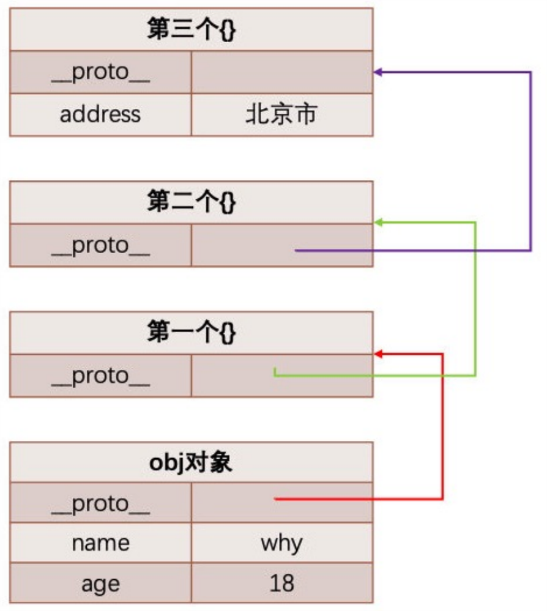
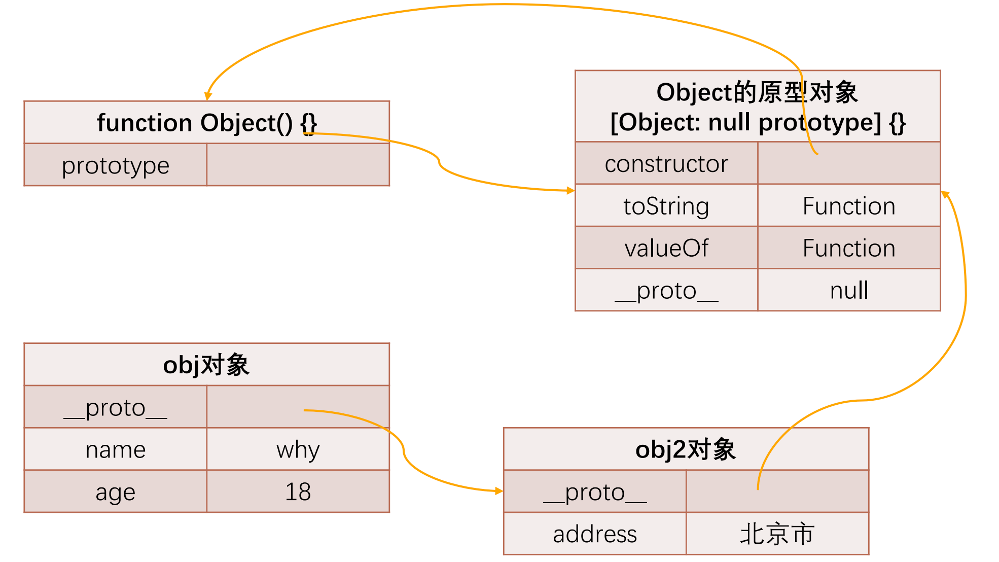
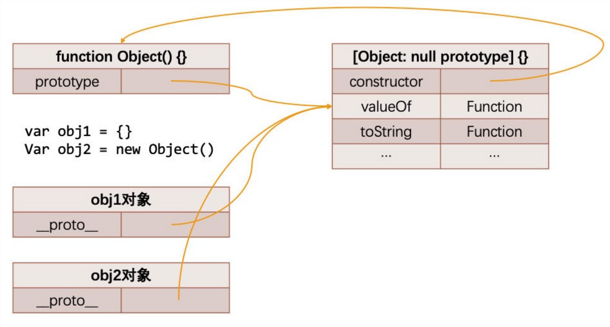
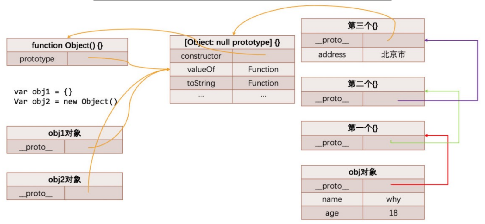
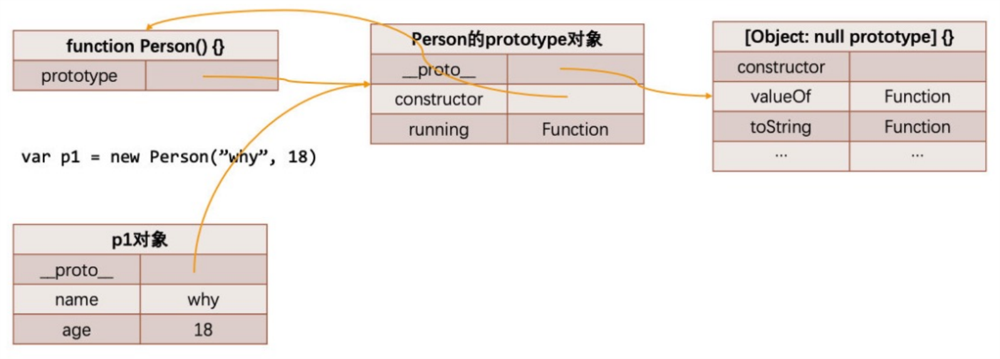
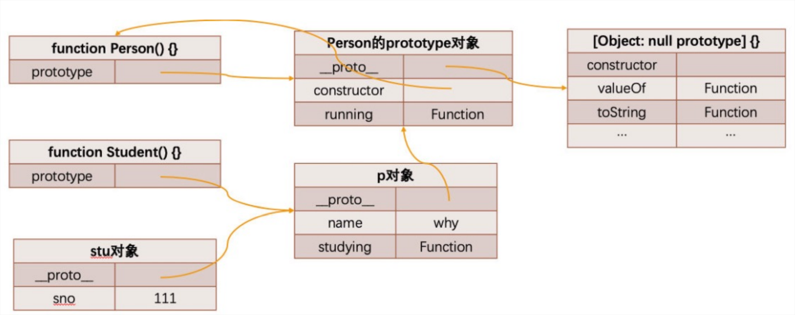
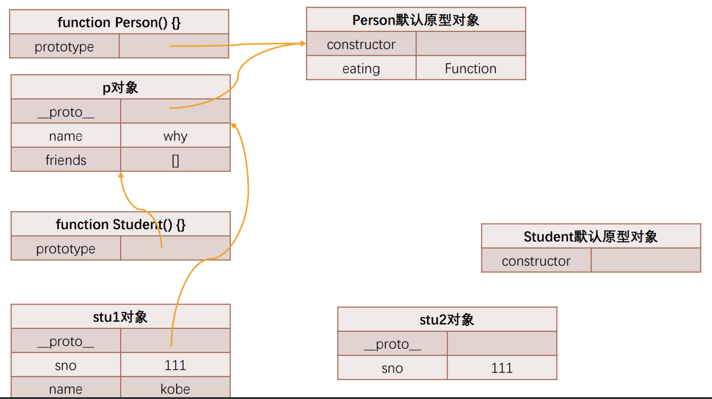
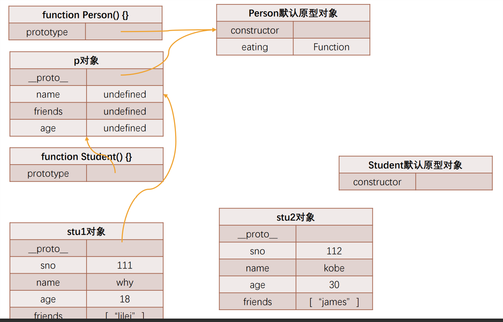
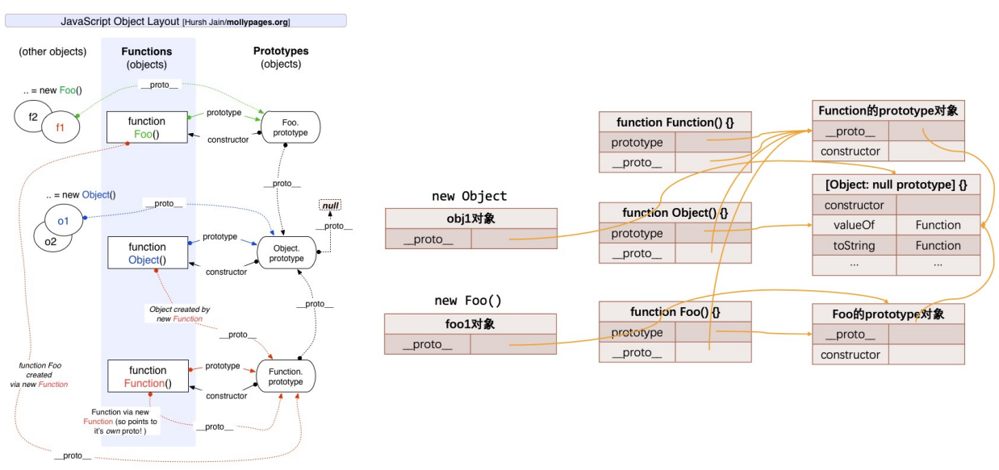

## JavaScript中的类和对象

- 当我们编写如下代码的时候，我们会如何来称呼这个Person呢？

```js
function Person() {}
var p1 = new Person()
var p2 = new Person()
```

- 在JS中Person应该被称之为是一个**构造函数**；
- 从很多面向对象语言过来的开发者，也习惯称之为类，因为类可以帮助我们创建出来对象p1、p2；
- 如果从面向对象的编程范式角度来看，Person确实是可以称之为类的；


## 面向对象的特性 – 继承

- 面向对象有三大特性：封装、继承、多态
  - 封装：我们前面将属性和方法封装到一个类中，可以称之为封装的过程；
  - 继承：继承是面向对象中非常重要的，不仅仅可以减少重复代码的数量，也是多态前提（纯面向对象中）；
  - 多态：不同的对象在执行时表现出不同的形态；
- 那么继承是做什么呢？
  - 继承可以帮助我们将重复的代码和逻辑抽取到父类中，子类只需要直接继承过来使用即可。
- 那么JavaScript当中如何实现继承呢？
  - 不着急，我们先来看一下JavaScript原型链的机制；
  - 再利用原型链的机制实现一下继承；


## JavaScript原型链

- 在真正实现继承之前，我们先来理解一个非常重要的概念：原型链。
- 我们知道，从一个对象上获取属性，如果在当前对象中没有获取到就会去它的原型上面获取：

```js
var obj = {
  name: 'why',
  age: 18
}

```


一层一层的沿着[[prototype]] 往上找的话，这种查找的过程就是原型链查找

```js
var obj = {
  name: 'why',
  age: 18
}

// 在对象中访问某一个属性的时候，就会出触发[[get]]操作，getter会这样做
// 	1.在当前的对象中查找属性
// 	2.如果没有找到, 这个时候会去原型(__proto__/[[prototype]])对象上查找
// 	3.这个查找的过程就是原型链查找
obj.__proto__ = {}
obj.__proto__.__proto__ = {}
obj.__proto__.__proto__ = {
  address: '北京市'
}
```




## Object的原型

那么什么地方是原型链的尽头呢？比如第三个对象是否也是有原型**[[prototype]]**属性呢？

```js
var obj = {
  name: 'why',
  age: 18
}

// 在对象中访问某一个属性的时候，就会出触发[[get]]操作，getter会这样做
// 	1.在当前的对象中查找属性
// 	2.如果没有找到, 这个时候会去原型(__proto__/[[prototype]])对象上查找
// 	3.这个查找的过程就是原型链查找
obj.__proto__ = {}
obj.__proto__.__proto__ = {}
obj.__proto__.__proto__ = {
  address: '北京市'
}

console.log(obj.__proto__.__proto__.__proto__.__proto__) // null（到头了）

var obj = {
  name: 'why',
  age: 18
}
console.log(obj.__proto__)	// [Object: null prototype] {}，顶层原型，顶层原型的__proto__就是null了
console.log(obj.__proto__.__proto__)	// null（到头了）
```

我们会发现它打印的是 [Object: null prototype] {}

事实上这个原型就是我们最顶层的原型了。

从Object直接创建出来的对象的原型都是 [Object: null prototype] {}。

那么我们可能会问题： [Object: null prototype] {} 原型有什么特殊吗？

- 特殊一：该对象有原型属性，但是它的原型属性已经指向的是null，也就是已经是顶层原型了；

- 特殊二：该对象上有很多默认的属性和方法；

  


## 创建Object对象的内存图



```js
var obj = {
  name: 'why',
  age: 18
}
obj.__proto__ = {}
obj.__proto__.__proto__ = {}
obj.__proto__.__proto__ = {
  address: '北京市'
}

var obj1 = {}
var obj2 = new Object()
function Person() {}
/*
1. 在内存中创建了一个对象
var o = {}
2.this的赋值
this = o
3.将Person函数的显式原型prototype赋值给前面创建出来的对象的隐式原型
o.__proto__ = Person.prototype
4.执行函数体
5.返回o（这个时候o就赋值给p了）
*/
var p = new Person()
console.log(p.__proto === Person.prototype) // true

/*
不管是obj1,还是obj2,其实都是Object这个构造函数new出来的实例，所以实际上和Person和p的关系一样
所以 obj1.__proto__ === Object.prototype // true
		obj2.__proto__ === Object.prototype	// true
*/
```




## Object是所有类的父类

从我们上面的Object原型我们可以得出一个结论：原型链最顶层的原型对象就是Object的原型对象

```js
function Person(name, age) {
  this.name = name
  this.age = age
}

Person.prototype.running = function () {
  console.log(this.name + 'running~')
}

var p1 = new Person('why', 18)

console.log(p1)
console.log(p1.valueOf)
console.log(p1.toString())

// 这里的valueOf和toString并不是p1这个对象的，也不是Person的prototype中的，而是顺着原型链找到Object的prototype对象才有的
```




## 继承1: 原型链继承

如果我们现在需要实现继承，那么就可以利用原型链来实现了：

优点：

​	可以继承父类及其原型的全部属性和方法
​	实例和子类和父类在一条原型链上
缺点：

​	子类实例无法向父类传参
​	因为是通过原型实现的继承，所以父类的实例属性会变成子类的原型属性，会导致包含引用类型值的原型属性会被所有的实例共享（基本类型没有该问题）

- 目前stu的原型是p对象，而p对象的原型是Person默认的原型，里面包含running等函数；
- 注意：给子类添加原型的属性和方法需谨慎，必须放在替换原型的语句之后，否则会被覆盖掉

```js
// 1.定义父类构造函数
function Person() {
  this.name = 'why'
}
// 2.父类原型上添加内容
Person.prototype.running = function () {
  console.log(this.name + 'running~')
}
// 3.定义子类构造函数
function Student() {
  this.sno = 111
}
// 4.创建父类对象，并且作为子类的原型对象
var p = new Person()
Student.prototype = p
// 5.在子类原型添加内容
Student.prototype.studying = function () {
  console.log(this.name + 'studying~')
}
```




```js
function Person() {
  this.name = "why"
  this.friends = []
}
Person.prototype.eating = function () {
  console.log('eating~')
}
function Student() {
  this.sno = 111
}
var p = new Person()
Student.prototype = p
var stu1 = new Student()
var stu2 = new Student()
stu1.name = "kobe"
```





### 原型链继承的弊端

但是目前有一个很大的弊端：某些属性其实是保存在p对象上的；

- 第一，我们通过直接打印对象是看不到这个属性的；

  ```js
  function Person() {
    this.name = "why"
    this.friends = []
  }
  function Student() {
    this.sno = 111
  }
  var p = new Person()
  Student.prototype = p
  var stu1 = new Student()
  console.log(stu1) // Person { sno: 111 }
  console.log(stu1.name)  // why
  ```

- 第二，这个属性会被多个对象共享，如果这个对象是一个引用类型，那么就会造成问题；

  ```js
  // 父类: 公共属性和方法
  function Person() {
    this.name = "why"
    this.friends = []
  }
  
  // 子类: 特有属性和方法
  function Student() {
    this.sno = 111
  }
  
  var p = new Person()
  Student.prototype = p
  
  var stu1 = new Student()
  var stu2 = new Student()
  
  // 获取引用, 修改引用中的值, 会相互影响
  stu1.friends.push("kobe")
  
  console.log(stu1.friends) // [ 'kobe' ]
  console.log(stu2.friends) // [ 'kobe' ]
  ```

- 第三，不能给Person传递参数，因为这个对象是一次性创建的（没办法定制化）；


## 继承2: 借用构造函数继承

为了解决原型链继承中存在的问题，开发人员提供了一种新的技术: 

- constructor stealing(有很多名称: 借用构造函数或者称之为经典继承或者称之为伪造对象)：
  - steal是偷窃、剽窃的意思，但是这里可以翻译成借用；
- 借用继承的做法非常简单：在子类型构造函数的内部调用父类型构造函数.
  - 因为函数可以在任意的时刻被调用；
  - 因此通过apply()和call()方法也可以在新创建的对象上执行构造函数；

优点：

​	可以向父类传参
​	因为使用的call或apply的方式，所以可以实现多继承，即一个子类继承多个父类的属性和方法
​	解决了引用数据类型值共享的问题

缺点：

​	因为只是“借调”了构造函数，所以无法继承父类原型中的属性和方法
​	父类的属性和方法都要在父类构造函数中定义才能继承到，每次创建子类实例都重新执行一次父类的构造函数，无法实现方法的复用。（所以在实际开发中，这种继承方式很少单独使用）

注意：

​	子类的私有属性，为防止被父类覆盖，应定义在call或apply之后

```js
function ParentType(name) {
   // 父类
   this.attr = [1, 2]
   this.name = name
 }

 ParentType.prototype.getAttr = function () {
   // 向父类原型增加方法
   return this.attr
 }

 function ChildType(name) {
   // 定义子类
   ParentType.call(this, name) // 继承了父类
 }

 let instance1 = new ChildType('liang') // 创建子类实例
 instance1.attr.push(3)
 console.log(instance1.attr) // [1, 2, 3] 修改了属性值
 console.log(instance1.name) // liang, 实现了向父类传参
 console.log(instance1.getAttr) // undefined，未继承父类原型中的属性和方法

 let instance2 = new ChildType('zai') // 创建另一个子类实例
 console.log(instance2.attr) // [1, 2] 没有被共享引用类型值
 console.log(instance2.name) // zai, 实现了向父类传参

```


## 继承3: 组合借用继承

实现原理：

​	将原型链和借用构造函数的技术组合到一起，从而发挥二者之长的一种继承方式

优点：

​	解决了原型链的引用类型值共享的问题
​	解决了借用构造函数无法继承原型以及构造函数中的方法无法被复用的问题
​	是 JavaScript 最常用的继承模式

缺点：

​	无论什么情况下，都会调用两次父类型的构造函数：一次是在创建子类型原型的时候（ChildType.prototype = new ParentType();），一次是在子类型构造函数内部（ParentType.call(this, name); ）

```js
// 父类: 公共属性和方法
function Person(name, age, friends) {
  this.name = name
  this.age = age
  this.friends = friends
}

Person.prototype.eating = function() {
  console.log(this.name + " eating~")
}

// 子类: 特有属性和方法
function Student(name, age, friends, sno) {
  Person.call(this, name, age, friends)	// 借用构造函数继承
  this.sno = 111
}

var p = new Person()
Student.prototype = p	// 原型链继承

Student.prototype.studying = function() {
  console.log(this.name + " studying~")
}

var stu = new Student("why", 18, ["kobe"], 111)
var stu1 = new Student("why", 18, ["lilei"], 111)
var stu2 = new Student("kobe", 30, ["james"], 112)

stu1.friends.push("lucy")
console.log(stu1.friends)	// [ 'lilei', 'lucy' ]
console.log(stu2.friends)	// [ 'james' ]
```





### 组合借用继承的弊端

组合继承是JavaScript最常用的继承模式之一：

- 如果你理解到这里, 点到为止, 那么组合来实现继承只能说问题不大；
- 但是它依然不是很完美，但是基本已经没有问题了；(不成问题的问题, 基本一词基本可用, 但基本不用)

组合继承存在什么问题呢?

- 组合继承最大的问题就是无论在什么情况下，都会调用两次父类构造函数。
  - 一次在创建子类原型的时候；
  - 另一次在子类构造函数内部(也就是每次创建子类实例的时候)；
- 另外，如果你仔细按照我的流程走了上面的每一个步骤，你会发现：所有的子类实例事实上会拥有两份父类的 属性
  - 一份在当前的实例自己里面(也就是person本身的)，另一份在子类对应的原型对象中(也就是 person.__proto__里面)；
  - 当然，这两份属性我们无需担心访问出现问题，因为默认一定是访问实例本身这一部分的；


## 继承4: 原型式继承函数

原型式继承的渊源

- 这种模式要从道格拉斯·克罗克福德（Douglas Crockford，著名的前端大师，JSON的创立者）在2006年写的 一篇文章说起: Prototypal Inheritance in JavaScript(在JS中使用原型式继承)
- 在这篇文章中，它介绍了一种继承方法，而且这种继承方法不是通过构造函数来实现的.
- 为了理解这种方式，我们先再次回顾一下JavaScript想实现继承的目的：重复利用另外一个对象的属性和方法.

最终的目的：student对象的原型指向了person对象；

```js
// 这个函数接受一个对象，返回一个对象，返回的对象的原型是传入的对象
function object(obj) {
  function Func() {}
  Func.prototype = obj
  return new Func()
}

// 在es6之后，新增了Object.setPrototypeOf这个方法后就直接通过这个方法给对象新增原型了，输入和输出不变
function object(obj) {
  var newObj = {}
  Object.setPrototypeOf(newObj, obj)	// setPrototypeOf，第一个参数是添加原型的对象，第二个参数是添加的原型
  return newObj
}

// 在es5之后，新增了Object.create这个api后，也可以这样写，接收的obj作为student的原型，address作为student的属性
var student = Object.create(obj, {
  address: {
    value: '北京市',
    enumerable: true
  }
})
```


## 继承5: 寄生式继承函数

寄生式(Parasitic)继承

- 寄生式(Parasitic)继承是与原型式继承紧密相关的一种思想, 并且同样由道格拉斯·克罗克福德(Douglas Crockford)提出和推广的；
- 寄生式继承的思路是结合原型类继承和工厂模式的一种方式；
- 即创建一个封装继承过程的函数, 该函数在内部以某种方式来增强对象，最后再将这个对象返回；

```js
function object(obj) {
  function Func() {}
  Func.prototype = obj
  return new Func()
}

function createStudent(person) {
  var newObj = object(person)
  newObj.studying = function () {
    console.log(this.name + 'studying')
  }
  return newObj
}
```


## 继承6: 寄生组合式继承

现在我们来回顾一下之前提出的比较理想的组合继承

组合继承是比较理想的继承方式, 但是存在两个问题:

- 问题一: 构造函数会被调用两次: 一次在创建子类型原型对象的时候, 一次在创建子类型实例的时候.
- 问题二: 父类型中的属性会有两份: 一份在原型对象中, 一份在子类型实例中.

事实上, 我们现在可以利用寄生式继承将这两个问题给解决掉.

- 你需要先明确一点: 当我们在子类型的构造函数中调用父类型.call(this, 参数)这个函数的时候, 就会将父类型中的属性和方法复制一份到了子类型中. 所以父类型本身里面的内容, 我们不再需要.
- 这个时候, 我们还需要获取到一份父类型的原型对象中的属性和方法.
- 能不能直接让子类型的原型对象 = 父类型的原型对象呢?不要这么做, 因为这么做意味着以后修改了子类型原型对象的某个引用类型的时候, 父类型原生对象的引用类型也会被修改.
- 我们使用前面的寄生式思想就可以了.

```js
function Person(name, age, friends) {
  this.name = name
  this.age = age
  this.friends = friends
}

Person.prototype.eating = function() {
  console.log(this.name + " eating~")
}

// 子类: 特有属性和方法
function Student(name, age, friends, sno) {
  Person.call(this, name, age, friends)
  this.sno = sno
}

Student.prototype = Object.create(Person.prototype)
var stu = new Student('why', 18, ['kobe'], 111)
console.log(stu)	// Person { name: 'why', age: 18, friends: [ 'kobe' ], sno: 111 }
stu.eating()	// why eating~
console.log(stu.constructor)	// [Function: Person]
```

打印的stu的结果是Person，打印出来的stu.constructor也是Person，这显然不是我们想要的，我们Student类的实例打印出来就应该是Student。

那么为什么会是这样呢？

Student这个函数没有constructor属性，那么他找自己的原型，自己的原型（Object.create(Person.prototype)）也是没有的(刚创建出来的，原型的属性为空)，那么接着往上找，找到Object.create(Person.prototype)的原型（隐式原型），也就是Person.prototype，Person.prototype是有constructor的，它的constructor指向的就是Person。所以，Student类的实例打印出来的才是Person，那么怎么解决呢？

我们需要把Student的原型的constructor赋值为Student

```js
function Person(name, age, friends) {
  this.name = name
  this.age = age
  this.friends = friends
}
Person.prototype.eating = function() {
  console.log(this.name + " eating~")
}
function Student(name, age, friends, sno) {
  Person.call(this, name, age, friends)
  this.sno = sno
}

Student.prototype = Object.create(Person.prototype)

// 给Student的原型增加一个constructor
Object.defineProperty(Student.prototype, 'constructor', {
  enumerable: false,
  configurable: true,
  writable: true,
  value: Student
})

var stu = new Student('why', 18, ['kobe'], 111)
console.log(stu)	// Student { name: 'why', age: 18, friends: [ 'kobe' ], sno: 111 }
stu.eating()	// why eating~
console.log(stu.constructor)	// [Function: Student]
```


把寄生组合的代码封装一下

```js
// 当然这个函数，在Object.create和Object.setPrototypeOf之前用到的，但是在create和setPrototypeOf之后就可以不使用这个了，怎么使用可以见前面的代码
function createObject(o) {
  function Fn() {}
  Fn.prototype = o
  return new Fn()
}
// SubType继承的子类,SuperType被继承的父类
function inheritPrototype(SubType, SuperType) {
  SubType.prototype = createObject(SuperType.prototype)
  Object.defineProperty(SubType.prototype, 'constructor', {
    enumerable: false,
    configurable: true,
    writable: true,
    value: SubType
  })
}
```


## 原型继承关系

