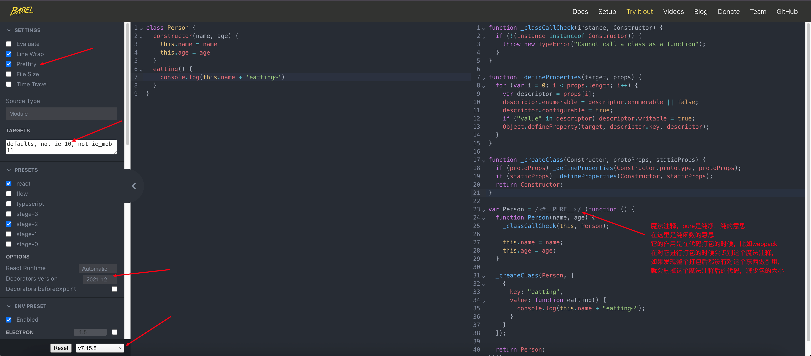

## hasOwnProperty

对象是否有某一个属于自己的属性（不是在原型上的属性）

```js
var obj = {
  name: 'wts',
  age: 18
}

// 这里传进来的对象(address)不会加到原型上，而是加到info对象的自由属性上
var info = Object.create(obj, {
  address: {
    value: '北京市',
    enumerable: true
  }
})
console.log(info)
console.log(info.hasOwnProperty('address'))	// true	这个是自有属性
console.log(info.hasOwnProperty('name'))	// false	这个是在原型上
```


## in/for in 操作符

判断某个属性是否在某个对象或者对象的原型上

```js
var obj = {
  name: 'wts',
  age: 18
}

// 这里传进来的对象(address)不会加到原型上，而是加到info对象的自由属性上
var info = Object.create(obj, {
  address: {
    value: '北京市',
    enumerable: true
  }
})
console.log(info)
console.log(info.hasOwnProperty('address'))	// true	这个是自有属性
console.log(info.hasOwnProperty('name'))	// false	这个是在原型上

// in操作符，不管是原型上，还是自由属性都统一判断是否存在
console.log('address' in obj)	// true
console.log('name' in obj)	// true

// 可以将for-in循环看成是in操作法，包括原型上都能判断到
for(var key in obj) {
  console.log(key)	// name, age, address
}
```


## instanceof

用于检测构造函数的pototype，是否出现在某个实例对象的原型链上

```js

function createObject(o) {
  function Fn() {}
  Fn.prototype = o
  return new Fn()
}
function inheritPrototype(SubType, SuperType) {
  SubType.prototype = createObject(SuperType.prototype)
  Object.defineProperty(SubType.prototype, 'constructor', {
    enumerable: false,
    configurable: true,
    writable: true,
    value: SubType
  })
}

function Person() {}
function Student() {}
inheritPrototype(Student, Person)
console.log(Person.prototype.__proto__)
var stu = new Student()
console.log(stu instanceof Student) // true
console.log(stu instanceof Student) // true
console.log(stu instanceof Object) // true
// 判断stu的原型链是否存在Student/Object的prototype
```


## **isPrototypeOf**

用于检测某个对象，是否出现在某个实例对象的原型链上

```js
var obj = {
  name: 'why'
}
var info = Object.create(obj)
console.log(obj.isPrototypeOf(info))	// true
console.log(obj instanceof info)	// TypeError
```


## 原型继承关系

对象里面有一个`__proto__`对象， 被称为隐式原型对象

如果Foo是一个函数，那么他会有一个显式原型对象: Foo.prototype

那么Foo.prototype来自哪里？

只要创建一个函数，就会自动为这个函数创建一个prototype对象，Foo.prototype = {constructor: Foo}

另外Foo也可以作为一个对象，那么他会有一个隐式原型: `Foo.__proto__`

那么`Foo.__proto__`来自哪里？

`new Function() Foo.__proto__ = Function.prototype`

Function.prototype = {constructor: Function}

因为所有的函数其实都是通过new Function得到的，所以所有的函数作为对象的话，它的`__proto__`指向的都是Function.prototype

```js 
function Foo() {}
console.log(Foo.prototype === Foo.__proto__)  // false
console.log(Foo.__proto__ === Function.prototype) // true
console.log(Foo.prototype.constructor)  // [Function: Foo]
console.log(Foo.__proto__.constructor)  // [Function: Function]
```


## 认识class定义类

我们会发现，按照前面的构造函数形式创建 类，不仅仅和编写普通的函数过于相似，而且代码并不容易理解。

- 在ES6（ECMAScript2015）新的标准中使用了class关键字来直接定义类；
- 但是类本质上依然是前面所讲的构造函数、原型链的语法糖而已；
- 所以学好了前面的构造函数、原型链更有利于我们理解类的概念和继承关系；

那么，如何使用class来定义一个类呢？

- 可以使用两种方式来声明类：类声明和类表达式；

```js
class Person {
  
}
var Student = class {
  
}
```


## 类和构造函数的异同

我们来研究一下类的一些特性：

- 你会发现它和我们的构造函数的特性其实是一致的；

```js
class Person {
  
}
var p = new Person
console.log(Person) // [class Person]
console.log(Person.prototype) // {}
console.log(Person.prototype.constructor) // [class Person]

console.log(p.__proto__ === Person.prototype)	// true
console.log(typeof Person) // function
```


## 类的构造函数

如果我们希望在创建对象的时候给类传递一些参数，这个时候应该如何做呢？ 

- 每个类都可以有一个自己的构造函数（方法），这个方法的名称是固定的constructor； 
- 当我们通过new操作符，操作一个类的时候会调用这个类的构造函数constructor； 
- 每个类只能有一个构造函数，如果包含多个构造函数，那么会抛出异常；

当我们通过new关键字操作类的时候，会调用这个constructor函数，并且执行如下操作： 

- 1.在内存中创建一个新的对象（空对象）； 
- 2.这个对象内部的[[prototype]]属性会被赋值为该类的prototype属性； 
- 3.构造函数内部的this，会指向创建出来的新对象； 
- 4.执行构造函数的内部代码（函数体代码）； 
- 5.如果构造函数没有返回非空对象，则返回创建出来的新对象；


## 类的实例方法

在上面我们定义的属性都是直接放到了this上，也就意味着它是放到了创建出来的新对象中： 

- 在前面我们说过对于实例的方法，我们是希望放到原型上的，这样可以被多个实例来共享； 
- 这个时候我们可以直接在类中定义；

```js
class Person {
  // constructor方法只能有一个
  constructor(name, age, height) {
    this.name = name
    this.age = age
    this.height = height
  }
  running() {
    console.log(this.name + ' running~')
  }
  eating() {
    console.log(this.name + ' eating~')
  }
}
```


## 类的访问器方法

我们之前讲对象的属性描述符时有讲过对象可以添加setter和getter函数的，那么类也是可以的：

```JS
class Person {
  constructor(name) {
    this._name = name
  }
  set name(newName) {
    this._name = newName
  }
  get name() {
    return this._name
  }
}
```


## 类的静态方法

静态方法通常用于定义直接使用类来执行的方法，不需要有类的实例，使用static关键字来定义：

```js
var names = ["abc", "cba", "nba"]

class Person {
  constructor(name, age) {
    this.name = name
    this.age = age
    this._address = "广州市"
  }

  // 类的静态方法(类方法),这个方法只能类才能调用，实例不能调用
  static randomPerson() {
    var nameIndex = Math.floor(Math.random() * names.length)
    var name = names[nameIndex]
    var age = Math.floor(Math.random() * 100)
    return new Person(name, age)
  }
}

var p = new Person("why", 18)
// console.log(Object.getOwnPropertyDescriptors(Person.prototype))

for (var i = 0; i < 50; i++) {
  console.log(Person.randomPerson())
}

```


## ES6类的继承 - extends

前面我们花了很大的篇幅讨论了在ES5中实现继承的方案，虽然最终实现了相对满意的继承机制，但是过程却依然 是非常繁琐的。

- 在ES6中新增了使用extends关键字，可以方便的帮助我们实现继承：

```JS
class Person {
  
}
class Student extends Person {
  
}
```


## super关键字

我们会发现在上面的代码中我使用了一个super关键字，这个super关键字有不同的使用方式：

- 注意：在子（派生）类的构造函数中使用this或者返回默认对象之前，必须先通过super调用父类的构造函数！
- super的使用位置有三个：子类的构造函数、实例方法、静态方法；

```js
class Person {
  constructor(name, age) {
    this.name = name
    this.age = age
  }

  running() {
    console.log(this.name + " running~")
  }

  eating() {
    console.log(this.name + " eating~")
  }

  personMethod() {
    console.log("处理逻辑1")
    console.log("处理逻辑2")
    console.log("处理逻辑3")
  }

  static staticMethod() {
    console.log("PersonStaticMethod")
  }
}

// Student称之为子类(派生类)
class Student extends Person {
  // JS引擎在解析子类的时候就有要求, 如果我们有实现继承
  // 那么子类的构造方法中, 在使用this之前
  constructor(name, age, sno) {
    super(name, age)
    this.sno = sno
  }

  studying() {
    console.log(this.name + " studying~")
  }

  // 子类对父类的方法的重写
  running() {
    console.log("student " + this.name + " running")
  }

  // 重写personMethod方法
  personMethod() {
    // 复用父类中的处理逻辑
    super.personMethod()

    // 对父类的处理逻辑进行补充
    console.log("处理逻辑4")
    console.log("处理逻辑5")
    console.log("处理逻辑6")
  }

  // 重写静态方法
  static staticMethod() {
    super.staticMethod()
    console.log("StudentStaticMethod")
  }
}

var stu = new Student("why", 18, 111)
console.log(stu)

// console.log(Object.getOwnPropertyDescriptors(stu.__proto__))
// console.log(Object.getOwnPropertyDescriptors(stu.__proto__.__proto__))

stu.eating()
stu.running()

stu.personMethod()

Student.staticMethod()

console.log(Object.getOwnPropertyDescriptors(Person))


```


## ES6转ES5

```JS
class Person {
  
}
```

像这种比较新的语法在IE10的浏览器中可能不能显示，因为IE10不兼容这种比较新的语法，那么怎么办呢？为什么在vue或者react中我们使用比较新的语法，却可以在这种比较低的IE10浏览器中使用呢？

不管是vue还是react都会使用脚手架构建项目，在vue中使用的是vue cli，vue cli是通过webpack环境构建的，webpack在构建的过程中，会通过babel把高版本的JS、TS代码降级为比较低版本浏览器支持的语法。

babel转换代码地址：https://babeljs.io/repl#?browsers=defaults%2C%20not%20ie%2011%2C%20not%20ie_mob%2011&build=&builtIns=false&corejs=3.21&spec=false&loose=false&code_lz=MYGwhgzhAEAKCmAnCB7AdtA3gKGtbAvkA&forceAllTransforms=false&modules=false&shippedProposals=false&evaluate=false&fileSize=false&timeTravel=false&sourceType=module&lineWrap=true&presets=env%2Creact%2Cstage-2&prettier=false&targets=&version=7.27.3&externalPlugins=&assumptions=%7B%7D



var Person 后面写的自执行函数的原因？

1. 防止变量污染到全局
2. 方便webpack做tree-shaking，如果这个函数在所有地方都没有用到的话，那么可以把这个函数直接删掉，这个过程就叫做tree-shaking,目的是减少包的大小。当然，只有纯函数才能做tree-shaking操作，因为如果不是纯函数，那么有可能被其他地方引用，或者引用到其他地方，可能会出错

继承如何实现？


这里包括原型的继承和静态方法的继承


## 阅读源码

阅读源码大家遇到的最大的问题： 

1.一定不要浮躁 

2.看到后面忘记前面的东西 

- Bookmarks的打标签的工具：command(ctrl) + alt + k 
- 读一个函数的时候忘记传进来是什么？ 

3.读完一个函数还是不知道它要干嘛 

4.debugger


## 继承内置类

我们也可以让我们的类继承自内置类，比如Array：

```JS
class Person extends Object {}
// 相当于
class Person {}	// 默认就是继承了Object


class HYArray extends Array {
  lastItem() {
    return this[this.length - 1]
  }
}
var array = new HYArray(10, 20, 30)
console.log(array.lastItem)

// 也可以继承Object
class Person extends Object {
  
}
```


## 类的混入mixin

JavaScript的类只支持单继承：也就是只能有一个父类 

- 那么在开发中我们我们需要在一个类中添加更多相似的功能时，应该如何来做呢？ 
- 这个时候我们可以使用混入（mixin）；

```js
function mixinRunner (BaseClass) {
  return class extends BaseClass {
    running() {
      console.log('running~')
    }
  }
}

function mixinEater(BaseClass) {
  return class extends BaseClass {
    eating() {
      console.log('eating~')
    }
  }
}

class Person {
  
}
class NewPerson extends mixinEater(mixinRunner(Person)) {
  
}
var up = new NewPerson()
np.eating()
np.running()
```

弊端: 新增属性的话，或者参数的话，无能为力了


## 在react中的高阶组件


这里利用到了很多前面学过的思维

- 柯粒化：connect函数接受两个参数，又返回一个函数，返回的这个函数又接受一个参数，这个就是柯粒化的思维，将一个参数或者多个参数传递给一个函数后，这个函数返回一个函数，返回的函数又接收新的参数
- 组件增强，在EnhanceComponent这个类就是对传进来的WrappedComponent这个组件的增强(也可以称为混入)


## JavaScript中的多态

面向对象的三大特性：封装、继承、多态。 

- 前面两个我们都已经详细解析过了，接下来我们讨论一下JavaScript的多态。 

JavaScript有多态吗？ 

- 维基百科对多态的定义：多态（英语：polymorphism）指为不同数据类型的实体提供统一的接口，或使用一 个单一的符号来表示多个不同的类型。 
- 非常的抽象，个人的总结：不同的数据类型进行同一个操作，表现出不同的行为，就是多态的体现。 

那么从上面的定义来看，JavaScript是一定存在多态的。

```js
function sum(a, b) {
  console.log(a + b)
}
sum(10, 20)
sum('abc', 'cba')
```

```js
class Shape{
  getArea() {}
}
class Reactangle extends Shape {
  
}
class Circle extends Shape {
  
}
var r = new Reactangle()
var c = new Circle()

// 多态：当对不同的数据类型执行同一个操作时，如果表现出来的行为（形态）不一样，那么就是多态的体现
function calcArea(shape: Shape) {
  console.log(shape.getArea())
}
// 在这里我们不管是传入r还是传入c，调用的都是父类的getArea这个方法，那么也就是说明，他们表现的行为是一致的，所以我们说他不是多态
calcArea(r)
calcArea(c)


// 做一下修改

class Shape{
  getArea() {}
}
class Reactangle extends Shape {
  // 重写父类的方法
  getArea() {
    return 100
  }
}
class Circle extends Shape {
  // 重写父类的方法
  getArea() {
    return 200
  }
}
var r = new Reactangle()
var c = new Circle()

// 多态：当对不同的数据类型执行同一个操作时，如果表现出来的行为（形态）不一样，那么就是多态的体现
function calcArea(shape: Shape) {
  console.log(shape.getArea())
}
// 修改后，可以发现如果传入的是r，那么会调用r中的getArea,如果传入的是c，那么就会调用c中的getArea，这个时候我们
// 就可以说这种表现就是多态
calcArea(r)
calcArea(c)
```

传统的面向对象多态有三个前提：

1. 必须有继承（是多态的前提）
2. 必须有重写（子类重写父类的方法）
3. 必须有父类引用指向子类对象


父类的引用指向子类对象怎么理解呢？

```js

function calcArea(shape: Shape) {
  console.log(shape.getArea())
}
calcArea(r)
// 1.这里的r传给calcArea实际上相当于把r赋值给了shape
// 2.但是这个r实际上是 new Reactangle，也就是Reactangle的实例
// 3.所以可以这样理解 shape: Shape = new Reactangle
// 4.在这个表达式中，父类的引用指的是shape: Shape,子类的对象指的是 new Reactangle
// 5.这个就是父类的引用指向子类的引用
```

上面这些是传统的面向对象的多态，

那么在js中面向对象中的多态

```js
// 多态：当对不同的数据类型执行同一个操作时，如果表现出来的行为（形态）不一样，那么就是多态的体现
function calcArea(foo) {
  console.log(foo.getArea())
}

var obj1 = {
  name: 'wts',
  getArea: function () {
    return 1000
  }
}

class Person {
  getArea() {
    return 2000
  }
}

var p = new Person() 

calcArea(obj1)
calcArea(p)

// 严格按照多态的概念的话，以上代码也算多态，因为，不同的数据类型执行同一个操作的时候，表现的行为是不一样的
// 但是这里没有继承，没有重写，父类引用指向子类对象也不存在

// 多态：当对不同的数据类型执行同一个操作时，如果表现出来的行为（形态）不一样，那么就是多态的体现
// 根据多态的定义，这里也是多态的体现
function sum(m, n) {
  return m + n
}
sum(10, 20)
sum('abc', 'cba')
```

所以js中是有多态的，只不过和传统的多态不一样，但是他是符合多态的定义的。


